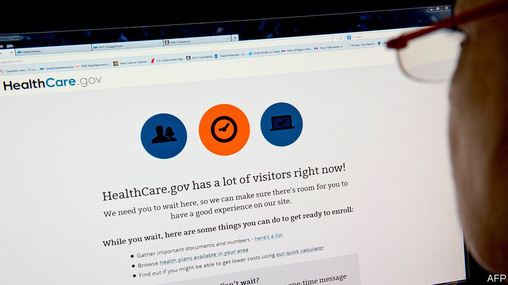

###### Software and the state

# Despite high-profile failures, government tech is slowly improving 

##### Efforts to fix a system that has been on the blink 

 

> Mar 18th 2021 


IT HAS BEEN a bad year for government software. Early in the pandemic, unemployment-insurance systems failed, preventing many jobless from signing up for benefits. Glitchy vaccine-registration software in Pennsylvania, New Jersey and Florida slowed roll-out. Deloitte, a consultancy, was paid more than $40m by the Centres for Disease Control to produce a buggy vaccine-data system. In February whistleblowers reported that prison-administration software was keeping inmates in Arizona locked up past their release dates.


It is not simply that the pandemic has put a strain on harried government boffins: an oft-cited report by Standish Group, an advisory firm, found that only 13% of large government software projects succeed. The roll-out of America’s online health-care marketplace became a national joke. Hackers stole the records of more than 20m federal personnel. A pricey intelligence system was so awful that paratroopers in Afghanistan begged higher-ups to switch. Such foul-ups are the rule.


Procurement is the first problem. The way government agencies buy things is so complicated that only a few big companies understand the process. Some firms continue to get state and federal contracts even after delivering error-prone systems at fantastic cost. New York chose Xerox to modernise its Medicaid-claims system even though the company had already been sued by Alaska and Texas for allegedly botching similar efforts.


Poorly written contract solicitations make things worse. Requirements are often so restrictive that many eligible firms are instantly disqualified. Contracts may contain no provision for testing. Deloitte’s vaccine-management system might have benefited from more testing: it doesn’t work on some web browsers, and important buttons are hidden on a smartphone.


Many agencies lack the expertise to ensure that complex software projects run smoothly. A government report found that an opaque, drawn-out hiring process was a significant barrier to getting tech talent. Agencies can be penny-wise and pound-foolish, allocating plenty of money for tech contracts but not enough for the staff required to ensure projects are a success.


Bureaucracy doesn’t help. Staffers may want to take advantage of modern technology, but fear falling foul of old rules. During the pandemic, unemployment-insurance and vaccine-registration systems were crushed under the weight of traffic that would have been easily handled by cloud-computing infrastructure. Little thought goes into user experience. In 2018 the poor design of a software interface led a state employee to press the wrong button, issuing a warning that a ballistic missile was incoming to Hawaii residents, who scrambled to text goodbyes to loved ones.


Change is under way. After the failed roll-out of Healthcare.gov, the American government set up 18F, an internal technology consultancy that has created sleek new digital tools, and the US Digital Service (USDS), which deploys tech whizzes to multi-year “tours” in government. Technology Transformation Services, a unit dedicated to improving government tech, has created digital.gov, which provides resources to improve tech literacy across the government. USDS has pioneered SME-QA, a promising new way to hire software developers and other experts.


Mark Lerner, a civic-tech expert, advocates modular contracting—short, bite-sized contracts that are easy to replicate. Spreading tech know-how among contracting officers can stop government from buying lemons. “We need to be building systems”, says Amanda Miklik, a former USDS director of design, “to support contracting officers in being able to sniff out bullshit.” And civic-tech experts agree that government must take user research seriously: the goals of new software must be well defined before contracts are awarded.


A new opportunity arose on March 10th, when the House passed a $1.9trn stimulus package. The bill includes $1bn for the Technology Modernisation Fund (TMF), a vehicle intended to improve federal tech. The hefty sum, a 40-fold increase over TMF’s 2020 figure, is a signal that Congress and the Biden administration take IT modernisation seriously. But unless the government improves its ways, the money could all too easily be wasted. ■

