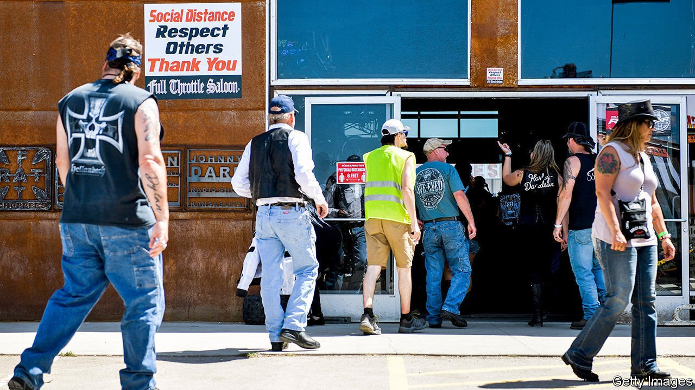
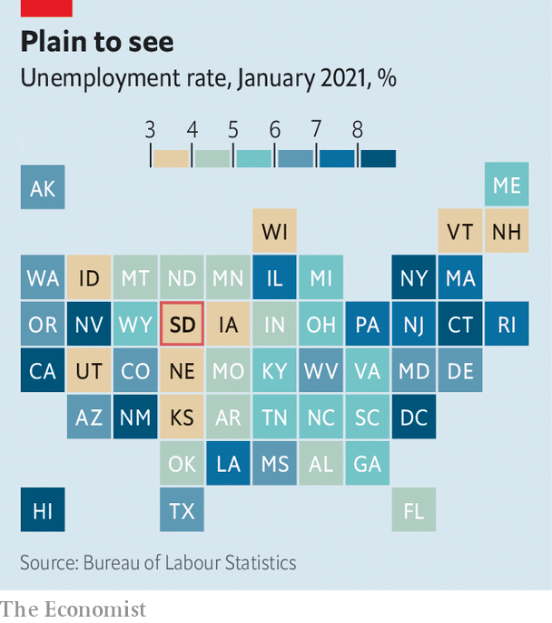

###### The economy v health

# South Dakota’s economy defies conventional wisdom about covid-19 

##### Lives or livelihoods? A lesson from the Mount Rushmore state 

 

> Mar 18th 2021 


AFTER PEAKING at nearly 15% last spring, America’s unemployment rate has fallen to 6.2%. But the recovery across the country as a whole, speedier than many economists had expected, has nothing on South Dakota, a state with particularly loose covid-19 restrictions. Unemployment there has tumbled to 3.1%—as low as it was before the pandemic. South Dakota’s unemployment rate is the lowest in the country (see map) and a full percentage point lower than that in North Dakota, which imposed extra restrictions in November.

 


South Dakota’s state government has shied away from mask mandates and stay-at-home orders. Bars, restaurants and clubs are open; many geared up for a huge St Patrick’s Day celebration on March 17th. At last month’s Conservative Political Action Conference, a big Republican bash, Kristi Noem, South Dakota’s governor, took the plaudits for having apparently done the impossible: avoid a biblical death toll from covid-19 while keeping the state open for business. South Dakota made a choice—albeit one which was not open to many other states.


It is not true that South Dakota has escaped covid-19. Fewer people have died from the virus than in most states, but few people live there. Adjusted for population, South Dakota ranks eighth among the states for most deaths from the disease, according to data from the Kaiser Family Foundation, a think-tank. The fact that it is not ranked even higher may owe more to the state’s low population density and lack of travel hubs than it does to enlightened covid policy. 


Many states hit comparably hard by covid-19, such as New York, have also suffered economically. South Dakota’s economic strength seems genuine. The drop in the unemployment rate has been driven by growth in jobs, not by people falling out of the labour force. In the third quarter of 2020 the total value of wages and salaries in the state was where you would expect it to be had the pandemic never happened. The Economist has constructed an index of economic activity using mobility data from Google. Compared with a pre-pandemic baseline, it was 2% lower last week in South Dakota. Across all America it was 24% lower. 


Parts of South Dakota’s economy have suffered. Employment in leisure and hospitality has fallen by over a tenth in the past year, as fewer tourists visit the Badlands and Mount Rushmore. In some respects the state was dealt a good hand. It is more reliant than average on industries that can run with social distancing, such as manufacturing. And in the past year the federal government has boosted its headcount in South Dakota by 2%.


Nonetheless the uncomfortable reality is that South Dakota undermines an assertion that some economists and public-health types are fond of repeating: that, as far as covid-19 is concerned, there is no trade-off between lives and livelihoods. That trade-off may indeed exist, at least in the case of rural areas where the population seems to have a high appetite for risk. South Dakota’s public-health response to the pandemic has been poor, but at least its economy has not also collapsed.

