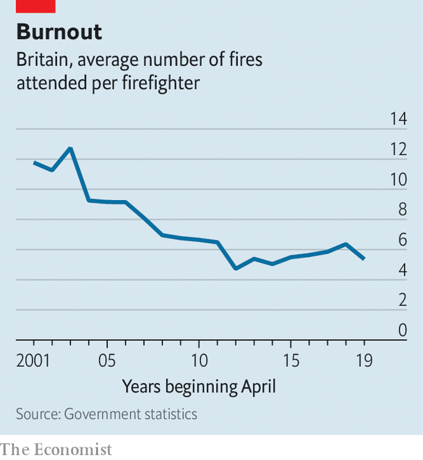

###### No smoke, no fire

# Not even covid-19 has dented firefighters’ resistance to change 

##### They were willing to help during the pandemic. But not much 

 

> Mar 27th 2021 

WHEN THE pandemic hit, firefighters acted as ambulance drivers to relieve pressure on the NHS. But there were limits to their union’s willingness to help out: under a deal with local authorities, the Fire Brigades Union (FBU) agreed that its members would deliver food to vulnerable people but not check on their welfare. The deal expired in January, and the union has since urged its members not to volunteer individually to help with the vaccine roll-out. A report from the national inspectorate on March 17th noted that the so-called “grey book”, which sets the terms and conditions for firefighters, has not been updated since 2009 and leaves “little room for services to adapt quickly and provide firefighters with necessary flexibility”.

While working practices have not changed much in two decades, the demands on workers have. Oven chips are one big reason. In the mid-1990s about one in five domestic fires in Britain began with a chip pan, but by the late 2010s that was down to closer to one in 20. Less combustible cooking, fewer smokers and safer electrical appliances have all contributed to a large decline in fires. In two decades, the number of domestic fires has fallen by more than half, while the number of firefighters has declined only slightly. The result is a sharp fall in the ratio of fires to firefighters (see chart).


The FBU insists that their members are still busy. Car accidents provide another major source of work and false alarms still need to be responded to. But road-accident casualties have also fallen by half in two decades. The total number of incidents to which firefighters were summoned in England has fallen by 40% over the period.

 


Politicians keen on potential cost savings have been eager to reform the service and give it more roles. Cross-training firefighters as paramedics was tried in 2015 but then abandoned. A government review in 2013 argued that £200m ($275m) of annual savings could be found if Britain’s 52 separate fire-and-rescue services were all run at the average level of efficiency or higher. Reforming the service demands considerable political will, and the FBU tends to have more stamina than governments.

The fire service is perfect territory for union organising. It takes months to train a firefighter. High barriers to entry into the business, high union membership and high public regard combine to give the FBU a lot of industrial clout, which it is not afraid to use. While the fire service was not exempted from the public-sector pay freezes of the past decade, firefighters’ earnings, at £31,767 a year, remain well above the national average; and digital technology helps them to work on their own projects during the longueurs between call-outs. “The hourly rate is pretty good when you think about the time sitting around the station,” says a firefighter who runs a buy-to-let property business on the side. It is not hard to see why several private firms make a living out of coaching potential firefighters through the process. It’s nice work if you can get it. ■

