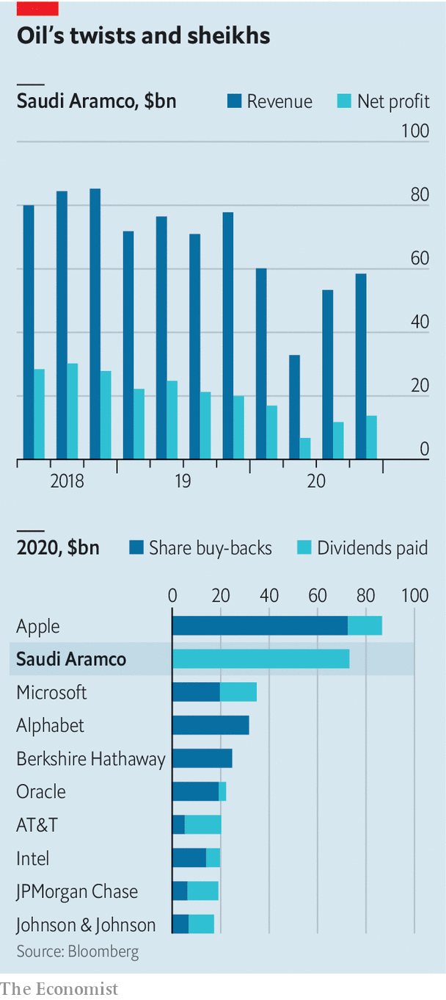

###### A lean year

# Saudi Aramco’s profits decline—but not the dividend 

##### Even amid a pandemic, big oil equals big pay-outs 

 

> Mar 27th 2021 

 


BIG OIL EQUALS big payouts. The covid-induced collapse in the price of crude, which wiped billions from supermajors’ profits, tested this regularity—but not to breaking point. ExxonMobil booked an annual net loss of $22bn but still paid $15bn to shareholders. On March 21st Saudi Aramco said it, too, would maintain its $75bn dividend, on which its kingdom’s budget depends. Never mind the 44% fall in earnings.■

