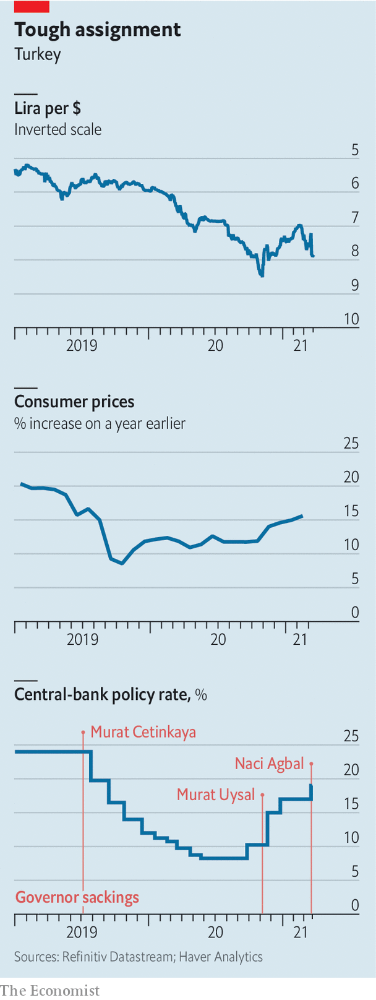

###### Erdogan’s own goal

# A debacle at Turkey’s central bank 

##### Firing yet another central-bank governor was a serious mistake 

 

> Mar 25th 2021 

A WEEK AGO Turkey seemed poised to become this year’s emerging-market success story. Foreign investors were pouring back, lured by high interest rates. The central bank sounded serious about taming inflation. The lira was outperforming most of its peers. The economy could look forward to a year of strong growth.

Then Recep Tayyip Erdogan stepped in. The Turkish president’s shocking decision to sack Naci Agbal, the central-bank governor, in the small hours of March 20th set off an earthquake. The lira plunged by 15% against the dollar as soon as markets opened, before regaining some of its losses. The yield on ten-year lira bonds rose by nearly five percentage points in a day, a new record. The main stockmarket sank by 10%, reversing all the gains it had made so far this year. Investors, who had bought some $19bn in Turkish assets since Mr Agbal’s appointment last November, began fleeing in droves. During his four months in office, Mr Agbal helped to rebuild the central bank’s reputation. Mr Erdogan demolished it with a stroke of his pen.


Mr Erdogan has now fired three central-bank governors in under two years. Mr Agbal’s departure is the most dramatic to date. With a series of overdue interest-rate rises, including a two-percentage-point increase on March 18th, the governor had offered investors a  that the central bank was something other than an extension of Mr Erdogan’s government. That hope is now gone. The lira, which had surged back to life after losing half of its dollar value in under four years, is once again on the ropes. Foreign investors feel betrayed. “These are the worst moments any emerging market has experienced in a quarter of a century,” wrote Charles Robertson of Renaissance Capital.


Mr Agbal had already been under some pressure. Rumours had been swirling that one of his rivals, Berat Albayrak, who resigned as finance minister a day after Mr Agbal’s appointment, might be returning to government. Mr Erdogan, an opponent of high interest rates, must also have been uneasy with the governor’s most recent rate rises. But few people expected him to remove Mr Agbal so unceremoniously and so quickly. “Even if another orthodox candidate will be put in, who knows how long they will stay in charge?” says Robin Brooks, chief economist at the Institute of International Finance. “This was basically the final straw.”

The new head of the bank, Sahap Kavcioglu, a former ruling-party parliamentarian who is thought to be close to Mr Albayrak, is a relative unknown. Between 2005 and 2015 he was deputy manager at Halkbank, a Turkish state lender which is currently under indictment in America on money-laundering charges. He has sought to contain the damage from his own appointment, saying he would continue efforts to tackle inflation, which reached 15.6% last month. Investors are unimpressed. Only last month, the new governor echoed Mr Erdogan’s view that the key to fighting inflation was lowering rates, a theory widely ridiculed by economists.

 


The brutal market reaction may give Mr Erdogan pause for thought. “My guess is that it’s going to get through to Erdogan that a country with so much foreign debt does not have the freedom to set interest rates as low as it likes,” says Paul McNamara, investment director at GAM, an asset-management firm. Turkey’s president and the central bank may grudgingly surrender to the markets, he says. “There needs to be a realisation they’ve bitten off more than they can chew.” Turkey's short-term foreign debt reached $140bn in January, around a fifth of GDP.

That realisation may take time to sink in. Turkey’s government may again decide to use stopgap measures, getting state banks to prop up the lira by selling billions of dollars and preventing foreigners from shorting the currency, to pave the way for a rate cut. There are signs this is already happening. Interest rates on overnight swaps for the lira touched 1,400% on March 23rd, making it hard for investors to dump Turkish assets. But this will be a losing battle, says Phoenix Kalen of Société Générale. Having wasted $130bn in precious foreign reserves to stem the lira’s slide since 2019, the bank lacks firepower. Net reserves have dwindled to $10.9bn. They are closer to a negative $40bn when currency swaps with local banks are excluded.

Mr Erdogan now faces an unenviable choice; to keep rates high and defend the currency, or cut them to boost the economy and risk a currency crash. A more distant risk is capital controls. Turkey’s finance minister ruled those out on March 22nd, though some analysts have not. In a country that relies heavily on capital inflows, such controls would bring the economy to a halt. That makes them unlikely, but no longer unthinkable.

The tragedy is that all this is happening to an economy brimming with potential. Turkey has handled the covid-19 pandemic better than most big European countries. The economy expanded by 1.8% last year, no mean feat for a country whose tourism sector, which generates upwards of $30bn in annual revenues, was devastated. Before the central bank earthquake, the IMF predicted that growth would reach 6% this year. That figure will surely have to be revised downward. Turkey’s economy is resilient and dynamic. But as long as it is micromanaged by a strongman whose economic theories give investors the creeps, it will continue to take two steps back for every step forward. Turkey’s president was once a semi-professional football player. He may have just scored the worst own goal of his career. ■

A version of this article was published online on March 22nd 2021

