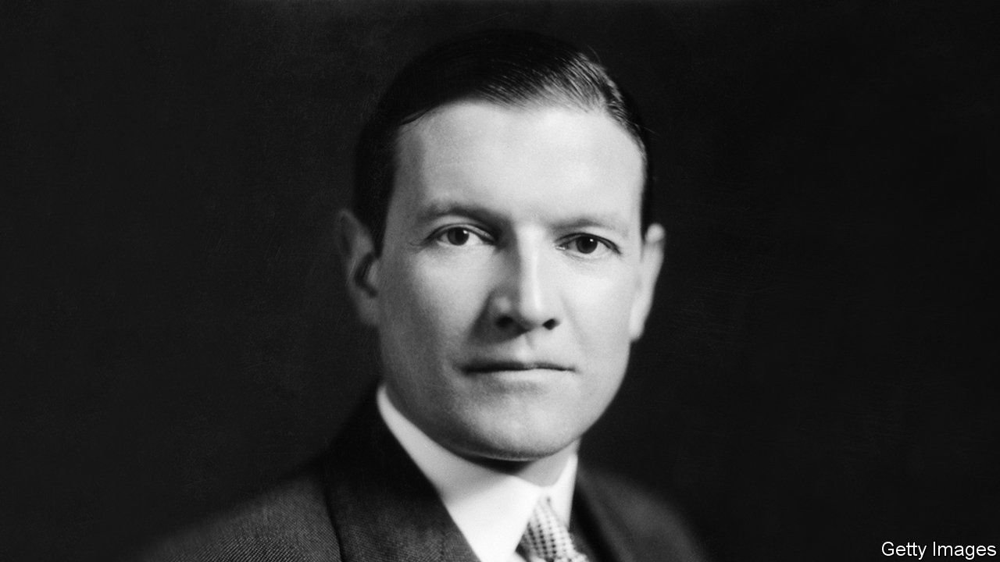
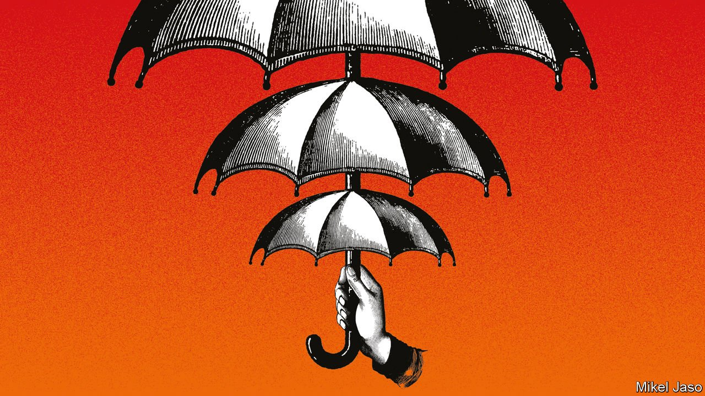

###### On nuclear power, Namibia, Uber, jury trials, beer, Bob Dylan

# Letters to the editor 

##### A selection of correspondence 

 

> Mar 27th 2021 


Ten years on

Coverage of the Fukushima disaster tends to muddle two key facts (“”, March 6th). The first is that Fukushima has the lowest seawall elevation of all the Pacific-facing nuclear-reactor sites in Japan, making it significantly more susceptible to the risk from a tsunami. A higher location with backup power and cooling systems would have avoided the disaster. Despite misgivings about its low-lying position, the selection of the site was driven by politics. Securing approval from local constituencies is an incontestable requirement for nuclear operations in Japan over other considerations.


The second key factor is design. All the Pacific reactors on that afternoon of March 11th 2011, including Fukushima, safely initiated emergency shutdown sequences in response to the earthquake, testimony to the Japanese nuclear industry’s strong safety record.

It was not the earthquake that caused the disaster, but a freak tsunami, combined with the Japanese nuclear industry’s and population’s inability to debate risk. Nuclear revival can be safe even in earthquake-prone Japan, and is essential if the country is to achieve carbon-neutral power.

TROY FOWLER

Nuclear fuel team

Japan “Sogo-Shosha” General Trading Company, 2010-14

West Linn, Oregon

The new generation of advanced modular reactors being developed in Japan, America and Canada address all the issues you raised. Japan, for example, has a High Temperature Gas-cooled Reactor that is inherently safe, is 45% more efficient than a pressurised water reactor and can be factory built in three to four years, rather than up to 15 years. It complements intermittent renewables as part of any reliable energy portfolio.

The HTGR also produces 75% less waste than current reactors. As some of the new advanced reactors can re-utilise spent fuel, Britain’s legacy waste becomes an asset with intrinsic value, and no longer a liability. And how much better to deal with it under the watchful eye of Britain’s regulator.

IAN FELLS

Professor emeritus

Newcastle University

A “high level of regulation” is only one necessary condition for attaining, as you contend, a “very small” risk of failure. In order to make nuclear power safer we must pay equal attention to nurturing a strong safety culture among our nuclear-power utilities. A safety culture is analogous to the human body’s immune system that protects it against pathogens and fends off diseases. A safety culture based on trust, transparency and accountability is the key to the secure operation of nuclear reactors; it should also be the basis of relations and interactions among reactor suppliers, operators and regulators.

PROFESSOR NAJMEDIN MESHKATI

Department of Civil and Environmental Engineering

University of Southern California

Los Angeles

Nuclear power has had its day. It is now prohibitively expensive to construct. Britain’s Hinkley Point C reactor was granted a licence in 2012 and is not expected to be operating until 2026. It will have cost £23bn ($32bn). As for small modular reactors, the proposed NuScale reactor in America is scheduled for 2029.

PETER NASHSydney

The American government has not been able to prove that buried nuclear waste will be dealt with effectively. Yucca Mountain in Nevada was selected as the least unsatisfactory location only because Nevada has a small population and large remote areas.

DAVID CALVIN GOGERTY

Idyllwild, California

 


A forgotten atrocity

There are other candidates to compete with Hitler as “the worst racist in history” (“”, March 6th). “The Kaiser’s Holocaust” by David Olusoga and Casper Erichsen illuminates a chapter of the past not many of us learn about: the genocide of the Herero and Nama peoples of Namibia. Their slaughter served as a blueprint for the Nazis in many ways. General Lothar von Trotha’s name may not be well known outside Germany and Namibia, but he is on a par with Hitler.

SARA WAUGH

Lopez Island, Washington

 


A minimum minimum wage

Uber may have accepted the Supreme Court’s ruling in Britain to treat its drivers like employees (“”, March 20th). But it will only pay the minimum wage once a driver accepts a booking. The drivers have claimed that up to half their time is spent waiting for rides, and this should rightly be considered part of their working hours. Would it be correct to pay supermarket workers only when they are scanning items?

THOMAS PAPPAS

London

 


Real life justice

You suggested that the decision to host the trial of Andrea Sahouri, a journalist, at Drake University Law School was bizarre (“”, March 13th). On the contrary, selecting the case for our annual trial practicum was an invaluable learning experience for our students, and also helped shine an international spotlight on this prosecution.

Remarkably, the vast majority of American law students can graduate without having ever seen a trial, let alone participated in one. That does not happen at Drake Law; we suspend regular classes for a week so that first-year law students can observe a real trial from the selection of the jury through to the verdict. Students have the opportunity to discuss tactical decisions and rulings with the attorneys and judges, and in most years, after the jury has reached its verdict, they are able to talk to jurors about their views of the evidence.

The real-life nature of the case makes it a much more meaningful experience than the typical law-school simulation. Seeing a defendant led off in handcuffs at the end of a murder trial, as students witnessed several years ago, is something they will never forget, bringing home the dramatic power of the legal system over people’s lives and liberty.

JERRY ANDERSON

Professor of law

Drake University Law School

Des Moines, Iowa

 


Support your local pub

One of the greatest opportunities presented by Britain’s separation from the EU (“”, March 13th) is differentiated excise duty. Allowing British pubs to enjoy a lower level of tax on draft beer, for example, was illegal under EU rules. Lowering the tax would provide a boost to a much-loved industry.

PAUL WELLS

Sandy, Bedfordshire

 


Continuing the Dylan meme

“” (March 6th) outlined welfare initiatives to beat the idiot wind. The pandemic has left us tangled up in blue and was no simple twist of fate. We’re together through life but mourn fallen angels. And yes, we desire another side, more freewheelin’. I just got my first AstraZeneca shot of love, leaving me knocked out loaded. Oh mercy. A new morning.

DREW FAGAN

Toronto

