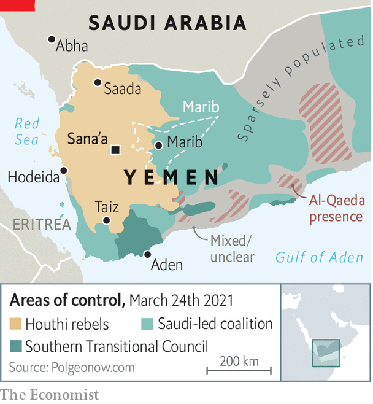

###### Desperate to leave

# Saudi Arabia is struggling to end its war in Yemen 

##### The kingdom knows it cannot win. So does the enemy 

 

> Mar 27th 2021 

SIX YEARS have passed since Saudi Arabia declared victory in what it dubbed Operation Decisive Storm, the opening salvo of its war in Yemen. Yet the kingdom is still trying to find its way out of the squall. On March 22nd it offered a ceasefire to its opponent, the Houthis, a Shia militant group that seized control of the Yemeni government (and much of the country) in 2015. The Saudi proposal called for a nationwide truce and offered to ease the air and sea blockade it has imposed on Houthi-controlled territory. “We want the guns to fall totally silent,” said Prince Faisal bin Farhan, the foreign minister.

The Houthis barely paused to consider the offer. Muhammad Abdulsalam, the chief Houthi negotiator, said the Saudi proposal contained nothing “serious or new”. He was half right: it was serious, but also a warmed-up version of a plan that had failed to win agreement during a year of negotiations. In case the verbal rejection was unclear, the Houthis then sent a drone across the border to attack the airport in Abha in southern Saudi Arabia. The kingdom remains stuck with an intractable dilemma: how do you convince your enemies to end a war they are winning?


That question has become more urgent as the conflict has grown more catastrophic. More than 112,000 Yemenis have died since the Houthis seized Sana’a, the capital. Millions have been displaced. The Yemeni economy is in ruins, with 80% of the population reliant on aid to survive. Instead of dislodging the Houthis, the war has pushed them closer to Iran, which gleefully sends military support to bleed its Saudi rival. For this strategic failure, the Saudis have spent tens of billions of dollars, endured a spree of drone and missile attacks, and damaged their standing with partners in the West.

 


Previous attempts at a ceasefire, including a unilateral Saudi truce last year, ended in failure. Both sides say they are open to a deal and have spent the past year in negotiations backed by the UN. But they continue to disagree on the details. The Houthis, for example, want the Saudi-led coalition to lift its blockade of the airport in Sana’a and the port at Hodeida, on the Red Sea. The Saudis are loth to give the Houthis unfettered movement of people and goods—and the revenue that comes with it. They counter by offering limited flights to Sana’a and allowing oil tankers to berth at Hodeida only if taxes and customs revenue are deposited in a special account at the central bank.

The latest Saudi proposal does not deal with these disagreements—but the act of offering it was itself a negotiating ploy. By doing so in public, the Saudis forced the Houthis to reject it in public. It was an effort to squeeze the group amid a renewed push for diplomacy. Joe Biden, America’s president, recently appointed a special envoy to help negotiate a deal. Antony Blinken, Mr Biden’s secretary of state, spoke with Prince Faisal on the day he announced the offer.

But the Houthis are in no mood for making what they see as concessions. After six years of war against a stronger, wealthier foe, they still control the capital and territory containing most of the population. They are pushing ahead with an offensive to capture Marib, the seat of a province with the same name. It is the largest city controlled by the government of Abd Rabbo Mansour Hadi, who is nominally the president of Yemen but governs from exile in Saudi Arabia. Marib is also home to the country’s largest oil and gas reserves, and occupies a strategic position along a road that connects to the eastern hinterlands and the Saudi border. Throughout the war it has been a relative oasis of stability, drawing more than 2m people displaced by fighting elsewhere.

The city has been under indiscriminate rocket and mortar fire for more than a year. In February the Houthis launched one of their periodic ground offensives to capture it. So far the coalition has held them off, and the Houthis have taken heavy casualties. They do not seem to mind the losses, though, as they frequently restock their forces with new conscripts, some of them still children. “Whenever the Houthis talk about peace with the international community, they escalate their attacks,” says Sultan al-Arada, the governor of Marib.

War is its own form of negotiation. The push for Marib gives the Houthis leverage; if they can be convinced to abandon it, they will expect something in return. Both sides will continue to talk, even as they fight. But those talks will be precarious. The Houthis have escalated their missile and drone attacks since the start of the year. Few of these cause serious damage, but a mass-casualty attack could swing Saudi public opinion against a ceasefire. The fall of Marib might embolden the Houthis to push for still more territory. And millions of Yemenis will remain caught in the middle, struggling merely to survive.■

