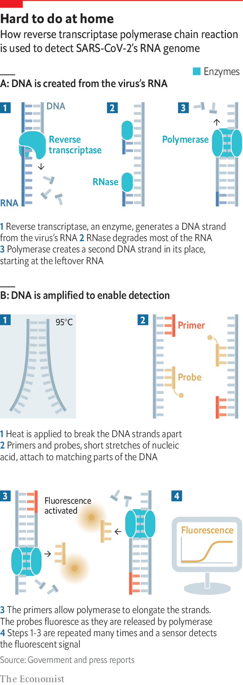
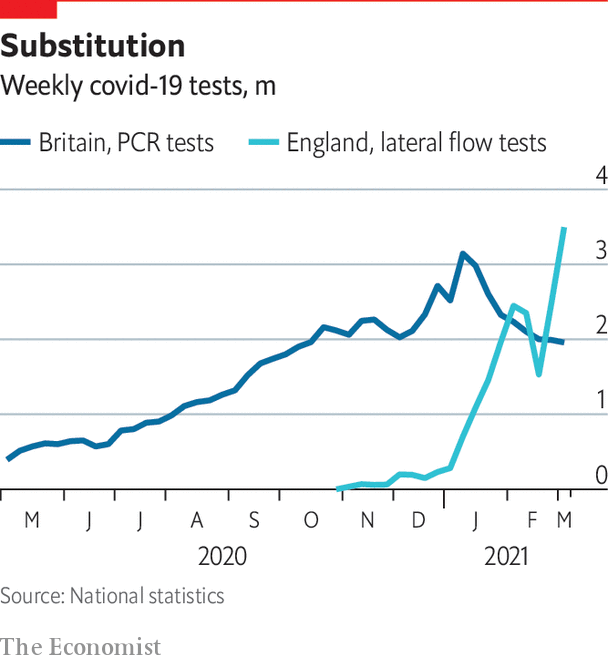
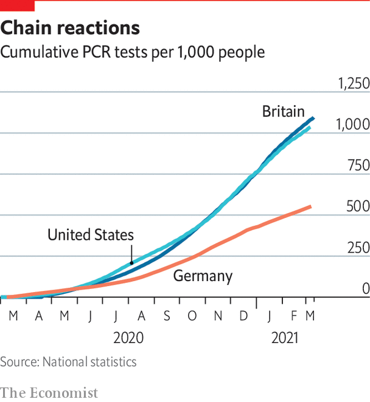

###### After a flying start

# Testing and tracing could have worked better against covid-19 

##### Many countries did not use the technology to its utmost 

 

> Mar 23rd 2021 

T HE FIRST outbreak of a novel disease is the opening scene of a whodunnit. In 1976, when more than two dozen members of the American Legion died after a convention in Philadelphia, public-health officials spent months scouring the hotel they had met in before finally tracking down the culprit in the water tank on the roof: a new bacterium which, having caused the first known cases of Legionnaires’ disease, was named Legionella. In the 1980s it took years of hard work and acrimonious argument among epidemiologists and virologists to blame the terrible and varied symptoms of AIDS on HIV, a virus of a type never previously seen in humans.

For covid-19, the mystery was solved almost as soon as it had begun. The novel pneumonia that doctors in Wuhan noticed in December 2019 immediately brought to mind Severe Acute Respiratory Syndrome (SARS), a disease caused by a coronavirus which broke out in 2002. As a result of SARS and the subsequent outbreak in 2012 of Middle East Respiratory Syndrome (MERS), also caused by a coronavirus, there were already established protocols for growing cells from the lining of the nose, throat and lungs in order to look for coronavirus infection. They were soon put to use.


To identify the possible coronavirus responsible meant producing a sequence of its genome. The first step in this process was to extract RNA—the molecule on which coronavirus genomes are written—from the cell cultures. The genetic sequences in these RNA molecules then had to be transcribed into complementary bits of DNA, because that is what automated sequencing machines work with (see part A of diagram).

 


Computer programs assembled the sequences those machines produced into a recognisable, if gappy, coronavirus genome. Researchers used this to make DNA “primers” with which to fish out the not-yet-sequenced bits of the genome. Finished sequences were published less than two weeks after the process had begun. On January 12th 2020 the world knew its enemy—soon thereafter named SARS-CoV-2—down to the last letter of its genome.

In terms of the science done, this was all routine; the appropriate use of standard laboratory techniques. In terms of its impact, it was enormous. Knowing the viral sequence was fundamental to vaccination efforts, made it possible to track the virus’s evolution and, most immediately, made it possible to test people with a cough and see if they were infected. The first AIDS tests were not available until four years after medical science became aware of the condition they tested for. For SARS it took six months. Procedures for testing swabs from the nose and throat for RNA from SARS-CoV-2 were published 11 days after the genome sequence, on January 23rd.

There was, however, a drawback to the tests. They required suitably equipped laboratories. Most countries did not have nearly enough of the relevant lab capacity; in others, much of it was being used for different things. “Prior to March 23rd my lab had never performed a viral diagnostic,” says Stacey Gabriel, who runs genetic-sequencing operations at the Broad Institute in Cambridge, Massachusetts. But with public institutions swamped she and her colleagues created one of the largest testing shops on America’s east coast from scratch, reconfiguring the specialised robots that populate one of the world’s most advanced cancer-genetics labs to do the grunt work.

Dr Gabriel learned two lessons in the process. The first is that uniformity matters a lot. The Broad started off testing samples from Massachusetts nursing homes which came in containers of varying size and with various amounts of liquid, some accompanied by handwritten forms, some by barcodes. Dealing with such messiness is no task for a robot, and so to begin with just a few thousand samples a day passed through machines capable of handling far more. The second is that you need software to track the whole process. Commercial software, dry swabs and barcoding soon had the lab firing on all cylinders. By March 2021 it could handle 200,000 tests a day and was serving customers as far afield as New York.

The data such labs produce are not just for patients and doctors. In most countries covid-19 is a notifiable disease; the authorities have a legal right to know who has been found to be infected. When a sample tests positive the lab has to pass the identity of the person it came from on to public-health officials. At that point a new sort of detective work begins: where did that person—the index case, in public-health speak—pick up the virus? To whom might they have given it?

Without a trace

Several East Asian countries demonstrated that, if started in the earliest days of an epidemic and pursued with vigour and persistence, such contact tracing can be a powerful tool. Some, such as Singapore and Taiwan, benefited in this from their experience with SARS in the mid-2000s; tracing systems set in place back then were put to use with an urgency born of experience. A level of invasiveness from which most Western authorities shied away was often employed. In South Korea, for instance, contact tracers were able to download a list of all financial transactions made by those who tested positive; they could then obtain CCTV footage from shops the index case had visited in search of other customers to check up on. “[Such snooping] has come up with discussions I’ve had with policymakers,” says Christophe Fraser, a digital epidemiologist at the University of Oxford. “We got very hung up on the idea of contact tracing disrupting people’s lives.”

Western governments acted in a slower, less thoroughgoing way. They failed to track the initial spread, in part because of insufficient testing capacity (and, in America, dud tests from the Centres for Disease Control and Prevention). They ended up with much less impressive systems. Tom Frieden, a former director of the CDC, says he thinks that, at its current level of effort, America could plausibly trace about 15,000 cases a day—a level that has been handsomely exceeded every day since April 2nd 2020. Britain has earmarked £37bn for testing and tracing over the 2020 and 2021 financial years, and though it may well spend less, the shoddiness that has dogged some elements of the campaign, such as a database cock-up which lost thousands of results in September 2020, will be remembered.

 


A basic problem is that contact tracing is a lot of work. Theoretical assessments based on analysing social networks and experience in Asia both suggest that some 30 contacts need to be identified for each index case. Digital tools can lessen the load. Resolve to Save Lives, a campaign run by Vital Strategies, an NGO, developed Locator, which taps into credit data to help tracers track down people who may have caught the virus from a specific index case. But the amount of work required remained enormous.

Apps and antibodies

A much discussed alternative to such programmes was to use the world’s most ubiquitous tracking devices: smartphones. Google and Apple worked together to develop a system which enabled phones to keep a list of occasions when they were near another phone for a significant period of time, and the identity of that second phone. When someone tests positive for SARS-CoV-2 they are asked to send a message from their phone which is used to notify all the other phones they had been near within a particular window of time. But everything is peer-to-peer; neither the big tech companies nor the public-health authorities get a list of contacts.

Unfortunately this built-in privacy makes it hard to assess the technology’s efficacy. British and Swiss studies suggest such apps do reduce spread, but not enough to make them more than an also-ran technology. None of the successful contact-tracing systems in East Asia relies on such things to any significant extent.

Even without good tracing, self isolation of those who tested positive helped slow the spread of the disease. But over time the shortcomings of the initial testing technology, reverse-transcriptase polymerase chain reaction (RT-PCR), became ever more apparent. It is conceptually elegant (see diagram) and easy for labs to use. But despite its familiarity, reliability and sensitivity, it has real disadvantages.

One is that it needs labs, and is carried out most efficiently in big ones. This means samples may have to travel a long way. It also means that they can get held in queues. The Broad runs its RT-PCR tests in just three and a half hours; but the average sample takes 15 hours to process. Results from RT-PCR tests normally come in days not minutes.

 


Another problem is that though the presence of viral RNA clearly shows that a person has been infected, it says very little about where they stand in the course of the disease; RNA is detectible from very soon after infection to long after the disease has run its course. In public-health terms what is needed is a test that spots people who are actually infectious—people with cells in their noses and throats actively churning out virus particles.

To look for the SARS-CoV-2 particles themselves means looking for their distinctive protein components, not for the RNA that tells cells how to make them. The most detectible such component is the spike protein which studs the particles’ outer membranes. And one of the basic rules of modern biotechnology is that when you want to find a protein, use an antibody.

Antibodies are large molecules that come in millions of varieties, each of which sticks to one target—known as that antibody’s “antigen”—and one target only. A handy technology called lateral-flow testing makes use of that specificity. A sample is placed at one end of a porous membrane and, as it seeps along to the other, encounters a line of antibodies designed to recognise it. When the sample is urine and the antigen is a hormone found in expectant women, you have a pregnancy test. When the sample is mucus from a swab and the antigen is the spike protein, it is a covid-19 test—a cheap, convenient one which can provide results with in half an hour. Such tests may not pick up all the people in whom RT-PCR might detect a trace of the virus. But if their nose and throat cells are not producing enough antigen for the test to detect, they are probably not producing enough to be infectious, either.

At the beginning of the epidemic “the supply chain for the lateral-flow tests wasn’t there,” says Dr Gabriel. Chris Hand, the chairman of Abingdon Health, a British contract manufacturer of lateral-flow tests, says the main bottleneck was the speciality membranes that are part of every test kit. “They come on large reels of 100 metres plus, which go through automated equipment to add biochemicals by spraying them at low volumes,” he says. But once the biochemicals—the bespoke antibodies and some more generic bits and bobs—are ready, the production processes in place and the packaging sorted, the tests could be churned out by the million.

New technologies now reaching the market will further change the dynamics of test and trace. QuantuMDx is one of a number of companies developing automated PCR-in-a-box systems that provide results within a couple of hours. Jonathan O’Halloran, the firm’s boss, says the British company has been relying on its own testing system for the past 22 weeks, testing its 90 staff members every morning (they are free to decline). About once a week lunchtime brings the news that someone has tested positive; they are immediately sent home to isolate. When things are done this fast, the fact that RNA is detectable before people are infectious is a plus; isolating on the basis of an early PCR test means no one ever turns up to work infectious. The company claims not to have lost a single day to infection.

A combination of local, automated PCR and lateral-flow tests could be the basis of an ideal testing system—one which has a chance of keeping ahead of, and containing, a low level of disease rather than lagging behind one that is shooting up. Antigen tests would be used to scan the population for new infections. Those found would be referred to contact tracers; contacts who might have been infected could then be PCR-tested to find out which of them actually were.

Great for public health. No benefit, in itself, to the index cases who would wait, isolated, to see what fate the virus and their immune systems had in store for them—painfully aware that their next encounter with the wonders of modern medical technology could be in a hospital bed. ■

