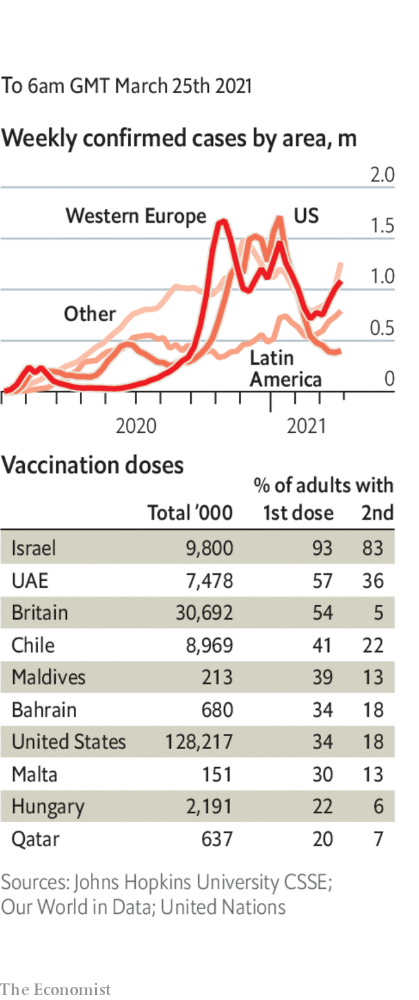

###### 

# Politics this week 

#####  

 

> Mar 25th 2021 

Myanmar’s army continued to shoot at demonstrators and rampage through neighbourhoods where there have been protests against the military coup. Among the victims was a seven-year-old girl, one of at least 260 people killed by the security forces since February 1st. Thousands have been arrested. A court hearing for Aung San Suu Kyi, Myanmar’s deposed leader, had to be adjourned because of problems with the internet, which the army has shut down.

North Korea fired two ballistic missiles off its east coast, a reminder to Joe Biden that the regime remains a threat to stability in East Asia.


Two Canadians went on trial for espionage in China, in separate cases. Western diplomats believe their arrest two years ago was in response to the detention in Canada of an executive at Huawei.

 against several Europeans, including members of the European Parliament and academics. Its action followed co-ordinated declarations by America, Britain, Canada and the EU of sanctions against four Chinese officials involved in the persecution of ethnic Uyghurs in the Chinese region of Xinjiang.

The row over the covid-19 vaccines deepened, as the European Commission in Brussels published proposals that would allow the EU to block the export of doses to countries that do not themselves export vaccines to Europe, or that already enjoy significantly higher inoculation rates than the EU does.

Germany's chancellor, Angela Merkel, suffered an embarrassing defeat when she reversed a tightening of lockdown rules over Easter following objections from the leaders of many of Germany's 16 states. Infections are surging again in Germany and many other EU countries, leading to tougher restrictions in a number of them, including France.

Turkey's president, Recep Tayyip Erdogan, fired his central-bank governor after he raised interest rates to tame inflation, as central-bank governors do.  by the sacking, and the lira sank. This is the third central-bank chief Mr Erdogan has dismissed in two years.

, Scotland’s first minister, survived a vote of no confidence. This came after a parliamentary inquiry concluded there were flaws in her government’s handling of sexual-abuse allegations against her predecessor, Alex Salmond, though an independent inquiry cleared her of breaching the ministerial code. She still hopes to win big in an election in May.

 in a parliamentary election, the fourth in less than two years. Likud, the party of Binyamin Netanyahu, the prime minister, won the most seats. But his right-wing bloc looks to be short of a majority. The opposition, meanwhile, is fragmented. If neither side is able to form a government, Israel will probably hold a new election.

Saudi Arabia to the Houthi rebels in Yemen. The kingdom has been fighting on behalf of the Yemeni government, which was dislodged by the Houthis in 2015. The Saudis offered to ease a blockade; the Houthis said this wasn’t enough.

Jihadists raided several villages in Niger near its border with Mali, killing at least 137 people. This year has seen a marked deterioration in security in the region.

Denis Sassou Nguesso won re-election as , which he has ruled for 36 years. Various countries, including France and America, have taken steps to confiscate his family’s assets, alleging they were bought with embezzled funds.

The state-funded Ethiopian Human Rights Commission accused Eritrean troops of killing more than 100 civilians in the Ethiopian city of Axum in November. Ethiopia’s prime minister, Abiy Ahmed, has acknowledged that Eritrean troops crossed the border during Ethiopia’s civil war against the northern region of Tigray.

In New York a jury found Geovanny Fuentes Ramirez guilty of trafficking cocaine. During the trial Juan Orlando Hernández, the president of Honduras, was repeatedly mentioned in the proceedings. Mr Fuentes Ramirez claimed that he had bribed Mr Hernández and let him access millions of dollars-worth of the drug. Mr Hernández denies all allegations.

Joe Biden put Kamala Harris in charge of co-ordinating efforts with Mexico, El Salvador, Guatemala and Honduras to reduce the flow of migrants attempting to cross the US -Mexico border. The vice-president’s priority is to stop unaccompanied children being sent to America; around 11,000 were detained between February 28th and March 20th, up from 5,600 in January.

Virginia abolished the death penalty, the first state in the American South to do so. It had executed more convicts than any other state, bar Texas.

America’s Supreme Court said it would look at reinstating the death sentence handed down to Dzhokhar Tsarnaev, the surviving bomber of the Boston marathon in 2013. Last year a federal appeals court found problems in the jury selection at Mr Tsarnaev’s trial, and ordered a new hearing to determine his sentence.

Coronavirus briefs

 


Amid a surge in cases, the Indian government was urged to speed up its inoculation programme. Only 44m doses have been administered so far.  so that they can be used domestically.

Imran Khan, Pakistan’s prime minister, tested positive for covid-19, apparently with only minor symptoms.

Despite having the best vaccine programme in Latin America, Chile went back into quarantine. A rise in infections has possibly been caused by many people taking holidays in January and February, and excess confidence in the vaccine roll-out.

In Britain the government said it was considering making it mandatory for care-home workers to get the jab.

Spectators from overseas were banned from the Tokyo Olympics, which start in July.

