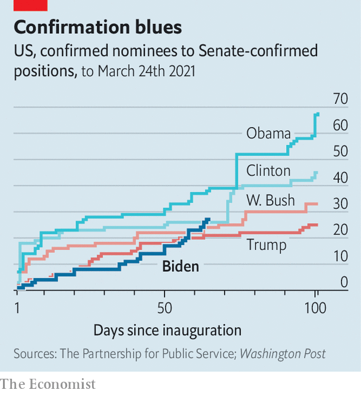

###### Patronage games

# Why is it so hard for Joe Biden to hire people? 

##### Nobody seems ready to reform Washington’s agonisingly slow appointments process 

 

> Mar 25th 2021 

ALL AMERICAN presidents are empowered to appoint thousands of true believers to turn their campaign promises into policy. But all modern presidents have struggled to get these people into their jobs. Joe Biden is no exception, at least when it comes to the roughly 1,100 appointees who require Senate confirmation. By March 24th, two months into his administration, after Rachel Levine, nominated as assistant secretary of health, became the first openly transgender federal official to win Senate approval, Mr Biden had obtained the confirmation of just 27 people. That puts him slightly ahead of where Donald Trump was at this point, but behind Barack Obama (see chart).

America has far more political appointees in its federal government, some 4,000 in all, than any other developed democracy, according to David Lewis, a political scientist at Vanderbilt University. No one ever really stops to wonder whether, if so many roles can sit empty, all these jobs are needed in the first place.


Presidents used to be free to hand out every job in the government. But in 1881 a spurned office-seeker assassinated President James Garfield. His successor, Chester Arthur, signed into law the act creating the civil service and, with it, the seeds of a permanent bureaucracy that would grow from administration to administration, developing many fine public servants along with an unknown quantity of rot.

 


To advocates of the system, preserving a large number of senior positions for presidential appointment to manage the vast bureaucracy makes sense. It should create more accountability, bring new energy and expertise into government, give officials in outlying departments or embassies a direct line to the White House and expose more citizens to public service. But things have generally not worked out that way.

One reason is that the Senate, especially when controlled by the rival party to the president’s, can be hostile to an administration and its appointees. Another is that presidents, and the people they succeed in appointing, tend to get very busy right away with matters besides hiring. A study in 2010 by Mr Lewis and a colleague, Nick Gallo, found that appointees were reliably worse managers than career officers—and those that came from presidential campaigns or political parties were the worst. 

Every appointment is a wrangle. Interest groups mobilise to push their candidates; campaign donors work the phones to plead for ambassadorships; sometimes a senator blocks a nomination for a time, to gain leverage against the White House over some distantly related matter. It took Mr Obama an average of 510 days, and Mr Trump an average of 525 days, to get each assistant secretary of state confirmed, according to the Partnership for Public Service, a non-profit group.

Wise in the ways of Washington, the Biden people anticipated the glacial Senate confirmation process and came up with a novel workaround. They had more than 1,000 appointees who didn’t require confirmation ready to go as soon as the president was inaugurated. In this category of jobs, that puts Mr Biden far ahead of both Mr Trump and Mr Obama.

But Mr Biden’s hack of the appointments process will carry him only so far. In the departments and agencies, the top positions generally require Senate approval. Acting and career officials may fill some of the vacancies, but until a confirmed leader arrives to make decisions they are just warming the seats. This is said to be the case now at the , which, across the government, has the  that must be filled with Senate-confirmed appointees. 

The secretary of state, Antony Blinken,  back in January. But he does not yet have an under-secretary for arms control and international-security affairs to advise him on dealing with Russia or . He has no under-secretary for civilian security, democracy and human rights, nor a co-ordinator for counterterrorism or chief of protocol. The administration has yet to nominate, let alone secure confirmation for, any of the 22 assistant secretaries. Dozens of embassies lack an ambassador, each of whom must be confirmed by the Senate.

In 2020 only 21% of the posts of assistant secretary or above were held by career officials, compared with 60% in 1975, according to the Partnership for Public Service. A similar though less extreme trend has shifted the balance of ambassadorships towards political appointees. The Biden administration has indicated it intends to reverse these trends by appointing more career diplomats to senior posts.

But that means disappointing more donors and other supporters, raising the stakes even further for each choice that remains in the president’s gift. Add to this consideration the priority Mr Biden places on diversity and the reality of how homogenous the ambassador corps is—only five of 189 ambassadors are black—and the maths become even more complex.

Mr Blinken got some good news last week: one of his deputies, Brian McKeon, finally cleared the Senate. Mr McKeon’s remit is resources and management. He has his work cut out for him. ■


A version of this article was published online on March 21st 2021

