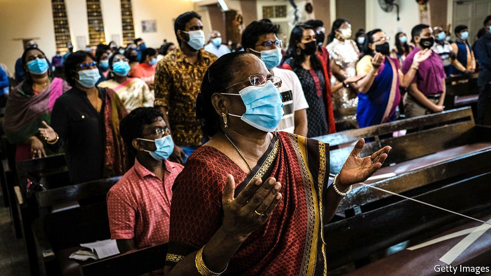

###### In the name of God

# Malaysians are fighting one another over the word “Allah” 

##### Can anyone use it, or should only Muslims be allowed to utter it? 

 

> Apr 3rd 2021 

THE FIRST tenet of Islam is La ilaha ill’ allah—“There is no deity but God.” Allah is simply the word for God in Arabic and several other languages, including Malay. But Malaysia’s home ministry decreed in 1986 that the word Allah, among others, would henceforth be reserved for the exclusive use, in print at least, of Muslims, who are more than 60% of the population. Christians and other religious minorities had to find other ways to refer to God. The intention was to prevent pious Muslims from being confused and then led astray by non-Muslim texts. In mid-March the Malaysian High Court struck down the ban, finding in favour of Jill Ireland Lawrence Bill, a Christian woman who took the government to court for confiscating Catholic tracts with the word Allah in the title. The government has appealed.

It is a long-running dispute. In 2009 a court ruled in favour of a Catholic newspaper, the Herald, which had sued the home ministry for its right to refer to God as Allah. The judgment set off days of protests and arson attacks on churches. The government appealed then, too, and a few days later the court set aside its own ruling. In 2013 an appeals court reconfirmed the ban. 


This time the argument is unfolding in newspapers and online rather than on the streets. The government has played the issue down. Even the leader of PAS, an Islamic party in the ruling coalition, has made conciliatory noises. The police chief denounced talk of demonstrations from a leader of UMNO, a party that represents Malays—the country’s biggest ethnicity, who are deemed to be Muslim by law.

One reason for the caution is the fear that protests might propagate covid-19. But a far bigger one is simple politics. UMNO led the governing coalition in 2009. It worried about losing Malay votes to PAS, so it affected pious outrage. These days three different parties compete for the Malay vote: PAS, UMNO and Bersatu, which is led by the prime minister, Muhyiddin Yassin. His shaky government has repeatedly dodged no-confidence votes owing to covid-related lockdowns. Should it fall, minority voters are likely to hold the key to power at a new election, making the Allah row something of a liability.

This has allowed minority activists to take the lead. In Sabah and Sarawak, the two states in the Malaysian part of Borneo where most of the country’s Christians live, and where Malays are in the minority, it has even brought politicians together. A letter signed by 54 state and national legislators, including nearly a tenth of the lower house of parliament, called on the national government and the people to accept the court’s ruling. Wilfred Madius Tangau, the lawmaker who organised the statement, is keen to stress that the issue is a cultural rather than a religious one. The use of Allah by Christians is only surprising to Muslims on the Malaysian mainland, he says. On Borneo, “it has not been a problem for Muslims. They are used to it.”

Things could yet take a nasty turn. The sultans of Selangor and Johor, who are the heads of the Islamic faith in their states, have backed the appeal. If the case is still rumbling during the next elections, which may be held later this year, expect God’s name to get a thorough airing. ■

