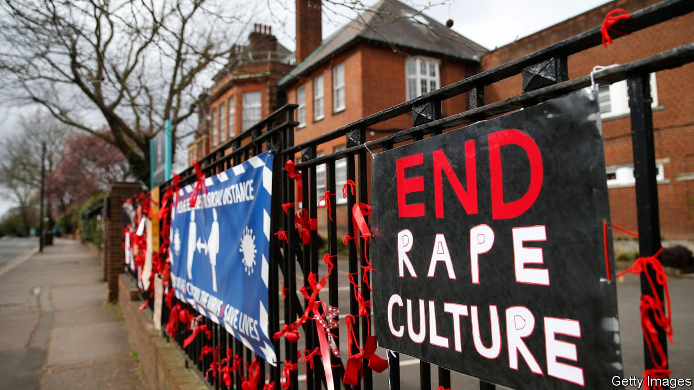

###### Girls aloud

# Britain’s private schools are caught in a sexual-abuse scandal 

##### A wave of testimonies draws attention to the behaviour of male pupils 

 

> Apr 3rd 2021 

FOR CENTURIES, Britain’s public schools (a term for private schools designed to baffle people who didn’t go to one) were notorious for the “fagging” system that allowed older boys to abuse younger boys. Barely have they washed that taint from their reputations than another emerges. Over the past month, a wave of testimonies have been published of sexual harassment, assault and rape of girls—and private schools are their focus.

After a series of stories of abuse by pupils of some of the country’s top boys’ schools, Soma Sara, a former pupil of Wycombe Abbey, a top girls’ school, created a website entitled Everyone’s Invited. It now displays more than 11,000 testimonies of abuse. London’s Metropolitan Police is encouraging victims to come forward and the National Police Chiefs’ Council (NPCC), the umbrella organisation of chief constables, is investigating them.


The story raises three questions. The first is whether this is a private-school problem. According to two analyses of the testimonies on Everyone’s Invited, a large majority were about private schools. Detective Superintendent Mel Laremore, the Met’s lead for rape and sexual offences, told the BBC that “the private school element is there”, but that “it’s more widespread than private schools.”

If there is more abuse at private schools, that could be because more of them are single-sex, and boys at such schools tend not to see girls as human beings. That sounds plausible, but there’s no evidence for it, and mixed schools are not blameless. A survey carried out by the University of Warwick in 2017 found that more than a third of girls in mixed schools had experienced sexual harassment and a quarter unwanted touching. The bias may therefore be in the reporting. The press is more interested in posh schools with famous names than in state schools, and stories beget stories.

The second question is whether abuse is worse than it used to be, or merely more widely discussed. Interviewed by the BBC, Simon Bailey, chief constable of Norfolk and the NPCC’s lead on child protection, made it clear he thought something had changed. “There’s an erosion of an understanding of what normal sexual relationships look like,” which he put down to online pornography. Certainly, technology has widened the opportunity for sexual abuse through, for instance, the dissemination of sexual photos and videos, though it remains unclear whether there’s more physical abuse than in the past.

After stories from around the world of abuse in offices and universities, this is the first big scandal based in schools, which raises the third question: whether abuse in schools is particularly common in Britain. It may well be. In a survey of violence against women in Europe in 2014, Britain was the fifth-worst country: some 44% of women had experienced physical violence, sexual violence or both, compared with 33% in Europe as a whole; and the boy is the father of the man. Of the many leagues in which Britain wishes to outdo the EU, that is not one. ■

