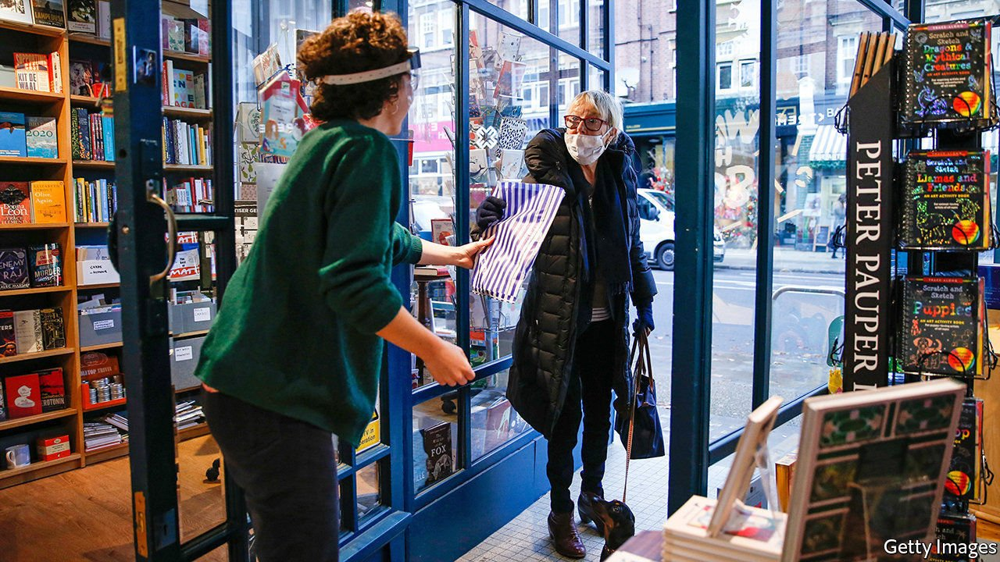
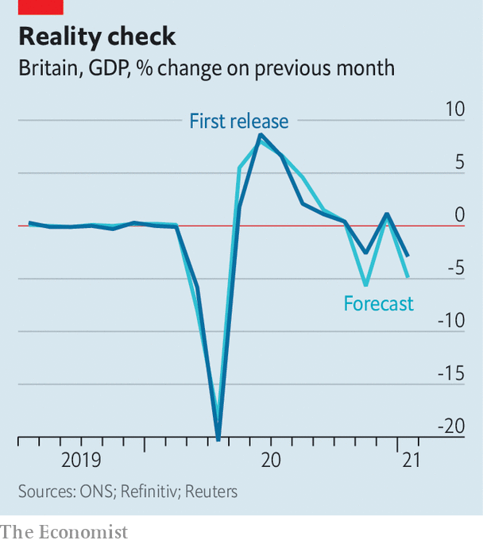

###### Beating expectations

# British firms are adapting to lockdowns—and confounding forecasters 

##### The country looks set for rapid economic growth 

 

> Mar 31st 2021 

FORECASTING THE economy during Britain’s first lockdown was relatively straightforward. A walk through any city centre told the same story as the real-time mobility data supplied by Google and Apple: ordering people to stay at home caused a collapse in economic activity. Forecasters accurately predicted the scale of the collapse as Britain experienced its fastest and deepest recession in a century.

Over the past few months the job has become trickier. Monthly GDP figures have beaten the consensus estimate of independent economists all but once since July (see chart). The second lockdown in November was only half as damaging to the economy as had been expected, and the third lockdown appears to be beating expectations too.

 


The main reason for this is that firms have adapted to new circumstances faster than expected. Retailers now have click-and-collect sales that allow for continued custom. Hospitality firms are set up for takeaway trade. Many construction and manufacturing businesses, which shut during the first lockdown, have chosen to remain open since.


Despite similar covid-19 restrictions to last April, around 4m fewer workers were furloughed in January. The same month GDP dropped by just 2.9% compared with a 20% fall last spring. And it is not just output that is beating forecasters’ expectations: the public finances appear to be in a healthier state than anticipated and estimates for the peak in unemployment keep being revised down. With the vaccine roll-out proceeding at pace, Britain looks set for rapid growth in the months ahead.

