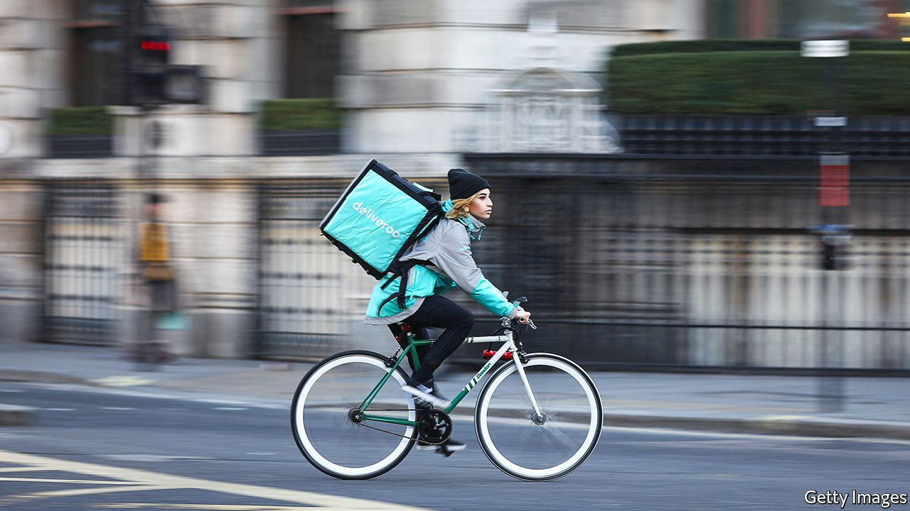

###### Cold dinner

# Deliveroo’s listing is less appetising than hoped 

##### That is bad news for the London Stock Exchange 

 

> Mar 31st 2021 

AS STOCK TICKERS go it is hard to beat “ROO”, a syllable that for many British investors will evoke a young marsupial from “Winnie the Pooh”. Deliveroo, an eight-year-old, kangaroo-logoed startup floated on the London Stock Exchange on March 31st at a valuation of £7.6bn ($10.5bn). It was one of the biggest and most anticipated British listings in years. But ROO signally failed to bounce: when the market opened the shares swiftly lost nearly a third of their value.

Deliveroo may have been fortunate to secure its high valuation amid choppy markets. Tech stocks have been falling of late. And starting a week ago, some of the City’s biggest fund managers—Legal &amp; General, M&amp;G, Aviva and Aberdeen Standard—made clear they would not be participating in the IPO. So, too, did Baillie Gifford’s James Anderson, who manages Britain’s biggest investment trust.


The reasons for the cold-shouldering were varied, and related. Deliveroo has suffered from growing criticism of the gig economy. In February Uber, a ridesharing firm that also delivers food, lost a long-running legal battle when Britain’s Supreme Court ruled it must treat drivers as workers, not as if they were self-employed.

Now critics of gig-economy practices are homing in on Deliveroo. An analysis of 300 couriers' takings during the past year found that one in three of its riders made on average less than £8.72 an hour, the minimum wage for those over 25.

That may be somewhat misleading. Edgar, a Deliveroo rider who works in south London, notes that couriers can choose to log in to the app from the suburbs, when they are still far from restaurants. That means a low average take if the whole period is counted, even though part of the time is akin to a commute. He makes between £9 and £11 an hour. Deliveroo allowed him to carry on earning when his usual restaurant jobs dried up during the first lockdown. One of the study’s lowest earners works in Yorkshire, where patches of low population density are common.


Nevertheless, City investors worry that Deliveroo’s gig-economy employment practices are unsustainable. It could face a regulatory crackdown, as Uber has. In IPO documentation the company warned investors that it faces legal inquiries in Britain, France, Spain, the Netherlands and other markets.

That big British institutions took such a high-profile stand on the “S” in “ESG”—environmental, social and governance—sets a precedent. It was the first time that prominent Western fund managers have publicly avoided a big IPO on such grounds. The protests were hardly up there with Extinction Rebellion glueing themselves to corporate offices. But for a conservative industry, they were fairly radical.

Their moves, and Deliveroo’s disappointing debut, will not help London win more tech listings. Deliveroo’s co-founder and chief executive, Will Shu, could have gone for New York, but Boris Johnson and others urged him to pick London. The boss of the stock exchange said that Deliveroo’s IPO highlighted British capital markets’ ability to support global tech companies. Rishi Sunak, the chancellor, hailed the firm as a “true British tech success story”.

To entice more listings, the government has recommended relaxing the rules. A review by Jonathan Hill, formerly Britain’s European Union commissioner in charge of financial services, concluded that Britain should give dual-class shares access to the “premium segment” of the regulator’s official list of securities, meaning entry to the main FTSE indices. Dual-class shares are a structure beloved of Silicon Valley founders as it lets them retain near-total control of their creations while cashing in.

Both Singapore and Hong Kong have allowed dual-class structures without suffering, notes Huw van Steenis, chair of sustainable finance at UBS, a bank. But the “G” in ESG is not helping London’s tech-listing ambitions either. The signs are that fund managers are opposed to the reforms: they added Mr Shu’s dual-class structure to their list of reasons to steer clear of Deliveroo. Each of Mr Shu's shares will have 20 votes as opposed to just one for everybody else's, for a period of three years.

Cynical observers suspect the institutions were grandstanding. Some of them have investments in other gig-economy companies, notably Uber. Their true worry was probably the firm’s ropy business model. In contrast to, say, the software business, in food delivery costs go up largely in line with revenue.

Last year, after a bid by Amazon to take a stake triggered an investigation by the Competition and Markets Authority, Deliveroo kept the investment partly by arguing it would go bust without Amazon’s help. That was in the depths of pandemic-related panic, and Deliveroo’s revenues later soared as people ordered in. But the firm still lost £224m in 2020.  as vaccine roll-outs herald the reopening of restaurants.

There was never any doubt the show would go on. Deliveroo won enough takers for its shares on the very first morning of its roadshow last week. Even with the sharp intraday price drop after listing the firm is still worth around the same as Sainsbury’s, a supermarket giant. But Deliveroo’s IPO travails will undoubtedly leave a bad taste—rather like Roo being dosed with extract of malt. ■


