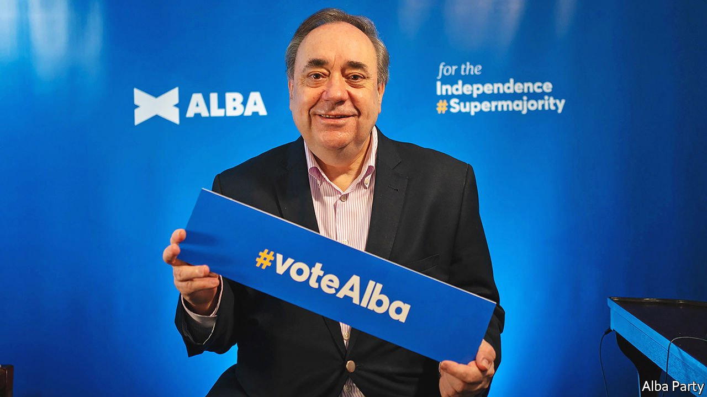

###### When separatists separate

# The return of Alex Salmond 

##### The former leader of the Scottish National Party has a new party, and some radical ideas for independence 

 

> Mar 31st 2021 

SUCCESSFUL POLITICAL parties are coalitions, and the Scottish National Party’s has been expansive. Over the years it has been divided on Europe, NATO and devolution. It has lured those who dream of a socialist Scotland, and those who think it can be a low-tax rival to Ireland. Young Scandiphiles rub elbows with old Anglophobes. Electoral success and growing support for independence have bound it together.

On March 26th, the party split. Alex Salmond, Nicola Sturgeon’s predecessor as first minister and its leader in the independence referendum of 2014, announced that he was leading a new party, called Alba. The Scottish Parliament’s electoral system comprises constituency and list seats, and is geared to stop one party becoming too powerful. Mr Salmond would like independence supporters to game this system, and back the SNP with one vote and Alba with the other, to create a parliament with a “supermajority” for independence.


To many, it looks like revenge. Last year Mr Salmond was tried and acquitted on charges of sexual assault against ten women. He accused Ms Sturgeon’s inner circle of a political plot to have him jailed, and he is suing the Scottish government over its handling of complaints against him. She doubts his fitness for office.

But Mr Salmond is also prising open a growing fissure in the SNP over how to achieve independence. Under the Scotland Act which governs devolution, the union is the preserve of Westminster. The referendum of 2014 took place after the British government granted a legal instrument, known as a Section 30 order. Persuading Boris Johnson to do so again is Ms Sturgeon’s strong preference; only if a referendum is recognised in London will it result in exit negotiations and statehood. Otherwise, it is a dead end.

Many nationalists are sick of waiting, and are toying with more radical options. Mr Salmond has offered himself as their leader. A big nationalist majority in the Scottish Parliament would be a “mandate to negotiate”, he argues. “It is a fundamental mistake to put forward the Section 30 as the Holy Grail.” He cites the “velvet divorce” that split Czechoslovakia in the early 1990s as an example of a break-up that was preceded by an election, rather than a referendum. He won’t be pinned to a strategy, but says options could include a plebiscite organised by the Scottish Parliament, securing international pressure, a constitutional convention of lawmakers or demonstrations.

Two SNP members of parliament and a handful of councillors have defected to Mr Salmond’s new party, but he probably won’t force a major exodus at the ballot box. Some 79% of SNP voters say they have an unfavourable view of him, a similar figure to Tory voters.

He could still find a niche. The SNP has become more Europhile since Brexit, and there is a split in the party over trans rights. Jan Eichhorn of the University of Edinburgh thinks he could win over socially conservative, pro-Brexit nationalists. Mr Salmond says he would like to attract working-class Scots who were animated by the referendum in 2014. The party has been held together by success, says Heinz Brandenburg of the University of Strathclyde: “Now, the cracks are just showing at the most inopportune moment.”

Mr Salmond may cause more damage if he fails to find such a niche. Rather than creating a parliament stuffed with nationalists, Mr Salmond may fall short of winning seats, while also denying the SNP the list seats it needs to form an overall majority. The SNP strategy has long been to win the trust of suburban Scotland through cool-headedness. Alba may frighten away persuadable voters, says a veteran. 

Some of Ms Sturgeon’s supporters are happy with the split. “He can have all the cranks that think we’ll win independence by hanging flags off bridges, and we’ll get on with speaking to the people we need to persuade,” says one. “I’ve never had a colonic irrigation but I imagine this is what it feels like.” Mr Johnson has several reasons to continue to refuse another independence referendum. Watching the once-disciplined nationalists scrap over strategy is a compelling one. ■

