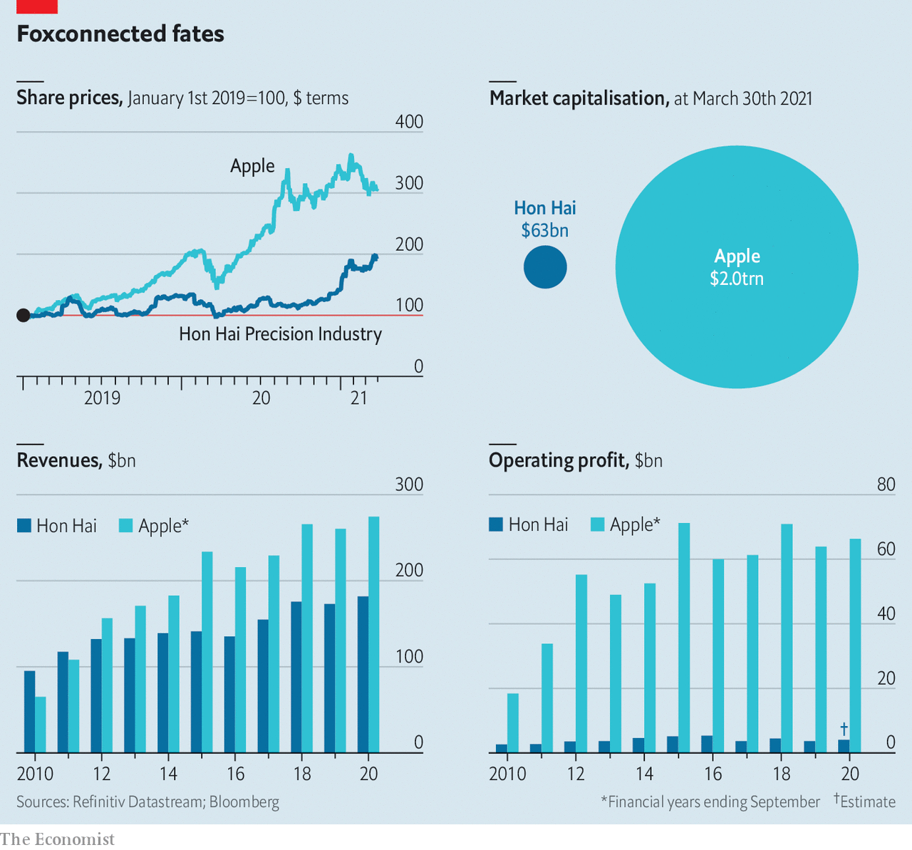

###### Riding Hon Hai

# Hon Hai, Apple’s biggest iPhone assembler, is eyeing cars 

##### The contract manufacturer has thrived amid the pandemic, in line with its biggest customer. Now it wants to diversify 

 

> Apr 3rd 2021 

 


HON HAI PRECISION INDUSTRY is as obscure as its main client is famous. On March 30th the firm, also known as Foxconn, reported record sales of $182bn in 2020, thanks to demand for the Apple gadgets it assembles. Its market value has doubled in a year, to $63bn. It is now eyeing smartphones on wheels. Analysts think it could be making 1m electric cars by 2025. If so, it may overtake Apple, whose iCar plans look less advanced.■

