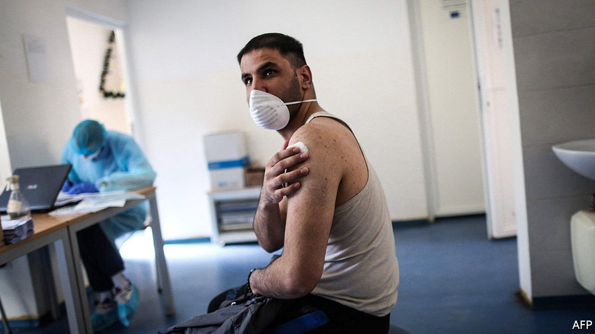
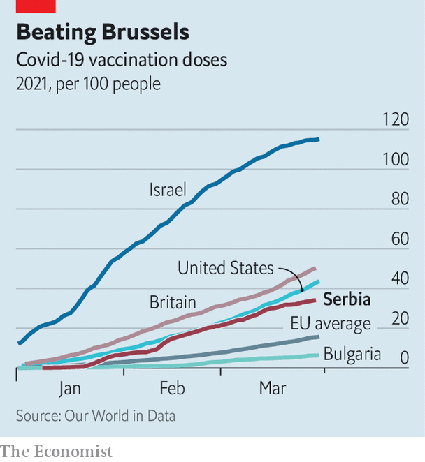

###### Vial stuff

# Serbia is outpacing nearly every country in the EU at vaccination 

##### Poor, autocratic and happy to take vaccines from Russia and China 

 

> Apr 3rd 2021 

SERBIA MAY not have had such glowing press coverage since the first world war. A poor country by European standards, and plagued by corruption, it nonetheless has one of the world’s fastest covid-19 vaccination campaigns—third in Europe in total doses delivered per person. Thousands of Bosnians, Macedonians and Montenegrins have crossed the border for free jabs. President Aleksandar Vucic has been having a good pandemic. 

On the government’s health website Serbs can sign up to receive a Chinese vaccine, a Russian one, a Western one or whatever is available. About three-quarters of the shots given so far are Chinese. To obtain the sought-after Pfizer vaccine, you may need contacts. Foreigners get AstraZeneca, possibly because many locals do not want it. By March 27th 20% of Serbs had had at least one dose. Mr Vucic crowed that 30-year-olds in Germany would have to wait for ages to get their first jab.


Nevertheless, rates of infection and death are rising fast. Many Serbs do not bother to take precautions, says Ivan Kostic, a surgeon in the central town of Cacak, particularly those who have had their first shot. Unlike elsewhere in Europe, there have been no long lockdowns. The health-care system is run-down: Serbian hospitals have a quarter fewer staff than western European ones, estimates Dr Kostic, partly because so many have emigrated.

 


Worse, conspiracy theories are starting to undermine the vaccination drive. One study found 70% of Serbs believe in at least one covid-19 conspiracy theory, such as that it is a bioweapon or is spread by drug makers; in western Europe the rate is about a quarter. Since the 1980s, says Vedran Dzihic of Vienna University, Serbia has engaged in “hyper-production” of conspiracy theories, mostly xenophobic ones directed at Albanians, Bosnians, Croats or the Vatican. Now citizens have difficulty discerning crackpot tales from reality.

Yet Mr Vucic’s strategy of not putting his foreign-policy eggs in one basket has paid off. He has bought vaccines in Europe, Russia and China, and signed deals to produce the Russian and Chinese ones in Serbia. Both countries hope to use vaccine politics to undermine faith in the EU. Polls show it is working, though some Serbs think that China expects commercial favours in return.

The EU has promised Serbia recovery funds, but has yet to donate any vaccine. Meanwhile, Mr Vucic’s success at getting vaccine elsewhere lets him pose as a regional leader. Serbia’s neighbours have few illusions about his benevolence, says Florian Bieber of Graz University. But his prowess at “street-wise, gangster-style” politics, domestic and international, makes him a force to be reckoned with. ■

Dig deeper

All our stories relating to the pandemic and the vaccines can be found on our . You can also listen to , our new podcast on the race between injections and infections, and find trackers showing ,  and the virus’s spread across  and .

