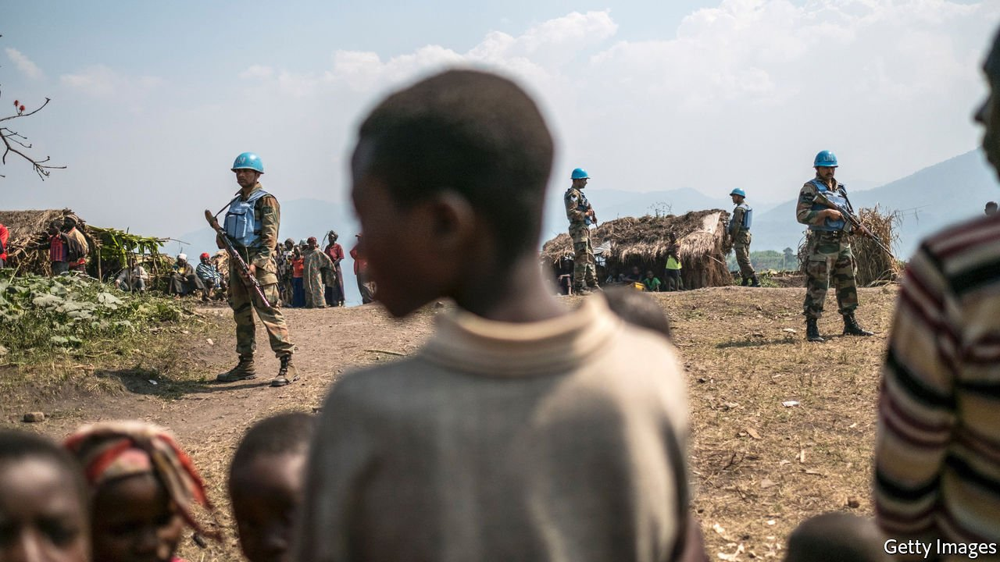
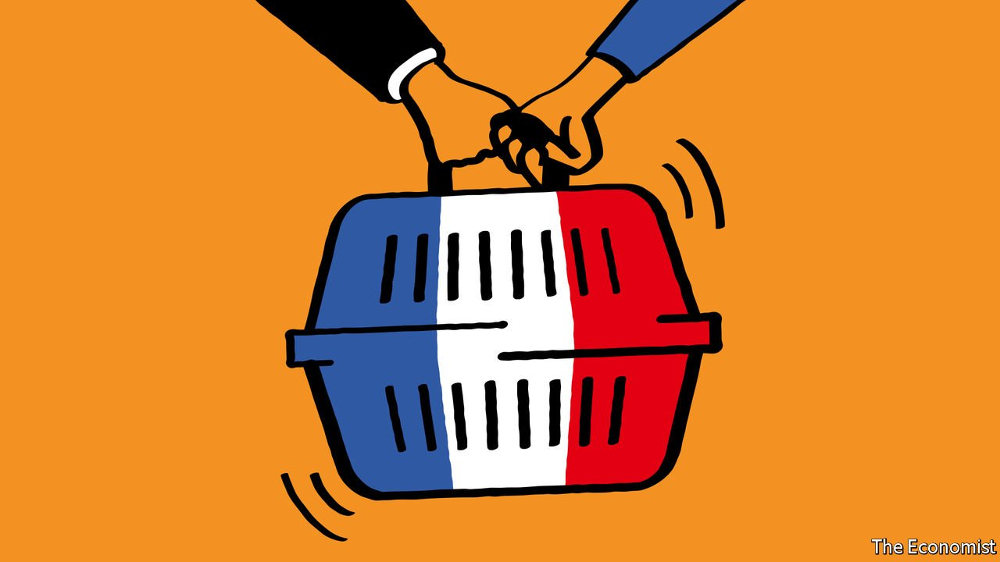

###### On the filibuster, UN peacekeepers, climate change, covid-19, cats

# Letters to the editor 

##### A selection of correspondence 

 

> Apr 3rd 2021 


Talking on your feet

Your briefing on the filibuster in the American Senate touched only lightly on one reason why it has become so overused: the fact that it is now so easy to deploy (”, March 13th). Currently, a senator or senators announce their intention to filibuster, a petition to end debate is filed, two days later there is a vote, and that is usually the end of the matter.


But rules do exist that can make it a much more tiresome affair by forcing senators to be physically present in the Senate chamber for a filibuster. Support among senators for this speechifying tactic may wane if it meant they had to spend more time in Congress.

WILLIAM MATTEA

Chief of staff to former senator, Carol Moseley Braun

Delavan, Wisconsin

The United States is a large and diverse country. Laws passed by its national legislature, if they are to be considered legitimate, should have a broad consensus along the lines of population and geography. Laws that fail have not attained that broad consensus. The filibuster is merely a procedural tool to ensure that legislation meets that bar.

However, since Congress cannot solve certain domestic problems at the national level, it may simply be time to reconsider whether they should be solved by the federal government at all. Our state governments are more than capable of tackling a large range of domestic issues, such as health care, education, energy policy and managing natural resources. Decentralising government would require some tax reform so that the states can generate enough revenue to enact expansive policies. But this would ensure both diversity and nuance in policies across the land.

We have been centralising power in Washington for generations. It is a proven loser. It is time to unwind it.

CRAIG WRIGHT

Louisville, Colorado

Senator John C. Calhoun of South Carolina used the filibuster, you said, to “nullify federal laws that might grant African-Americans rights” (“”, March 13th). Calhoun was an ardent supporter of slavery; but the Nullification Crisis to which you referred had nothing to do with rights for black people. His attempt to nullify the application of federal law to the South was a reaction to a tariff passed by Congress in 1828. The tariff increased the cost of manufactured goods for southern states (which had no industrial base) and potentially exposed slaveholders to retributive levies on cotton exports from European countries. As a result Calhoun, and other South Carolinians, argued that states should nullify federal laws, such as the tariff, that they deemed unconstitutional. It had nothing to do with the rights of African-Americans, which no national politician was contemplating in the 1830s.

RUFUS SACHDEV-WOOD

London

To illustrate the dangers of requiring supermajorities to govern, you noted how the European Union’s requirement of unanimity “has led to paralysis on critical issues such as the erosion of the rule of law in Hungary.” However, the unanimity requirement has been an obstacle only to denying the Hungarian government voting rights for breaching Article 7 of the treaty on European Union.

Yet the government could be found in risk of breach of the EU’s founding values with a feasible 80% vote. Such a determination would send a significant political message. Combined with the recently enacted law conditioning EU assistance on respect for the rule of law, which can be triggered by a qualified majority (55% of EU states representing 65% of the EU population), it would enable EU governments to press for compliance now.

KENNETH ROTH

Executive director

Human Rights Watch

New York

 


Peace on the ground

Your piece on UN peacekeeping unfairly criticised several of the largest countries that contribute troops (“”, March 21st, digital editions). The national caveats that you think make UN troops less effective have significantly decreased and do not have a big impact on operations.

Study after study has proved that the presence of peacekeepers on the ground directly equates to fewer civilian casualties. Recent research has shown that peacekeeping is also highly successful in preventing violence before it begins. Our contributing countries have responded positively to addressing performance-related issues. Their units are regularly evaluated and held accountable, and are sent home when they fail to meet expectations. Troops are not deployed when national caveats influence operational effectiveness. A comprehensive planning and performance-assessment system has been put in place in missions to ensure we are consistently making progress.

NICK BIRNBACK

Chief of strategic communications

United Nations Peace Operations

New York

 


Reporting climate impacts

“” (March 13th) reported on the regulatory push to make listed companies disclose their climate-related matters. The article said that “The flurry of rulemaking stems from a concern that climate change poses a threat to financial stability”, but questioned whether “this is true or not”. There is a scientific consensus about the adverse effects of climate change on the global economy, and the strong link between climate and financial stability is unquestionable. Most central bankers have no doubt about this relationship. What uncertainties there are relate to the timing, interplay and magnitudes of these effects.

In fact, the Bank for International Settlements has described the risks from climate-change-induced financial instability as “green swan” events (inspired by Nassim Taleb’s book “The Black Swan”). These are events that are almost certain to occur, only the exact manifestation is uncertain. In this context, corporate climate reporting is very important.

DAVID PAPP

Lead expert

Central Bank of Hungary

Budapest

 


Killed by covid-19

You offered two encouraging explanations for why happiness declined less among the old than among the young during the pandemic: video-chatting with family and “knowing that society made sacrifices to protect them” (“”, March 20th). You also noted that the old feel healthier. Isn't there a third, much sadder possible explanation? The least healthy and probably least happy among the old were hit hardest by the virus and we can no longer ask them how they feel.

JULIAN TERSTEGGE

Hamburg

 


Give kitties their due

I enjoyed the article on French presidential pets (“”, March 20th). You noted that Charles de Gaulle had a cat, but you did not mention that the feline in question was a Chartreux (named Gris Gris). Since all dogs are identified by breeds, this to me indicates that some people think less of cats than dogs, and do not realise that cat breeds are different.

LINDA CORUGEDO STENEBERG

Munich

