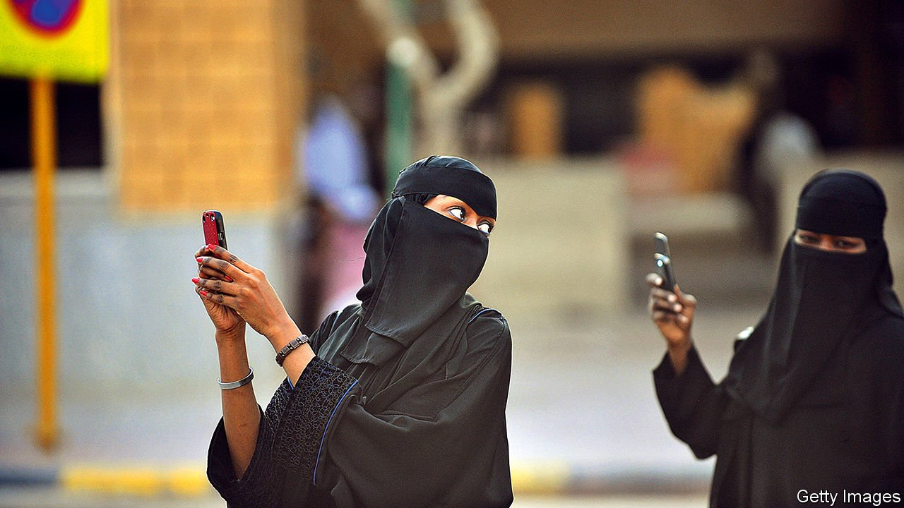

###### Apps and the oppressed

# Clubhouse gives Arabs a space to speak freely 

##### The region’s autocrats are taking notice 

 

> Apr 3rd 2021 

THE CONVERSATIONS can feel almost rebellious. Drift through the rooms and you hear heated talk of politics, business and religion. There is a frisson of flirtation too, with discussions about sex veiled in thin metaphors. And every so often someone stops to wonder when the police will crash through the door.

Clubhouse, a buzzy social-media app launched last year, was perfectly timed for the pandemic era. It is an audio-only service where users drop in and out of “rooms” for voice chats. Think of an endless smorgasbord of Zoom calls, but with faceless strangers instead of pixelated colleagues. Nothing goes viral because the chats are ephemeral: users cannot record or replay them.


Over the past two months Clubhouse has become a hit in the Middle East, a region already hooked on social media. A survey last year found that 46% of internet users in Arab countries spend at least five hours a day on social-media apps. They can’t all use Clubhouse. Sign-ups are by invitation only and so far it works only on iPhones, which many Arabs cannot afford. But those who can get into Clubhouse are having a blast.

The accents alone are a tour of the region’s linguistic breadth: the French-influenced patois of the Maghreb, the poetic flair of the Gulf. Some of the talk is quotidian, a sort of socially distanced sobhiyya (a morning chat over coffee). But in a region full of regimes hostile to free speech, it seems a safe space for heady conversations as well. In Lebanon there are rooms about how to limit the role of religion in politics. Women in Kuwait discuss sexual harassment. Citizens in other Gulf states take up taboo topics such as transgender rights.

These would be fraught conversations even on other social-media platforms. In Egypt, for example, police stop people on the street to inspect their Facebook feeds for subversive posts. A court jailed two young women last year for “debauchery” because they danced in a TikTok video (the sentences were later overturned). With a small user base and no permanent records, Clubhouse feels safer.

It is also more civil, at least for now. Saudis are enthusiastic tweeters. But to tweet about serious matters invites abuse from legions of trolls, some directed by a confidant of the Saudi crown prince, Muhammad bin Salman. Clubhouse’s spoken-word format makes it harder for governments to weaponise.

They will probably try—or just ban it outright. Last month Oman became the first Arab state to do so, saying it lacked a licence. Users in the United Arab Emirates have had unexplained problems gaining access to it (officially it is not blocked). Regime mouthpieces have started a campaign against it. Ahmed Moussa, a talk-show host in Egypt, said he uncovered a terrorist group on the app. Fahad al-Otaibi, a Saudi commentator, called it a “danger to state security”. Leaving a room not long ago, one Egyptian user offered a darkly funny goodbye: perhaps, he joked, “we can continue the conversation in prison.”

