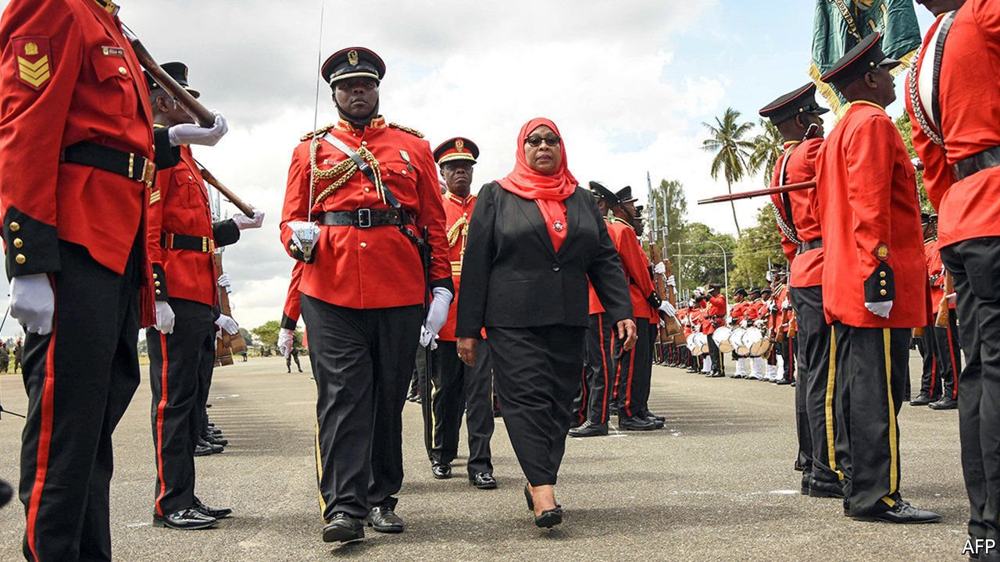

###### Hoping for change

# Tanzania’s new president surely can’t be worse than the old one 

##### Will Samia Suluhu Hassan reverse one of the most self-defeating coronavirus policies in the world? 

 

> Apr 3rd 2021 

TANZANIA’S NEW president, Samia Suluhu Hassan, vows to continue where her predecessor left off. Pity the country if she keeps her promise. John Magufuli, whose death was announced on March 17th, was a covid-denying populist who ran a ruthless authoritarian regime. Many believe that the virus killed him.

For the moment liberal Tanzanians are surprisingly upbeat, in part because they do not take Ms Samia, the country’s first female leader, at her word. She is a product of the ruling party, known by its initials CCM, which has held power in different guises since independence from Britain in 1961. But she is no insider. She comes from the semi-autonomous archipelago of Zanzibar, not the Tanganyika mainland, which is the hub of power.


Ms Samia was Mr Magufuli’s vice-president, but it is rumoured that she was foisted on him by CCM bigwigs. Foremost among these was Jakaya Kikwete, Tanzania’s president from 2005 to 2015, who is said to have admired her competent efficiency. Mr Magufuli valued it less and she was excluded from his inner circle. That is now seen as a reason for hope—as are the flashes of principle she has shown. In 2017, for example, she defied a presidential directive by visiting Tundu Lissu, a prominent opposition MP, as he recovered from being shot 16 times.

Still, few are expecting a radical departure from her predecessor’s policies. Not yet, anyway. Lacking a base within the party, Ms Samia will be concentrating on surviving the early stages of her presidency (inherited in accordance with the constitution), when she will be weakest. Mr Magufuli’s faction still holds dominant positions in the cabinet and the party.

She is not totally helpless, however. She may not have a base of her own, but she does have potential allies. With the support of Mr Kikwete’s previously sidelined faction, she was able to resist pressure to appoint Bashiru Ally, a Magufuli acolyte, as her deputy. Instead she tapped Philip Mpango, the finance minister, pleasing international donors. Still, she will have to avoid becoming too reliant on Mr Kikwete.

While foreign investors, often the butt of Mr Magufuli’s nativist policies, would welcome a return to the easy-going pro-market internationalism that marked the Kikwete years, many Tanzanians remember it as an era when corrupt patronage networks flourished. Kikwete factions “smell blood and sense a comeback”, says Thabit Jacob of Roskilde University. It would be sensible to look to the former president for cover rather than guidance.

Ms Samia’s first challenge will be to reverse one of the most self-defeating coronavirus policies in the world. Mr Magufuli responded to the pandemic with a blend of quackery and denialism. Turning his back on science, despite having a PhD in chemistry, he prescribed God, communion wafers and steam baths as prophylaxes. Unsurprisingly, the virus spread unchecked through the population.

A more sensible approach is desperately needed. Diplomats and the World Health Organisation hope the new president will again start publishing official data on the virus (after a year-long pause), sack the anti-vaxxer health minister and sign Tanzania up to the COVAX vaccine-sharing programme. Continuing to deny Tanzanians the jab would stain her reputation from the outset. Whether Ms Samia is for making such changes remains to be seen. In her first public appearances as president, she did not deign to wear a mask.■

