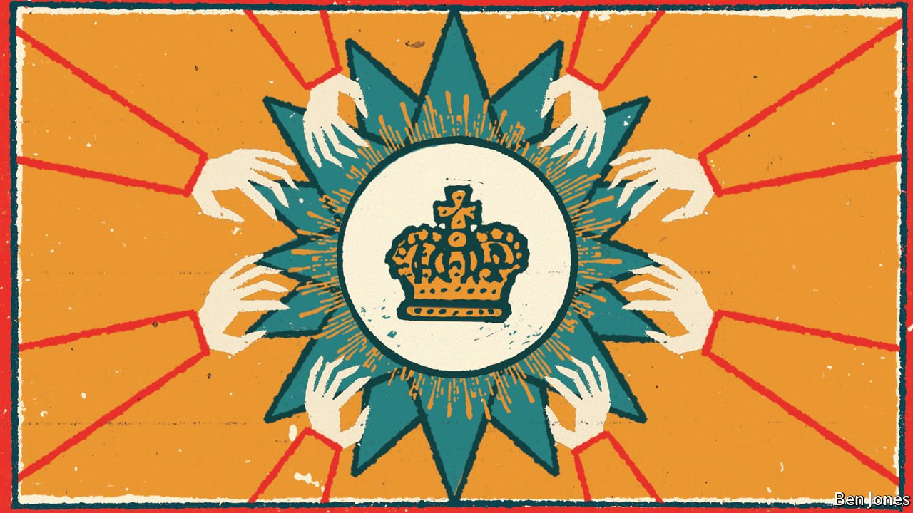

###### Chamorro tomorrow?

# A family of six Nicaraguan presidents looks to provide a seventh 

##### It may take an old dynasty to oust a younger one 

 

> Mar 31st 2021 

WHETHER THEY like it or not, Nicaraguans are in thrall to dynastic politics. In the 1950s the Somoza family dictatorship pulled off Latin America’s first parent-to-child transfer of power in almost a century. In 1979 Daniel Ortega banished the Somozas in a revolution. Today the autocratic Ortegas rule Nicaragua. Rosario Murillo, the vice-president, is Mr Ortega’s wife; their children run television channels. But neither clan comes close to the influence of the Chamorros over the past 150 years. They have provided six presidents—and may add a seventh, if elections later this year go their way.

Spanish in origin, the Chamorros rose to be a bastion of the establishment by the 1850s. Augusto César Sandino, a national hero, chided “nefarious chamorrismo” as a scourge Nicaragua needed to shed. From 1979, all three main newspapers were controlled by Chamorros.


But the name has come to denote duty and sacrifice as well as privilege. The catalyst for the revolution in 1979 was the murder of Pedro Joaquín Chamorro, the regime’s loudest critic. His widow, Violeta Barrios de Chamorro, ran for president and won in 1990, removing Mr Ortega from office until his return in 2007. Her son, Carlos, has become the country’s most famous independent journalist. He briefly went into exile after the anti-Ortega uprising of 2018 in which 450 people were killed. But he enjoys a degree of protection, some suggest, because the pitfalls of silencing a reporter with his name are so obvious.

In contemporary politics the name is a hindrance. One businessman winces while pondering the presidential candidacy of Juan Sebastián Chamorro, cousin to Carlos: “The only problem is he is a Chamorro.” “People are tired of the same surnames,” says a rival candidate. In her campaign in 1989 Violeta Barrios complained that the government would drop the “Chamorro” when mentioning her, implying she was not a true custodian of her family’s legacy. Today the opposite logic prevails. In a row with another aspirant, Cristiana Chamorro (daughter of Violeta), Ms Murillo described the Chamorros as an “opportunistic caste” that “thinks it deserves a crown”.

The opposition must pick a candidate by the end of May. Chamorro or not, he or she will have to beg for campaign funding from la gran capital, as Nicaragua’s half-dozen squillionaire tycoons are known (the richest, Carlos Pellas, is a distant relative). Then will come the harassment and vote-rigging by Mr Ortega’s henchmen and, possibly, disqualification from the ballot. A nasty game of thrones awaits.

