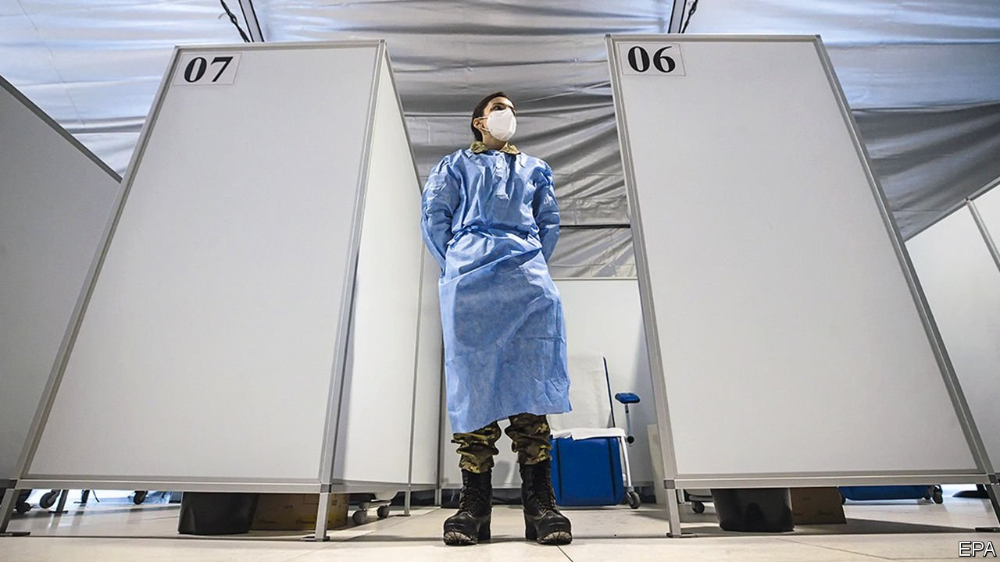
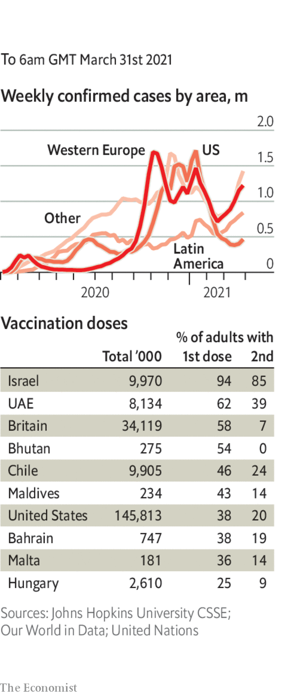

###### 

# Politics this week 

#####  

 

> Apr 3rd 2021 

The European Union outlined a mechanism to stop exports of covid-19 vaccine components to countries that do not export to the EU, or already have higher vaccination rates. Underlining the , Austria’s chancellor, Sebastian Kurz, threatened to try to stop the bloc from buying an extra 100m doses of Pfizer’s jab if his country did not get a bigger share. He has begun talks with Russia to buy vaccine. Britain, meanwhile, said a domestic factory would produce the new Novavax vaccine, which will reduce the country’s reliance on overseas production.

Despite surging infections Germany recommended that the AstraZeneca jab should be used mostly for the over-60s and limited among younger groups, because of concerns about blood-clotting. Angela Merkel said the country’s inoculation campaign “rests on the principle of trust”. The European Medicines Agency and the WHO continue to recommend the vaccine.


Talks to form a new Dutch government broke down after one of the negotiators tested positive for covid-19 and, while rushing to leave, was photographed displaying confidential notes.

A commission in Britain that was created after last year’s Black Lives Matter protests to investigate racial disparities concluded that race is less important than social class and family structure in explaining inequality. On schooling, the report found that most children from ethnic-minority groups did as well or better than their white peers. It added that the catch-all term BAME (black, Asian and minority ethnic) was not very useful. The report contradicted the claims of critical race theorists, some of whom claim that white privilege is the prime cause of most disparities.

Civil-rights groups lodged lawsuits against a new , claiming that its aim is to suppress turnout among black voters. The law’s supporters say the measures, such as new voter-identification requirements, are meant to streamline procedures.

New York’s state legislature passed a bill to legalise recreational marijuana, imposing a 13% sales tax on the drug for personal use.

China and Iran signed a 25-year partnership agreement. Details of the deal were not disclosed, but an earlier version included co-operation in areas such as energy, nuclear power and weapons development. The agreement brings Iran into China’s Belt and Road Initiative.

The authorities in Libya intercepted nearly 1,000 Europe-bound migrants at sea, said the UN. That brings the number of people brought back to Libya this year to around 5,000, many of whom are being detained in appalling conditions.

Jihadists fought the army in Mozambique for control of Palma, a hub for firms working on offshore gas projects. They killed dozens of people; witnesses reported seeing beheaded bodies in the streets. Thousands of survivors fled on boats to the provincial capital, Pemba. America accuses the rebels of links to Islamic State; others think they are driven largely by local grievances.

The police in  said 45 people died in a stampede during a public viewing of the body of John Magufuli, the late president. Mr Magufuli, who fought covid-19 with quackery, was given a hero’s burial. Many believe he died of the virus.

’s army continued its brutal campaign to crush demonstrations against a military coup. More than 100 people were killed on March 27th, the holiday on which, in a grotesque irony, Myanmar celebrates the armed forces’ contribution to the country. That has brought the death toll since the coup to above 500.

Australia’s prime minister demoted two politicians caught up in sex scandals. Christian Porter, the attorney-general, had been accused of rape when a teenager; he denies it. Linda Reynolds, the defence minister, had called a former member of staff who claimed to have been raped in parliament “a lying cow”.

Brazil’s president, Jair Bolsonaro, replaced six key government ministers, including General Fernando Azevedo e Silva as minister of defence. General Azevedo had resisted Mr Bolsonaro’s push for the army to participate in government affairs. In an unprecedented move, all three commanders of  quit to show solidarity with the general, plunging the Bolsonaro government into a crisis. Deaths from covid-19, meanwhile, hit a new daily record.

China’s parliament approved changes to Hong Kong’s electoral system. In future, candidates for the territory’s Legislative Council will need nominations from the Election Committee, a body stacked with backers of China’s Communist Party. Forty of the seats will now be filled by the committee. All candidates for election to public office will be vetted: those deemed unpatriotic will be struck off the list.

Experts from China and the WHO issued a report on their investigation into . It said the virus most probably jumped from animals to humans through an intermediate animal host, and that it was “extremely unlikely” that it had escaped from a Chinese laboratory.

Coronavirus briefs

 


The leaders of two dozen countries, including Britain, France and Germany, called for a new global treaty to fight pandemics. The declaration described covid-19 as “the biggest challenge to the global community since the 1940s”.

A second wave of covid-19 continued to surge in India, with detected daily cases exceeding 60,000 several times. Pakistan is also suffering a new wave, in which the president, prime minister and defence minister have all tested positive.

The African Union signed a deal with Johnson &amp; Johnson to supply 220m doses of its single-jab vaccine to member states starting later this year.

The head of America’s Centres for Disease Control said she felt a sense of “impending doom” about rising infections in the country. Joe Biden said that 200m  by May 1st, double his previous goal.

