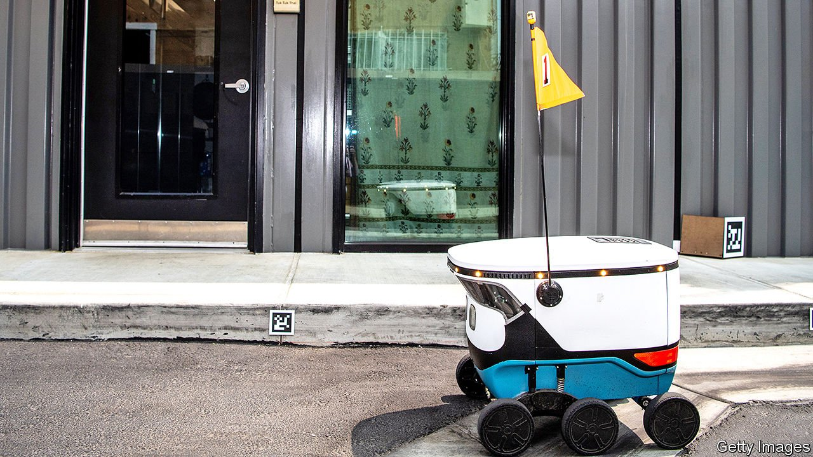

###### Ghost kitchens

# Cooking up a new business model during the pandemic 

##### Restaurateurs find a way to thrive without restaurants 

 

> Apr 3rd 2021 

A YEAR AGO Aaron Gordon supposed it was all over for his restaurant in a prosperous enclave of Washington, DC. The city had ordered restaurants to close for eat-in dining. But a surge in orders for takeout and delivery soon pushed his takings back up. Sensing an opportunity, he searched for a site to launch a takeout- and delivery-only business. Ghostline DC, a vast kitchen with space for six businesses to cook and box up food, is still going strong, he says, even as the city begins to let restaurants reopen.

Covid-19 has been calamitous for many restaurants across America, as elsewhere. But for some it has presented an opportunity. Just as the pandemic has accelerated a trend in retail towards online sales, so has it hastened the rise of “ghost restaurants”, which offer food but no tables to eat it at. Uber Eats says it now has more than 10,000 delivery-only restaurants on its platform in America, up from 3,000 in 2019.


Big restaurant groups are launching delivery-only operations. In February Applebee’s launched Cosmic Wings, one of several chains with delivery-only chicken wings. Denny’s, another national chain, is launching two virtual brands from its kitchens. 

But smaller, independent outfits have been the nimblest. When the owners of Espita, a high-end restaurant serving Oaxacan food in Washington, realised that survival depended on takeout but that much of its fare, from ceviche to tacos, did not travel well, it started a side-hustle in burgers. “We hoped it would allow us to keep on our staff,” says Josh Phillips, a co-owner. Ghostburger now makes nearly as much as the core business did before the pandemic.

Steve Salis is about to open a takeout- and delivery-only food hall in Bethesda, a Maryland suburb of the capital, with kitchen space for several of his restaurant businesses including Federalist Pig and Ted’s Bulletin. He hopes Ensemble, as it will be called, will show how such models allow brands to set up outposts in new areas.

The delivery-only model has its drawbacks. Restaurateurs routinely use the word “hate” when they talk about the third-party delivery apps upon which they depend to reach customers. Though some cities, including Washington, imposed limits on the fees such apps could charge restaurants during the pandemic, they swipe a chunk of the savings restaurants make by going virtual. Because drivers stack orders in one geographical area together, to maximise efficiency, restaurants have to assume each order will sit in a car for an hour before it reaches the customer.

And the delivery model tends to miss out on lucrative alcohol sales. Americans love the convenience of ordering food. But the pandemic has reminded many that they can mix a cocktail perfectly well, and a lot more cheaply, at home.

