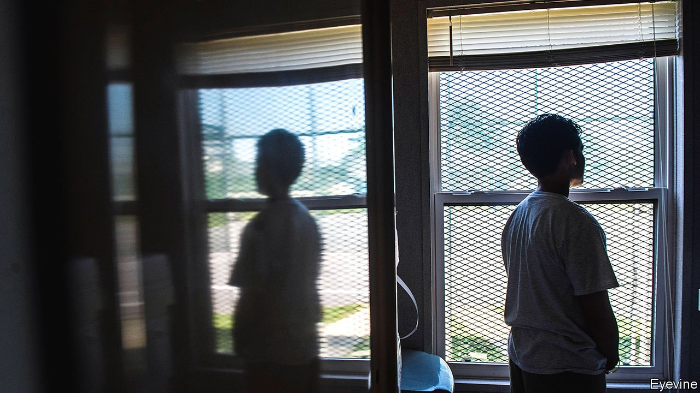

###### The juvenile criminal-justice system

# Reforming Maryland’s cruel treatment of young offenders 

##### Crime and excessive punishment 

 

> Apr 3rd 2021 

WARREN HYNSON’S teenage troublemaking, which began when he dropped out of school at 16, did not last long. Within months he was involved in a burglary in which the householder was shot dead. Mr Hynson was not holding the gun; he himself was shot and badly injured. But when he woke up in hospital he was charged with homicide. That is because Maryland has a “felony-murder” rule that allows people who commit certain crimes to be charged with murder if an accomplice kills someone. It also treats under-18s as if they are adults for some crimes. At 17, Mr Hynson was given a life sentence.

At Maryland Penitentiary in Baltimore, he recalls, he was pulled back from depression by educational programmes and art, and “I went from being ‘little brother’ to ‘brother’ and then ‘uncle’; even ‘pops’.” He was released in 2019 at the age of 45 after a judge reduced his sentence. Now working in a warehouse, selling his paintings and engaged to be married, he is haunted by the thought that men he befriended in prison as teenagers may die there.


America still charges under-18s as adults and puts them in adult jails, where they are far likelier to be assaulted and to commit suicide than other inmates. No other rich country does so. In the 1990s criminologists warned of a rising generation of young “superpredators” incapable of rehabilitation. After crime failed to surge as predicted and research into brain development showed that youngsters have greater potential to rehabilitate, states set about reforming their laws.

Since 2012, when the Supreme Court issued the first in a series of rulings that said the harshest sentence for juveniles—life without the possibility of parole—was unlawful except in rare cases, nearly half America’s states have abolished it. On March 30th Maryland became the latest to do so when it passed the Juvenile Restoration Act. This gets rid of life without the possibility of parole for under-18s and forces a review of all sentences for crimes committed under the age of 18 after 20 years have been served. More than 400 people could have their sentences reviewed as a result.

In Maryland, such a law is especially pressing because the state has the largest percentage of incarcerated African-Americans in the country, according to the Justice Policy Institute. Blacks constitute 31% of Maryland’s population but 70% of its prisoners. (The national average is 32%.) The Campaign for the Fair Sentencing of Youth (CFSY) says that, of inmates who have served more than 20 years of sentences handed to them as juveniles, 87% are black. Poor policing in Baltimore, Maryland’s biggest city, has played a part in this. So has a generation of Democratic leaders anxious not to appear soft on crime.

Maryland has lagged in justice reform in other important ways. It is one of only three states that require the governor to approve parole decisions, something those governors rarely do. In March Parris Glendening, a former Democratic governor, said he had made a “serious mistake” by refusing to grant parole to any lifers between 1995 and 2003. In 2019 Larry Hogan, a Republican, became the first governor in 24 years to approve parole for lifers sentenced as juveniles.

More change on the way

The state has no minimum age for prosecution. Children are routinely locked up before they appear in a juvenile court. Jenny Egan, a public defender, cites the recent case of a nine-year-old who spent the night alone in a cell after a friend of the teenager who was baby-sitting her tried to steal a car. When Ms Egan reached her, the terrified child could not stop shaking.

Children as young as 14 are charged as adults for certain crimes unless their lawyer can persuade a judge they should be moved to the juvenile system (which does not send children to adult prisons and puts a greater focus on rehabilitation). One lawyer recalls the recent case of a 13-year-old boy charged with attempted murder after a gang-related shooting from a car he was riding in. After the judge ruled that the child should be tried in an adult court he was sentenced to 40 years in prison.

Momentum for other reforms is building. One bill moving through Maryland’s legislature would remove the governor from parole decisions. Another would keep children under the age of 13 away from the courts. A third would abolish the felony-murder charge, under which Mr Hynson was convicted, for juveniles.

Abd’Allah Lateef, racial-equity specialist for the CFSY, says it is hard to exaggerate the tragedy long sentences for teenagers have wrought on families across America. At 17 he was sentenced to life without parole after he and a friend broke into a house in Philadelphia, intending to burgle it. They were disturbed by the elderly owner, who was pushed to the ground as they fled, breaking his femur. Two weeks later he died of a heart attack. Mr Lateef was charged with murder. His parents, on poor legal advice, urged him to plead innocent.

Because he was incarcerated more than 300 miles away from home, Mr Lateef’s parents, a nurse and a grocery-shop owner, could not visit often. They died before he was released in 2017, at the age of 51, following the Supreme Court’s rulings. Mr Lateef, who takes “full responsibility” for the mistakes he made as a teenager, says his greatest fury about “the willingness to leave me in prison until I died…when there was clearly no intent to harm, let alone kill”, is for the agonies suffered by his parents. ■

