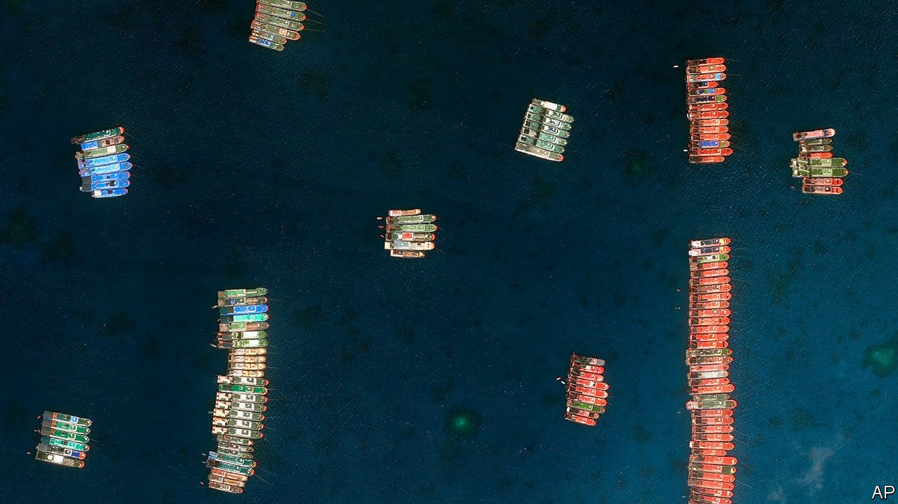
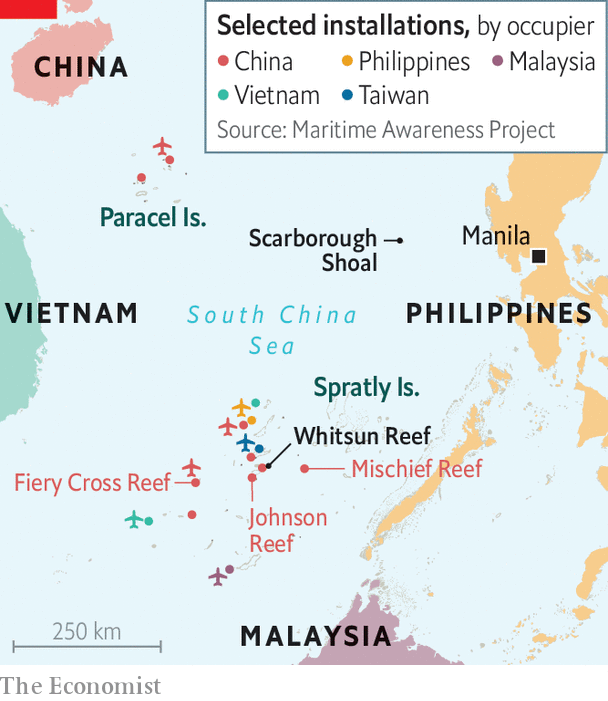

###### Reef madness

# China tries to nick another speck in the sea from the Philippines 

##### Whitsun Reef is three times farther from China than the Philippines 

 

> Apr 8th 2021 

THE CHINESE ships that appeared around Whitsun Reef in March were unusual for fishing vessels. They seemed to do little fishing, for a start. Satellite images revealed them to be pristine and lined up with military precision. China said the ships were simply sheltering from bad weather. But the Philippine government said they belonged to China’s “maritime militia”, a naval auxiliary force under the command of the People’s Liberation Army. The result is the latest stand-off in the South China Sea.

The Philippines says that Whitsun Reef, which it calls Julian Felipe Reef, lies within its “exclusive economic zone” (EEZ)—the area within 200 nautical miles of a country’s coastline over which it has certain rights. The reef, one of many in the Spratly Islands in the centre of the South China Sea, does not look like prime property. Some 13km long and shaped like a boomerang, it appears above water only at low tide. It is about 320km from the Philippines proper and about 1,060km from China. Yet China, which lays claim to almost all the South China Sea, has built and occupied artificial islands around similar outcrops in the Spratlys, such as Johnson Reef, 50km to the west, and Fiery Cross Reef, 180km to the west (see map). They now have airstrips, radar systems and a variety of missiles.


In 2016 an international tribunal in The Hague rejected China’s vague and sweeping claims in the South China Sea, including to the Spratly Islands, in a complaint brought by the Philippines. But Rodrigo Duterte, the Philippines’ president, has largely avoided confronting China over the issue, preferring instead to needle America, an ally but also a former colonial occupier of the Philippines.

 


Thus it was a surprise when Mr Duterte’s government strongly denounced the latest provocations. On March 21st Delfin Lorenzana, the defence minister, demanded that the 220 Chinese vessels in the reef’s lagoon leave “our sovereign territory”. Two weeks later he complained that China had shown “utter disregard…of international law”. The next day Teddy Locsin, the foreign minister, thundered at China’s “blatant falsehoods”. Though many of the ships have now left Whitsun Reef, they are thought to have dispersed to nearby reefs, still within the Philippines’ EEZ.

China has deployed a notionally civilian maritime militia since the 1970s, and Vietnam operates a similar fleet, although not as large or active. Chinese fishing boats played a big part in the Chinese seizure of disputed rocks and sandbars such as Mischief Reef in 1994 and Scarborough Shoal in 2012, notes Ryan Martinson of the US Naval War College. In late 2019 and 2020 China used both its maritime militia and its coastguard to intimidate the West Capella, a ship licensed by Malaysia to drill for oil and gas. In January China passed a law expanding the powers of its coastguard, allowing it to use force more readily.

The standoff over the West Capella prompted America to send first a warship, then bombers and finally a pair of aircraft carriers to the area. This time round, America has decided to send muscle again. On April 4th an American carrier strike group, led by the USS Theodore Roosevelt, entered the South China Sea.

The Philippine government is not as consistent. Despite his underlings’ fulminations, Mr Duterte is emollient: “Whatever differences we have with China…will not be an obstacle to the overall positive trajectory of our bilateral friendly relations.” As he put it in February, “I cannot afford to be brave in the mouth against China, because we are avoiding any confrontation that would lead to something we can hardly afford.” Even if he wanted to send his coastguard or navy to eject the Chinese ships from Whitsun Reef, they lack the charts necessary to navigate its shallow waters. ■

