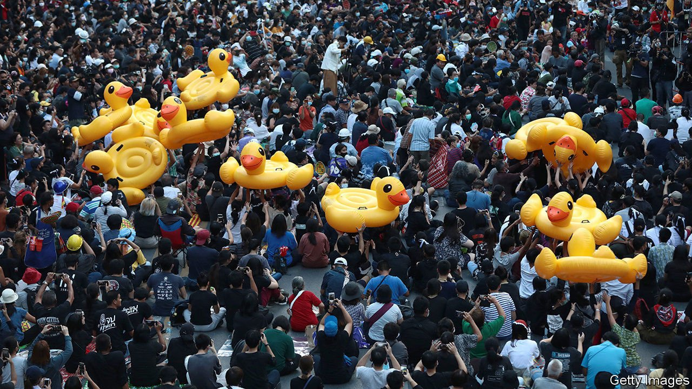

###### Strength without numbers

# Thailand’s democracy protests are dwindling 

##### But public displeasure with the government has not dissipated 

 

> Apr 8th 2021 

LAST SUMMER, despite the tropical heat and humidity, more than 10,000 mostly young protesters paraded repeatedly through central Bangkok. The protests had a carnival atmosphere. Students dressed as Harry Potter, the better to vanquish He-Who-Must-Not-Be-Named (King Maha Vajiralongkorn); held aloft giant yellow ducks (a symbol popular with democracy activists around the world); and flashed the three-fingered salute inspired by “The Hunger Games”, a series of books and films about resistance to tyranny. The protesters had three demands: an end to the government of Prayuth Chan-ocha, the coup-leading general who has installed himself as prime minister; the adoption of a new constitution to replace the one drawn up by the army; and a reduction in the powers of the monarchy.

The demonstrations continue, but over the past few months, the crowds have rarely exceeded 3,000. On some days just a few hundred turn up. The youth-led democracy movement appears to have run out of steam. “Even among the protest leaders, we are at a loss,” says Yanisa Varaksapong, an 18-year-old activist. “With our friends being arrested, and the reaction of the people, who aren’t as ready to come out on the street as they were last year.”


Five factors have contributed to the dwindling numbers. The first was a spike in cases of covid-19 in late December, which briefly brought the protests to a halt. Second, when students returned to the streets, police greeted them with tear gas, water cannon and rubber bullets. Third, the coup in neighbouring Myanmar on February 1st and the subsequent demonstrations in favour of democracy there have diverted international attention. Fourth, factionalism among the organisers has eroded popular support.

But the fifth and most important factor is fear. In recent months, after a two-year hiatus, the government has resumed charging people with lèse-majesté, or insulting the monarchy, which is punishable with up to 15 years in prison. Leniency is rare. Several prominent protest leaders, including Parit “Penguin” Chiwarak, a student activist, and Anon Nampa, a human-rights lawyer, have been detained under the law and denied bail.

The arrests have changed the democracy movement, says Pavin Chachavalpongpun of Kyoto University. “You only see sporadic protests,” he says. “And mostly these sporadic protests have only one aim: to call for the release of their friends.” On March 15th Mr Parit went on hunger strike to demand bail, helping to keep the detained protesters in the public eye.

Paul Chambers of Naresuan University argues that, despite the dwindling numbers, the government is not out of the woods. Longer-term challenges are piling up. Mr Prayuth, who seized power in a coup in 2014, is increasingly unpopular. The economy, heavily reliant on tourism, shrank by more than 6% last year. In January tourist arrivals were 99.8% lower than in the same month in 2020. This week parts of Bangkok went into partial lockdown after a jump in new cases of covid-19.

Although Mr Prayuth pushed through an authoritarian constitution and then manipulated the rules and legal proceedings to minimise opposition representation in parliament, opposition MPs are still managing to embarrass the government. They have tabled repeated no-confidence motions in Mr Prayuth and his ministers and have attempted to amend the constitution to make it more democratic. Although none of these efforts has succeeded, they have kept the spotlight on the government’s failings.

“I think the mood in August and September was that victory was right around the corner, and now…people see, much like earlier generations, that this is the struggle of a lifetime,” says Tyrell Haberkorn of the University of Wisconsin. Even so, through their open criticism of the monarchy, the protesters have already changed Thai society. “That is something no one would have foreseen,” says Mr Pavin. “The unsayable has become sayable.” ■

