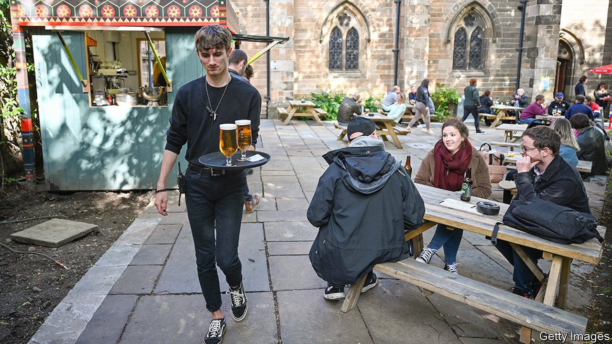

###### Pubs

# Britain’s boozers are going al fresco 

##### Will drinkers want to stay outside? 

 

> Apr 8th 2021 

IN BRITAIN, STANDING at the bar with a pint in hand is a cherished national tradition, though it dates back only a couple of centuries. Before the 1830s drinks were carried to tables from storerooms. Then came the gin palace. Seating disappeared to maximise standing space; bars and ornate plate-glass windows were introduced. The clientele found that packing in together was a pleasurable way to stay warm. Pubs had to change or die.

Now pubs are evolving rapidly again. The smoking ban of 2007 pushed patrons outside, not always in the most stylish manner. “There were some pretty shabby ad hoc shelters…which were a token to smokers so they didn’t get wet,” says Kevin Marsh, head of licensed leisure at Savills, an estate agent. Other adaptations were more refined. Trendy city pubs and spacious country taverns blessed with superior gardens invested in canvas canopies, igloos and heated wooden booths. They are now in the vanguard: having a luxurious beer garden is key to surviving covid-19.


Last year 1,837 pubs closed across Britain, according to CGA, a consultancy—an increase of 85% on the previous year. Survivors with outside spaces are likelier to flourish. From April 12th, pubs with gardens can reopen; those without will have to wait until May 17th. A mere 38% of licensed premises have outdoor space that can be used to host revellers, and that falls to 23% in Scotland, where drinking outside is chillier. Pubs can put up marquees for the whole summer without planning permission; usually, the limit is 28 days.

But marquees are the least of it. At the Golden Lion in Rainford, Merseyside, Chris Nevin has transformed an area that was used as a dumping ground into a National Trust-style woodland trail. Other features include a large marquee, a table-tennis table and a playhouse for young children. “We’re trying to reinvent what the pub is in the modern world,” says Mr Nevin.

Luxurious al fresco facilities are proliferating across the nation. The Mulberry Tree Inn in Stockton Heath is creating an external bar covered by a louvre canopy system. The Union Inn in Falkirk is laying an artificial lawn from which covid-safe pods will burgeon. Fletcher’s Sports Bar in Liverpool has a new 250-person capacity beer garden, with a large outdoor screen for live sports. Yr Hen Dderwen in Carmarthen is getting a £1m rooftop terrace. The Eastfield Inn in Henleaze will soon boast a restored pond, newly planted trees, outside booths—and maybe a few goats.

The growth of outside drinking is giving the traditional British boozer a European flavour. “Places like Paris, Madrid, Amsterdam have done it well for a long time,” says Mr Marsh. “We haven’t done it in any widespread kind of way. But we have reached a point now, because of innovation in the pandemic, where a proportion of pub trade will not go backwards.”

Whether the beer garden will put down roots depends on two uncertainties. The first is the weather. Although Mr Nevin notes that he hosted more than 100 socially distanced people in his marquee on a cold December night, a monsoon summer could drown this fragile plant. 

The second uncertainty is the British people. Thomas Thurnell-Read, a sociologist at Loughborough University, reckons the beer gardens’ success will depend partly on how much publicans allow for transgression and “retain that spontaneity, humour and convivial impropriety, within covid rules.” As a drinker puts it, “It’s not really a pub if you can’t crowd around a pool table shouting at your mates, is it?” ■

