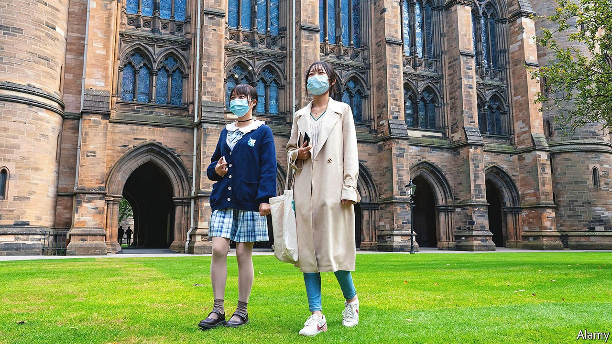
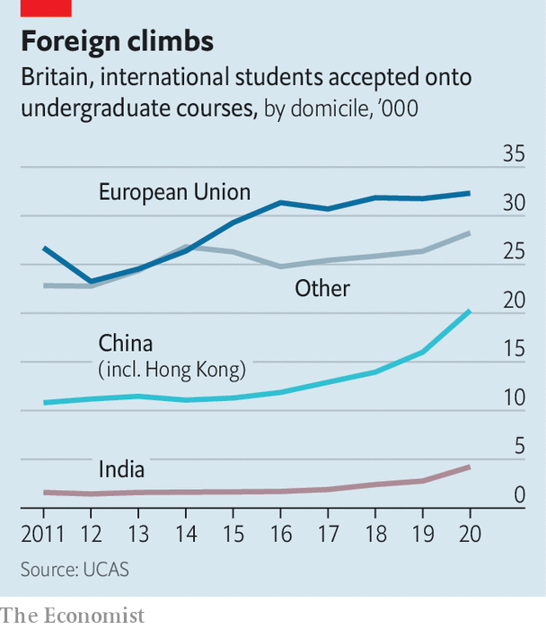

###### Smart moves

# Foreign students remain remarkably keen on Britain’s universities 

##### The pandemic has not discouraged them as much as was expected 

 

> Apr 10th 2021 

LAST YEAR Ann, a Chinese student who likes to use an English name, decided to plough ahead with her plan to study at Sheffield University, despite uncertainty about the spread of covid-19. When her postgraduate course started in September she dialled into lessons from her home in Shandong province; in January she came to Britain, even though she knew that would mean weathering a lockdown. Because her course only lasts a year she wants to be in a position to get out and about as soon as restrictions are loosened. She says she is not too worried about the virus, having bagged a vaccine in China before she flew out.

That foreigners still seem enthusiastic about studying in Britain has come as a big relief to universities. Last spring vice-chancellors warned that tens of thousands of international students would choose not to enrol because of the pandemic. The University and College Union forecast that the number starting new courses could fall by half. Because most international students pay vastly higher tuition fees than British ones, a slump risked poking huge holes in universities’ finances. Citing the risk of bankruptcies, Universities UK (UUK), a lobby group, tried and failed to convince the government to offer the sector a bail-out worth about £2bn ($2.75bn).


The data available so far suggests that things are turning out better than foreseen. In December UCAS, a body that processes university applications, reported that the number of foreigners given places on undergraduate courses last autumn had risen by nearly 11% compared with the previous year (see chart). There is less information about postgraduates, who make up more than half of foreign students and who are thought to be more likely to have put their study plans on hold. Vivienne Stern of UUK thinks it is possible that when all the sums are done the total number of enrolled foreigners could be similar to the number recorded before covid-19 hit. Some universities will still see shortfalls, and because many foreign students are studying remotely they are spending less than normal on accommodation and other living costs. But given the grisly expectations, says Ms Stern, recruitment has gone “ridiculously” well.

 


In part Britain has benefited from the misfortunes of competitors. A survey published in November found that the number of foreigners starting new courses at American universities had fallen more than 40%. Their number had been trending downwards throughout Donald Trump’s presidency. His rhetoric last spring and summer, when many foreign students were finalising their travel plans, did not persuade them that America would get infections under control. Australia, another popular destination, has not been able to say when border controls that presently prevent students from entering the country might be relaxed. Figures released in January showed that the total number of foreign students enrolled at its universities had decreased nearly 20% from their peak a few months prior to the pandemic.

Yet Britain is also probably benefiting from groundwork before the crisis. For years new policies aimed at limiting immigration discouraged foreign students from coming. Between 2012 and 2017 their number barely budged. Under Boris Johnson the government has changed course. In 2019 it confirmed that it was reintroducing visas that allow students to stay in the UK for two years after they graduate. That year the number of foreign students starting courses in Britain soared 17%, driven by big increases among Indians and Chinese.

The number of Europeans enrolling in British universities is likely to fall sharply this coming September (because of Brexit they will start having to pay full tuition fees). Continued growth in students from outside the EU—who are already nearly three times as numerous, once both undergraduates and postgraduates are counted—would cushion the impact. Whether or not Britain sees further waves of infections could yet affect foreign students’ choices. Exasperated by longer-than-expected stints of remote learning, some of this year’s cohort have been arguing that their tuition fees ought to be reduced. But early data on applications for courses starting this autumn look positive, says Nick Hillman of the Higher Education Policy Institute, a think-tank. Slumping job markets are only driving up the value of fancy foreign certificates. ■

