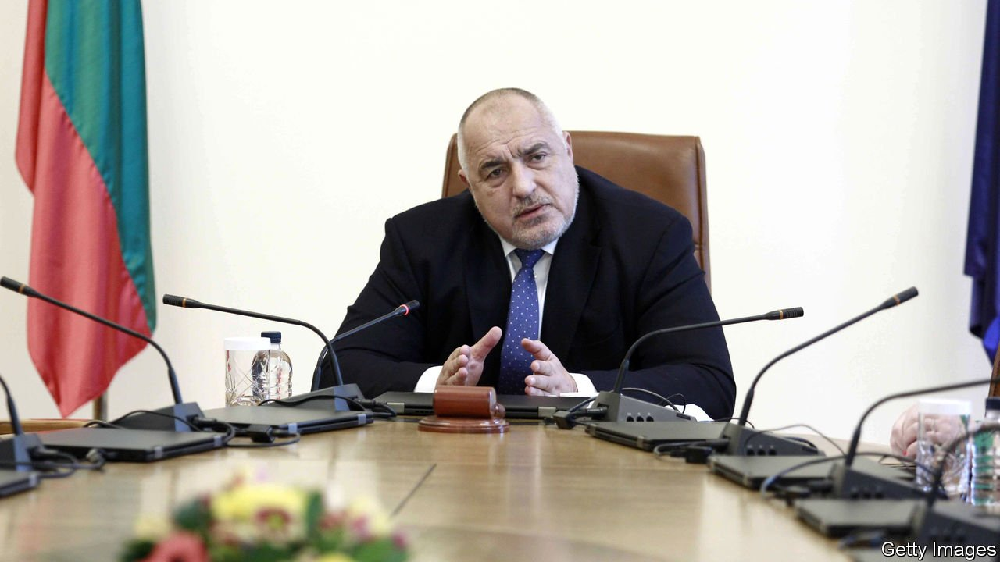

###### Bye-bye Boyko?

# Bulgaria’s prime minister stumbles badly at the polls 

##### But he’s been written off before 

 

> Apr 10th 2021 

“YOU WON’T make it on your own…let’s unite,” said Boyko Borisov, Bulgaria’s prime minister, standing forlornly in the snow soon after the polls had closed on April 4th. Opinion pollsters had predicted that the man who has dominated Bulgarian politics for more than a decade would lose some of his once-stellar support, but they did not foresee that he would do nearly as badly as he actually did. Now Mr Borisov is busy suggesting the formation of a technocratic government, which he would presumably control, though from behind the scenes.

Mr Borisov is clinging to power by his fingernails, and will remain dangling for weeks as the shocked leaders of the parties that have made it into parliament see if they can form a government. With 26% of the vote, his party will be the largest, but the vast majority of deputies from other parties have nothing in common—except that they loathe him.


Bulgaria is the poorest country in the EU, although its economy is a quarter bigger than it was when Mr Borisov became prime minister for the first time, in 2009. Then unemployment was a problem; now labour is scarce, not least because so many Bulgarians have emigrated. Last year the country was shaken by months of protest by people fed up with decades of ingrained corruption, political meddling in the judiciary and arrogant oligarchs.

Mr Borisov, a burly former bodyguard, came to power promising to stamp out corruption. Now, says Dimitar Bechev, a political scientist, his “tough guy, man-of-the-people act has worn out and he has come to symbolise all that is wrong with the country”. As scandal swirled around him and his party last year, photographs were leaked that appeared to show him in bed with a pistol on his bedside table and wodges of €500 ($595) notes in its half-open drawer. Mr Borisov said that the pictures had been manipulated.

Although those protests eventually fizzled out, the anger of the demonstrators has now been translated into parliament in the shape of three anti-Borisov parties. The biggest is led by Slavi Trifonov, a talk-show host and the frontman of the Ku-Ku Band, a musical combo whose albums include “Rip off the head of the duck”. He refused to campaign in the election. This strategy was successful, says Marin Lessenski, an analyst, because “it allowed everyone to project their own expectations onto him.”

Claiming to have symptoms of covid-19, Mr Trifonov has said nothing since his party came second with 18%. His preferred political mode is criticism and protest, says Boriana Dimitrova, a sociologist; he has presumably been shocked by the realisation that his unexpected success means he will now have to take some responsibility for the future of the country.

Ms Dimitrova predicts that either forming a new government will prove impossible, in which case a new poll is likely to be held in July, or that a short-lived technocratic government with a limited mandate supported by the anti-Borisov parties will take the helm until a new vote is held alongside a presidential election that is planned for October.

Mr Lessenski is less certain. Mr Borisov has been written off before, he says, and previously “proved a master tactician”. He thinks Mr Borisov will try to secure support in parliament from a party that represents Bulgaria’s Turkish minority, plus others that may somehow be persuaded to part with their anti-Borisov principles.

In the coming seven years up to €29bn of EU funds are available to be disbursed. Having a hand in how that is spent, legitimately or not, could act as “a huge incentive” to join a government. ■

