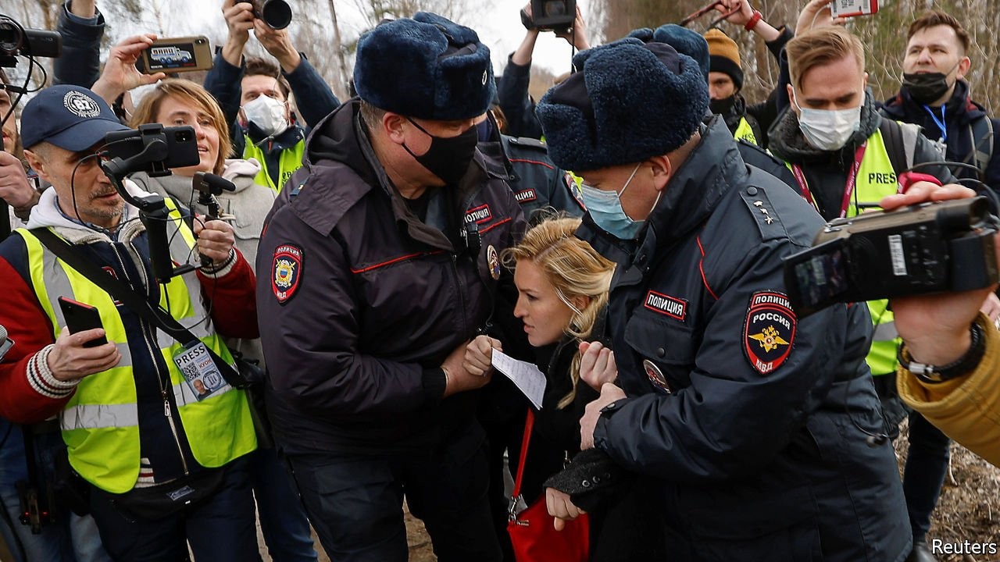

###### House of the dead

# Does the Kremlin want Alexei Navalny to die in prison? 

##### It is beginning to look like it 

 

> Apr 10th 2021 

VLADIMIR PUTIN may have hoped that locking up his main political opponent in a harsh penal colony would finally put him out of sight and out of mind. Instead, Alexei Navalny continues to torment the Russian president, exposing the cruelty and lies of his regime.

Deprived of his freedom and of any public platform, Mr Navalny is fighting back with the only instruments he has left: his body and his life. Since March 31st he has been on a hunger strike in his cell in Pokrov, some 100km (60 miles) east of Moscow. He is protesting against the appalling conditions of his confinement—he is being deprived both of sleep and of medical care. He has a fever and breathing problems. Three men in his barrack have been diagnosed with tuberculosis, which is common in Russian prisons.


Mr Navalny, who survived after being poisoned with Novichok, a nerve agent, last August, is also suffering severe back pain and numbness in both legs. Nonetheless, he has been denied access to a doctor of his choice, to which he is entitled under Russian law. Russia’s prison service has labelled him an escape risk, even though he voluntarily returned to Russia to face Mr Putin. This label means he can be woken every hour during the night by a prison guard shining a torch in his face.

“There is a real prospect that Russia is subjecting him to a slow death,” tweeted Agnès Callamard, the incoming head of Amnesty International, a human-rights group. She has written to Mr Putin calling for his release, noting that he is in jail only because he is “an outspoken critic of the Russian authorities”. She also demanded that Mr Navalny be granted access to a doctor he trusts.

Instead of a doctor, the Kremlin sent a television propaganda team to taunt Mr Navalny. For the assignment it chose Maria Butina, a celebrity Putin supporter who was jailed in America for infiltrating American political circles as part of Russia’s attempt to influence the election of 2016. Swaggering into Mr Navalny’s barrack with a TV crew, she yelled that the prison was more comfortable than a hotel in the small Siberian town where she grew up. (No matter that it has no hotel at all.) When Mr Navalny’s doctor and political ally, Anastasia Vasilyeva, arrived at the prison gates to demand access a few days later, she was detained, along with several journalists, including one from CNN.

Few things illustrate the pettiness of Mr Putin’s regime as clearly as its treatment of political prisoners. Mr Navalny asked for a family photo album; it was denied. While he is on hunger strike, he says, the prison governor had sweets planted in his clothes and gave his cellmates an electric stove on which they grill chicken and bread. “This is the essence of this regime’s [belief]: why would anyone want to defend his principles or fight for his rights if there is tasty grilled chicken nearby,” Mr Navalny said in an Instagram post via his lawyers.

While the Kremlin tries to crush Mr Navalny’s morale, his team has mounted a campaign to free him. It hopes to persuade at least 500,000 people to sign a protest against his imprisonment; as The Economist went to press, it had already gathered over 400,000 signatures. Various artists, scientists and journalists have sent messages of support. Every day that Mr Navalny spends in prison, he risks losing his health or worse. But he is gaining moral and political weight. ■

