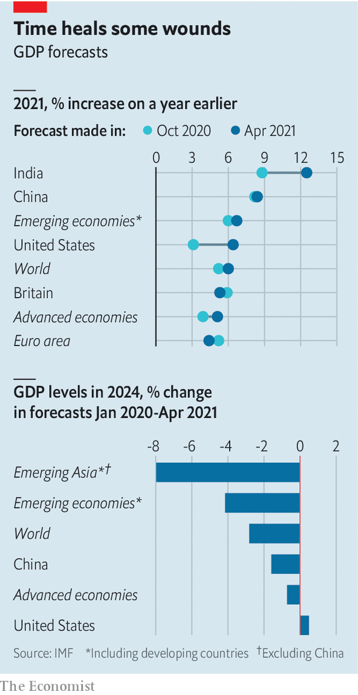

###### Making strides

# The IMF marks up the global recovery 

##### America looks set to outperform 

 

> Apr 10th 2021 

 


ON APRIL 6TH the IMF raised its forecasts for the global economic recovery. The cause? Vaccination programmes and a healthy dose of fiscal stimulus in rich countries. So robust is America’s recovery expected to be that by 2024 it will have overtaken the level of output that had been forecast before the pandemic. The rich world is projected to be about 1% below its pre-pandemic path. By contrast, in 2012, five years after the global financial crisis began, rich-country GDP was still a tenth below the fund’s pre-crisis forecast. The poorest countries, though, are set to bear deeper scars this time.

