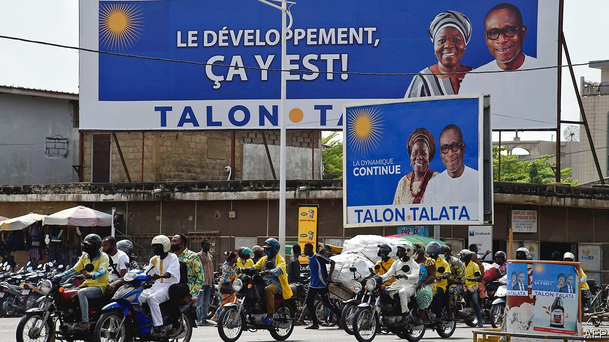

###### Turning thuggish

# Benin’s democratic beacon dims 

##### Politics in Benin and Chad is becoming more alike. That is not good 

 

> Apr 10th 2021 

“WE ARE NOT in a democratic country any more,” says Rogatien Biaou, a former minister turned opposition figure in Benin, which will hold presidential elections on April 11th. This is not hyperbole. Almost all opposition leaders have been blocked from standing. Others are in exile. Reckya Madougou, a high-profile would-be candidate, is behind bars. As President Patrice Talon slashes political freedom, anger is rising. On April 6th protesters took to the streets, chanting “Talon must go.”

Benin, a country of 12m people, had been a democratic beacon in west Africa. In 1991 the Beninois voted out Mathieu Kérékou, the long-time president who had taken power in a coup. It was the first time an incumbent president was peacefully voted out in mainland sub-Saharan Africa. Many hoped Benin’s vigorous democracy could inspire greater freedom in the region’s authoritarian regimes, such as Chad, which is also holding elections on April 11th. Instead it is Benin that is becoming more like Chad.


Mr Talon, a cotton magnate, came to power promising to consolidate Benin’s raucous and sometimes splintered democracy. Instead he has weakened it. In 2018 the government pushed through cumbersome new rules for fielding candidates and raised the cost of registering. The electoral commission, which was packed with Mr Talon’s allies, then barred all opposition parties from the parliamentary election in 2019 for failing to follow the new rules closely enough. The result was an abysmal turnout, a parliament made up entirely of supporters of Mr Talon, and protests to which security forces responded with live ammunition. Four people were killed and many more injured. The Constitutional Court, headed by Mr Talon’s former personal lawyer, waved the results through.

The submissive new parliament has since changed the electoral law to require all presidential candidates to have the backing of at least 10% of the country’s MPs and mayors. With a lock on parliament and all but a handful of mayors’ offices, Mr Talon and his allies could, in effect, choose who would run for president. Just two of the 19 challengers were permitted. Both are accused by the opposition of being allies of the president.

Mr Talon is changing not just the rules but also the referee. In 2018 he created a new court, known as CRIET, which is nominally for economic crimes and terrorism but has a habit of targeting Mr Talon’s rivals. The latest was Ms Madougou, who, despite already being barred from standing for president, was arrested on March 3rd and later charged with financing terrorism and plotting to kill two political figures.

A CRIET judge who recently fled Benin said to RFI, a French state broadcaster, that the court is not independent. In Ms Madougou’s case and many others, judges received “instructions” from political bigwigs, he says. The government denies this. Ms Madougou remains behind bars in conditions that are “scandalous”, says her lawyer, Mario Stasi: “I fear for her health.” Other opposition figures seem in danger, too. Ganiou Soglo, another would-be presidential candidate, survived after being shot by unidentified men on February 5th.

Since Mr Talon came to power, Benin has fallen from 78th to 113th in a ranking of press freedom by Reporters Without Borders, a watchdog based in Paris. Opposition-linked television and radio stations have been shut down and in just two years at least 17 journalists and bloggers have been prosecuted under a new digital law.

Mr Talon admits that Benin has given up some democratic achievements, but says this was to allow for development. He points to roads built on his watch and to rapid economic growth, at least before covid-19. But “democracy and development are not contradictory,” says David Zounmenou, a researcher in Benin for the Institute for Security Studies, a think-tank.

Chad has neither. It has been run by President Idriss Déby since he took power in a rebellion in 1990. Despite pumping plenty of oil, it remains desperately poor. A fifth of Chadian children die before the age of five. The wealthy Mr Talon is unlikely to compare himself to a former rebel, yet there are parallels. Mr Déby has also fiddled the electoral rules to block a would-be challenger. An attempt to arrest another candidate, Yaya Dillo, resulted in a shoot-out that he says killed his mother and son. The main opposition candidate, Saleh Kebzabo, subsequently withdrew, saying he refused to “provide cover for a large-scale masquerade”. France remains a staunch ally of Mr Déby.

Benin is not in quite as much of a mess as Chad is. Mr Talon’s attacks on democracy often have a legal veneer, whereas Mr Déby’s frequently do not. Mr Talon is standing for his second term; Mr Déby for his sixth. And in Benin some opposition figures, such as Mr Biaou, still hope to get democracy back on track.

Other observers are more worried. Mr Talon originally pledged to rule for just one term (the constitution allows two), but soon broke his promise. A pliant parliament and docile Constitutional Court mean there are few impediments in his way. Should he wish to change the constitution to run for a third term, frets Mathias Hounkpe of the Open Society Initiative for West Africa, an NGO, “I’m not sure many people can stop him.” ■

