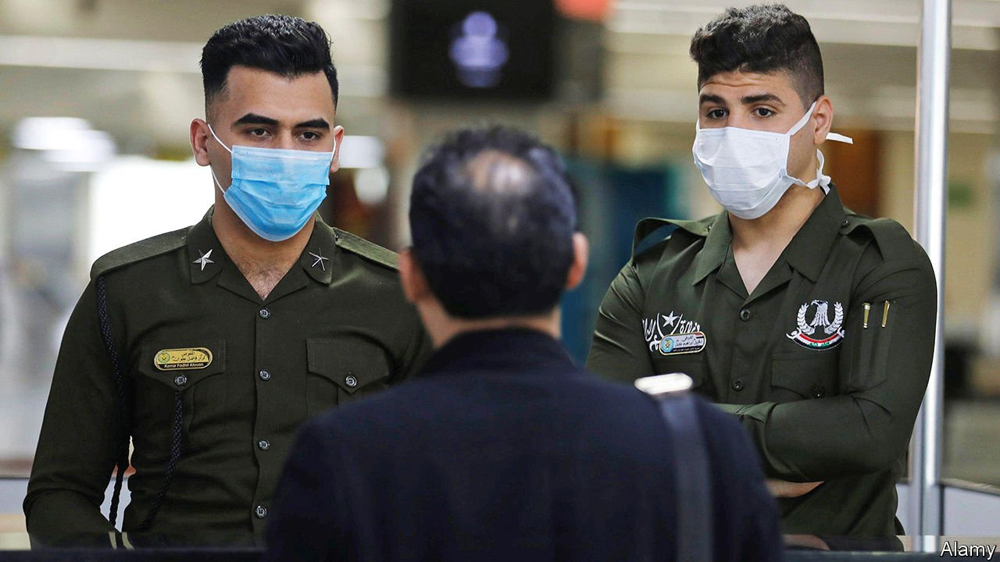

###### Opening up

# Getting into Iraq may soon be much easier 

##### Visa-free travel is supposed to woo expats and tourists 

 

> Apr 10th 2021 

GETTING INTO Iraq has never been easy. Saddam Hussein was loth to grant visas to curious Westerners, lest they see evidence of his regime’s brutality. After his overthrow in 2003, the borders opened up, but war kept civilians away. Then Iraq’s new rulers lowered a paper portcullis, demanding fees and the completion of myriad forms. Local middlemen offered to help—for a price, of course. Oil firms coughed up thousands of dollars to get their workers in.

That is all changing. Last month Mustafa al-Kadhimi, the prime minister, scrapped visa requirements for visitors from 36 countries, including America, China and those in the EU. They will be granted a two-month entry permit on arrival. Officials say the move will cut red tape, encourage investment and kick-start reconstruction. “It’s the single most effective decision to open Iraq to the world,” says a frequent German visitor.


The move is an effort to reposition Iraq as “an area of co-operation, not confrontation”, says one of Mr Kadhimi’s men. The prime minister hopes it will also let Iraq depend less on Iran. His advisers dream of attracting expats and even tourists. Iraq is certainly safer than it used to be. A visit by Pope Francis last month went off without a hitch.

Not everyone is happy, though. Some officials prefer Iranian to Western influence; others fear losing out on bribes. And xenophobia is still a problem. Clerics accuse the government of giving Westerners priority over pilgrims from Muslim countries that are not included in the plan. “It’s discrimination and won’t bring back tourism,” says a cleric in the holy city of Najaf.

The doors are not fully open yet. Iraqi consular staff say they have not been officially notified of the changes and that foreigners should still apply for visas. Mr Kadhimi’s underlings don’t always enforce his decrees. Spring break in Baghdad may have to wait until next year.

