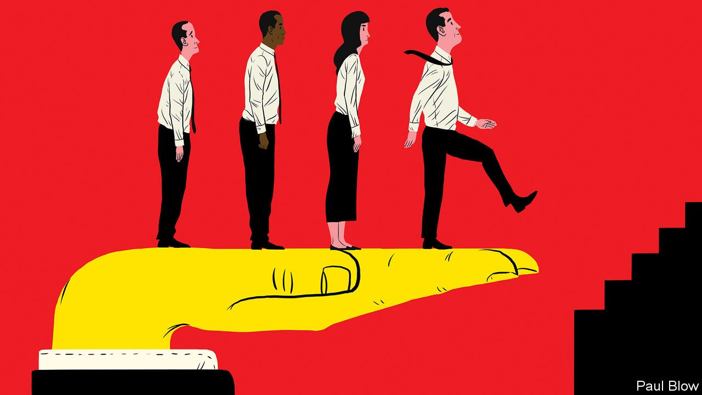

###### Government policy

# Changing central banks—and governments 

##### Policymakers are taking a more activist approach to managing labour markets - mostly for the better 

 

> Apr 8th 2021 

TO GET A sense of how policymakers used to think about unemployment, consider the Jackson Hole meeting, a jamboree for central bankers, in August 1994. One speaker, Alan Blinder, felt it necessary to remind his colleagues that “In my view, central banks...do indeed have a role in reducing unemployment,” not just in reducing inflation. Many in the audience thought that he was a bold radical. “I was called an outlier, and some worse words,” says Mr Blinder, who at the time was vice-chairman of the Federal Reserve. The sky-high inflation of the 1970s was still fresh in the minds of many participants. Like Paul Volcker, the Fed’s chairman in 1979-87, they believed that conquering inflation was their sole true calling, no matter the collateral damage. 

Today Mr Blinder’s views on unemployment would seem mundanely mainstream. The pandemic has helped to contribute to an intellectual revolution in macroeconomics. Policymakers of both left and right have come to recognise the enormous redistributive power of a booming economy—one that generates both plentiful jobs and healthy wage growth—for low-income and minority groups. A “lesson from the recovery from the great recession [of 2007-09]”, argue Jay Shambaugh, a former economic adviser to President Barack Obama, and Michael Strain, a conservative reformer, in a new paper, “is that low-wage workers and low-income households are relatively more sensitive to the business cycle”. Increasingly, policymakers believe they can do a lot more to push the economy to the top of that cycle. And they are more willing than they were to live with the trade-offs this entails.


There were signs of a change even before the covid-19 pandemic arrived. By 2015 most governments were losing their enthusiasm for the fiscal austerity that had marked the period after the financial crisis. Many came to realise the damage that years of budget-cutting had done. Others noted that the cost of borrowing had plunged, making fiscal stimulus less expensive. Analysis by UBS quantifies this change. Public spending was a net drag on the global economy in every year from 2010 to 2014. It began stimulating the economy in 2015, and that effect was worth as much as 1% of global income by 2019. 

Some of this extra spending was directed at reducing inequality. For decades governments had chipped away at the liberality of welfare states in order to boost incentives to work. But in the years before the pandemic there were signs that the “replacement rate” of unemployment benefits, which measures them as a share of in-work incomes, was rising.

This pro-poor shift was not just about cash. Some jurisdictions have legislated to give more employment rights to “gig” workers. In February Britain’s Supreme Court ruled that Uber’s drivers were not independent contractors and so were entitled to various in-work benefits, including the minimum wage. Others have cracked down on rule-breaking by employers, such as unfairly depriving workers of pay. Australia has strengthened labour-market enforcement, issuing more notices to errant employers and recovering more unpaid wages. Governments have also bumped up the minimum wage. Its value in the average rich country, relative to average earnings, rose from 35% in 2000 to 41% in 2019, seemingly without the adverse effects on employment that some economists earlier feared. 

The big bank rethink

Central banks were also changing. In the face of persistently low inflation, members of the Fed’s rate-setting committee repeatedly revised down their estimates of the rate of unemployment that was consistent with a 2% inflation target, from 5.5% in 2012 to 4.1% by 2020. In 2019 the Fed launched a wholesale review of its monetary-policy framework.

The pandemic has helped galvanise these efforts. In its new framework, announced last year, the Federal Reserve has switched to “average inflation targeting”. As part of this the Fed now emphasises the goal of maximising employment, implying that inflation could temporarily overshoot its 2% target if that helps more Americans to stay in or join the workforce. Returning to maximum employment “will require a society-wide commitment, with contributions from across government and the private sector,” Jerome Powell, the Fed chairman, argued in February.

The Fed is by no means the only central bank that is now placing greater emphasis on employment. In 2019 the Reserve Bank of New Zealand, which pioneered the single-minded focus on inflation in the 1980s, switched to a “dual mandate”, promising to seek to maximise employment as well. In September 2020, Wakatabe Masazumi, deputy governor of the Bank of Japan, said that “Personally, I feel there is room to consider the idea, voiced by some people, that monetary policy should focus more on job and income conditions.” Today it is hard to imagine the Bank of England pre-emptively raising interest rates so as to forestall a rise in inflation above 2%, as it did in 2017-18. Instead, the bank is more likely to wait until inflation consistently exceeds its target.

None of these changes means that central bankers no longer care about inflation, the traditional concern of bankers and investors. But their heightened concern with employment means that they are implicitly placing more emphasis on the interests of the poor. As one former senior central banker says, somewhat impishly, “Central bankers still do represent the capitalist classes—but less than before.”

Fiscal policy is also being rethought. Across the rich world the response to the covid-19 pandemic has been massive and sustained fiscal support for economies. And it is notable that this time, unlike after the global financial crisis, almost all governments are delaying moves to reduce fiscal stimulus so as to rein in gaping budget deficits and rising public debts. As ever Europe, scarred by the euro crisis, has been more reluctant to accept huge budget deficits, but even there efforts to trim borrowing have been more careful and slower than in the past.

Finally, the pandemic is reshaping welfare policy. Few doubt that trillions of extra spending to protect households’ incomes during lockdowns did a lot of good. In the first months of the pandemic America’s poverty rate declined, even as economic activity collapsed. In-work benefits such as the earned-income tax credit were protected. Such policies have proved popular with voters. 

A quiet revolution is now under way. Data from the International Labour Organisation suggest that countries have continued to introduce new social-protection programmes long after the acute phase of the first covid-19 lockdowns had passed. Britain may turn a temporary boost of £1,000 ($1,400) a year to its main welfare benefit into a permanent one. President Joe Biden is making child tax credits dramatically more generous, a provision which is expected to cut child poverty in half. Many European countries are keen to wind down their job-protection schemes as fast as possible; paying somebody not to work for a year or more may ultimately not be in anyone’s interest. Australia’s ended last month. Yet there seems little doubt that politicians will dust such ideas off whenever the next crisis hits.

Taken together such changes show that policymakers are more focused on the plight of workers than they once were. Yet making labour markets work better will still require governments, employers and workers to think more creatively. ■

Full contents of this special report


* 


