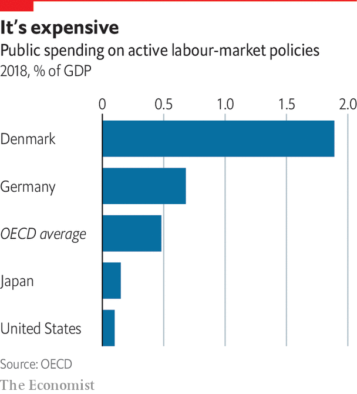

###### Flexicurity

# The case for Danish welfare 

##### Can a welfare state be both generous and efficient? 

 

> Apr 8th 2021 

APAPER PUBLISHED by three economists in early 2015 came to a hard-nosed conclusion. It looked at what had caused a surge in employment in America over the previous year. The jobs boom coincided with a cold-hearted Republican reform to make unemployment benefits less generous. The authors demonstrated, convincingly, that the one had caused the other, with the benefit cut leading to the creation of 1.8m extra jobs in 2014—about two-thirds of the total.

The notion that lavish welfare benefits discourage work, so that cutting them makes people look harder for a job, is widely accepted not just by economists but by most politicians and voters. Nobody nowadays wins election by promising to lavish the unemployed with public funds. So it is surprising to find that the country with the world’s most generous offer to the out-of-work also has one of its best-functioning labour markets. 


Danish benefits are worth more than 80% of previous earnings after six months out of work, compared with 60% across the rich world and less than 50% in Britain (America is even stingier). For Danish parents who lose their jobs, replacement rates can approach 100%.

 


The generosity of Denmark’s unemployment system is the flipside of its liberal regulation of employment contracts—a combination called “flexicurity”. Danish employers can hire and fire workers pretty much as they please. Jobs therefore come and go, but people’s incomes are stable. Yet the state’s munificence has not produced a class of feckless drifters. Denmark’s unemployment rate is lower than the rich-world average and its working-age employment rate is higher. Long-term unemployment is low. When Danish people lose a job, they find a new one faster than almost anyone else in the world, according to the OECD. 

That is because Denmark makes it hard for people to live off welfare. Recipients must submit a CV to a coach within two weeks of becoming unemployed. They can be struck off for not trying hard enough to search for work or to keep up with adult-education programmes. As a share of GDP Denmark spends four times as much as the average OECD country, and more than any single one, on “active labour-market policies” to make people more employable. 

This offers a tough lesson for those arguing for more generous welfare states. Simply boosting benefits may dissuade employment, as it did in America before 2014. To stop this happening requires massive investment in training, monitoring and enforcement of the rules for those out of work—spending money to avoid wasting it, in other words. The world’s best welfare system does not come cheap.

Full contents of this special report


* 


