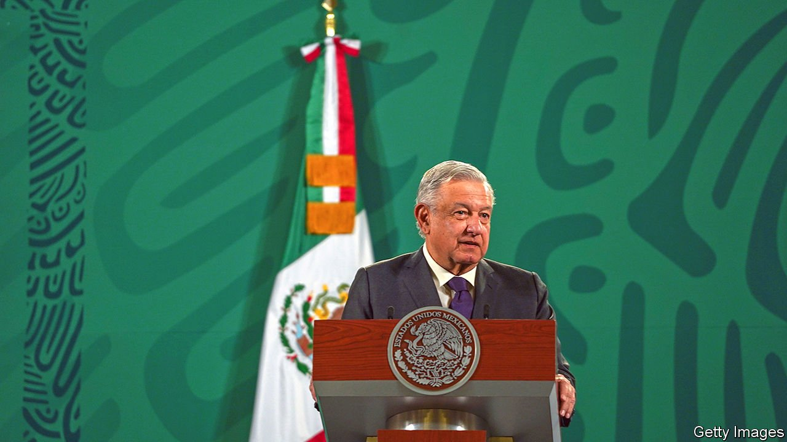
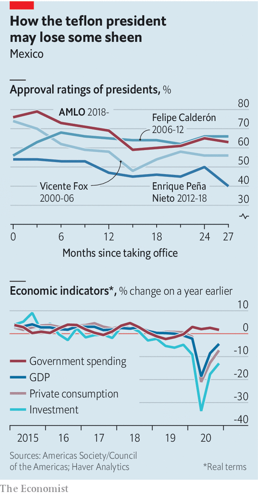

###### AMLO’s weak spots

# The Mexican economy has been battered by the pandemic 

##### Erratic policies from the populist president haven’t helped, either 

 

> Apr 8th 2021 

WHEN MEXICO’S president, Andrés Manuel López Obrador, was elected in 2018 he entered office with an approval rating of 76%, the highest for any new president in recent times. Astoundingly for an incumbent who has overseen one of the worst pandemic responses in the world, he remains popular, with nearly two-thirds giving him the thumbs up (see chart). Yet when it comes to his policies, Mexicans are far less sure of AMLO, as he is known.

One of his weaknesses is the economy, which shrank by 8.5% in 2020, the worst slump since the 1930s. Some 47% of voters think he is managing it badly, second only to the share who disapprove of his handling of organised crime (52% think he is doing poorly at curbing gangs). That should worry him. On June 6th hundreds of seats are up for grabs in legislative, local and gubernatorial elections. Morena, the party he founded, which is now the head of a coalition government, leads in the polls. But the election will still be seen as an important test for his brand of populism.


When he arrived in office, AMLO made big promises. He vowed to reduce poverty and to double Mexico’s lacklustre annual growth rate, which has been stuck at an annual average of just 2% for almost four decades. But his policies have not, by and large, lived up to the hype. In 2019, before covid-19 hit, the economy shrank by 0.1%. That was despite falling interest rates, a robust economy in the United States, which absorbs three-quarters of Mexico’s exports, and the signing of the USMCA trade deal by the United States, Canada and Mexico to replace NAFTA.

 


“What growth there has been in Mexico in recent years has come from a growing population and investment. [And] AMLO damaged the latter,” says Santiago Levy, a former deputy finance minister under the Institutional Revolutionary Party (PRI), which ran the show for most of the 20th century and is now part of the opposition. Between 2018 and 2019 foreign direct investment fell by 5%, thanks to the government’s habit of reneging on contracts. Early in his term AMLO pulled the plug on a new international airport in Mexico City planned by his predecessor, which was half-built; much of the planned budget of $13bn had already been spent.

The most disruptive example of AMLO’s erratic policymaking is in the energy sector, where he is determined to boost state providers. A bill currently before lawmakers would give Pemex, the national oil giant (and the world’s most indebted oil company) control over imports and distribution of fuel. It also lays down broad grounds on which private firms can have their permits suspended. A law introduced in February, currently suspended by the courts, would allow CFE, the state electricity company, to feed the power it generates into the grid before other producers, regardless of cost or environmental impact.

The pandemic has not helped matters. With over 200,000 dead from covid-19, Mexico has suffered the world’s third-highest reported death toll in absolute numbers. Revenues from tourism, which in a normal year account for 9% of GDP, shrank by more than half in 2020. Consumption, already falling in 2019, tumbled further. And, unlike other leaders in the region, AMLO, a fiscal hawk who says counter-cyclical measures “only deepen inequality and encourage corruption that benefits a few”, refused to ramp up government spending to help people and businesses weather the pandemic. By January 2021 Mexico had spent a measly 0.7% of GDP on health care and handouts, compared with 7.2% in Brazil. The economic pain for many Mexicans would have been much worse were it not for relatives abroad sending home record amounts of cash. Remittances rose by 11.4% to $41bn in 2020, close to 4% of GDP.

According to the UN’s regional economic commission, in 2020 the proportion of Mexicans who were unable to afford even basic necessities rose by nine percentage points to just over half—worse than anywhere else in Latin America. Wages fell, despite a rise in the legal minimum. More than 1m small- and medium-sized businesses went bust in the past two years.

The economy could pick up. Both the IMF and the finance ministry project 5% growth in GDP this year—thanks in part to the huge stimulus plan in the United States and the vaccine drive, which is slowly gathering pace. Mexico could also gain from the trend of near-shoring, which has been boosted by the pandemic, says Luis de la Calle, an economist. But although the government has brought forward some planned increases in social handouts ahead of the June elections, economists reckon that the overall low level of spending will hamper the recovery. Investment in Mexico is now at its lowest share of GDP for a quarter of a century. Bright spots such as manufacturing are doing well despite government policy, not because of it.

Mexico should be doing better: its people are young and it is next door to the world’s largest economy. The question for AMLO is whether a post-pandemic bounce will be enough without the changes needed to foster lasting growth.■

