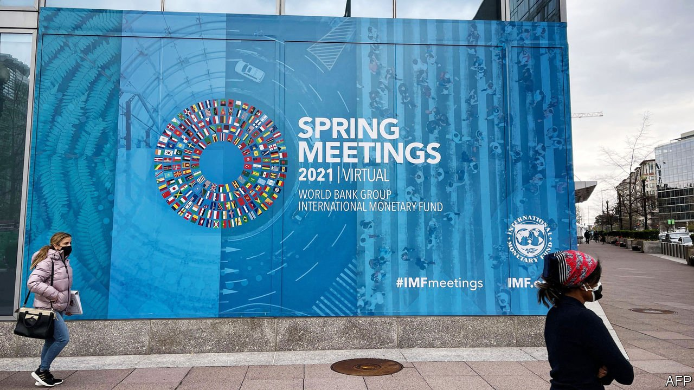
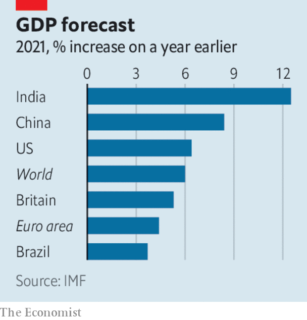

###### 

# Business this week 

#####  

 

> Apr 8th 2021 

 


 said that it now thinks the world economy shrank by 3.3% last year, less than it had feared, mainly because of the huge stimulus packages that propped up many economies and without which the contraction may have been three times as great. It increased its forecast for growth this year to 6%, as rich countries rebound from the pandemic with “smaller scars” than from the financial crisis of 2007-09. But the IMF warned that poorer countries, especially those that rely on informal work and tourism, will take longer to recover, leading to rising global inequality.

The new infrastructure spending plan unveiled by Joe Biden will fuel the American economy. Among the many commitments are $621bn on transport—such as roads, bridges, public transport, but also electric cars—$400bn for care homes and $100m for modernising the electric grid. Mr Biden’s plan faces a rockier road through Congress than the $1.9trn covid-relief package, as even some Democrats are questioning the additional burden on the national debt.


The White House wants to pay for all its extra spending mostly through , which it hopes will raise $2.5trn in revenue over 15 years. It will raise the domestic rate of tax and increase the levy on foreign profits. The administration is also pushing hard, through the OECD, for a global minimum corporate tax.

OPEC and Russia agreed to increase oil production gradually from May for three months. Saudi Arabia had resisted the move, arguing that prices are still volatile.

A grilling in the markets

Retail investors began buying and selling shares in Deliveroo, a week after the food-delivery company’s IPO was judged to have been a disaster; the stock lost a quarter of its value on the first day of trading in London. After an unappetising start, small investors looking for a slice of Deliveroo might eventually boost its share price.

Credit Suisse said it lost $4.7bn from its dealings with Archegos, a collapsed investment fund, a bigger amount than had been thought. The Swiss bank’s chief risk officer and head of investment banking are leaving; it is also cutting its dividend and suspending share buy-backs. Credit Suisse is still assessing the damage from its exposure to the implosion of Greensill, a financing firm.

A decade-long legal battle reached its conclusion when America’s Supreme Court ruled that Google had been legally entitled to use bits of Oracle’s Java code when it developed its Android platform. The decision found that application programming interfaces (APIs), which let developers access other code, are significantly different from other computer programs. The wider industry greeted the ruling with relief, since it appears to give legal sanction to a practice that is routine.

LG decided to pull out of the phone business and focus on connected devices for smart homes, components for electric vehicles and other products. The South Korean company was the fourth-biggest seller of mobile phones in 2005, but never broke through in smartphones.

Toshiba confirmed that it had received a buy-out offer, reportedly worth $20bn, from CVC, a private-equity firm. The Japanese conglomerate has been beset by accounting scandals and a disastrous acquisition. Shareholders recently forced it to set up an independent investigation into its alleged attempts at silencing activist investors.

It was a busy week for acquisitions involving Japanese companies, as Hitachi sealed a deal to buy GlobalLogic, a software-engineering company based in Silicon Valley, for $9.6bn. The Japanese industrial group said the takeover will quicken its transformation from being a supplier of hardware to a provider of digital solutions, which also involves selling off some subsidiaries such as its metals business.

Keeping it in the air

The French government said it would provide €4bn ($4.7bn) in additional funding to Air France to ease the troubled airline’s heavy debt load. The recapitalisation plan was signed off by Air France-KLM’s board; the Dutch government is still in discussions with the EU about similar measures for KLM. The French government, the group’s biggest investor, will increase its stake to just under 30%.

Hollywood breathed a sigh of relief upon the release of “Godzilla vs Kong”, a beast of a hit that raked in $48.5m over its first five days in America, the biggest box-office draw since the start of the covid crisis. That’s still some way behind cinema’s pre-pandemic golden age: “Sonic the Hedgehog” earned $164m over its opening weekend in February 2020. “Godzilla vs Kong” was simultaneously streamed on HBO Max, but fans still put their bums on cinema seats.

