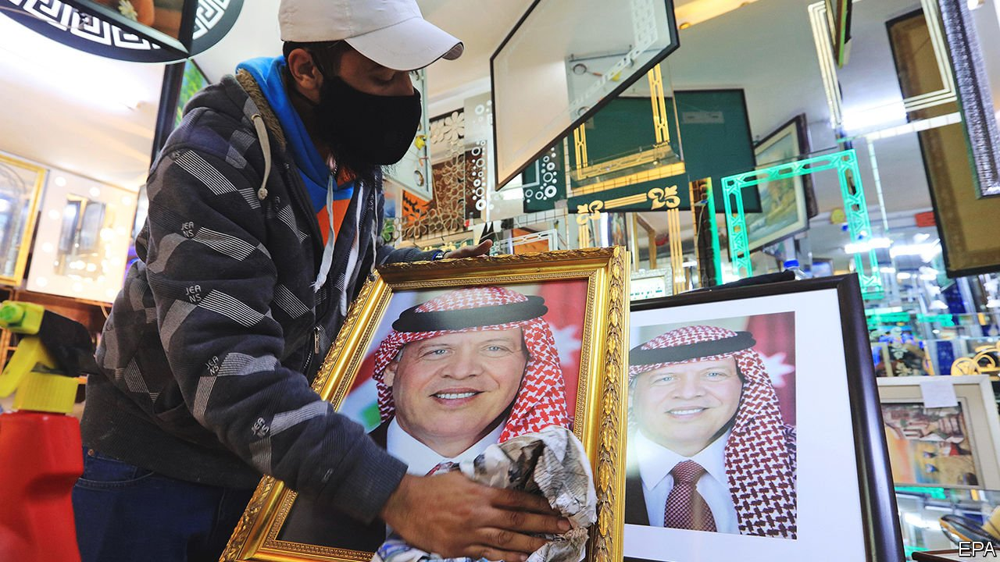
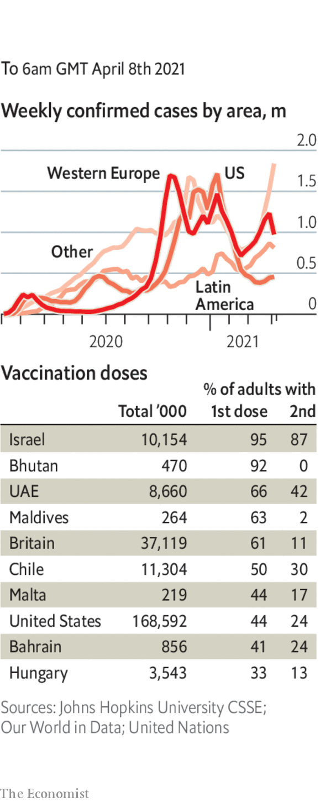

###### 

# Politics this week 

#####  

 

> Apr 8th 2021 

Around 20 people were arrested in  on charges of plotting against the crown. Prince Hamzah, a half-brother of the king and former heir apparent, was confined to a palace outside Amman. No evidence of an actual plot was shared by the authorities. Prince Hamzah has been a vocal critic of the government. From detention he released a video in which he assailed it for alleged corruption and repression, though he later pledged his loyalty to King Abdullah.

Israel's president gave Binyamin Netanyahu the first crack at forming a government. The prime minister’s party won the most seats in an election last month, but his coalition is short of a majority.


An Iranian cargo ship anchored off Yemen was damaged by an explosion. Iran says the ship is a civilian one providing security for shipping; others believe Iran uses it for spying. Some reports say Israel was behind the attack.

More than 100 people were killed in clashes in Ethiopia along the borders of the country’s Afar and Somali regions. Violence in the area has escalated in recent months. Tensions over internal boundaries have risen since November, when fighting broke out between the federal government and the ousted rulers of Tigray, a northern region.

Talks broke down between Egypt, Ethiopia and Sudan over a new dam in Ethiopia, along one of the tributaries of the Nile river. Egypt threatens to take action to “protect its water and its people”. Ethiopia said it will continue filling the reservoir behind the dam.

Samia Suluhu Hassan, the new president of Tanzania, signalled a change in policy on covid-19, which is thought to have killed her predecessor, John Magufuli. Whereas he had refused to order the use of masks or other measures to contain the virus, Ms Hassan said her government will be guided by expert advice.

The BBC said its Beijing correspondent, John Sudworth, had moved to Taiwan following pressure and threats from the Chinese authorities. The broadcaster said it was proud of Mr Sudworth's reporting. A Chinese official denounced his coverage of Xinjiang and the outbreak of covid-19 in China.

Seven prominent pro-democracy campaigners in Hong Kong were convicted of unlawful assembly for their involvement in demonstrations in 2019. Among them were Jimmy Lai, a media tycoon, and Martin Lee, a lawyer and former politician.

North Korea announced that it would not send any athletes to the Olympics, which are due to start in Tokyo in July, to protect them from covid-19.

At least 50 people died when a crowded train collided with a truck in Taiwan’s worst railway disaster in decades.

Australia and New Zealand announced that they would allow each other’s citizens to  without vaccinations or tests for covid-19.

A second wave of , which is recording more than 100,000 cases a day, the highest tally in the world. Bangladesh and Pakistan are also suffering.

Lawmakers in Arkansas overturned a veto by the Republican governor, Asa Hutchinson, of a bill that will ban the provision to people under 18 of drugs and surgery for gender transition. It is the first such bill to pass in the United States; half a dozen states are mulling similar ones.

Police shot and killed a man who rammed a car into a barricade at the Capitol in Washington. A policeman was killed. The suspect was a 25-year-old with an interest in the Nation of Islam, a black-nationalist group.

Almost 19,000 unaccompanied migrant children were taken into American custody at the border with Mexico in March, a monthly record. More than 170,000 migrants were apprehended in total, up by 70% from February.

In Greenland’s snap election, Inuit Ataqatigiit (IA), an indigenous people’s party, beat the Siumut party, which has ruled the Danish autonomous territory almost uninterrupted since 1979. IA said it would form a government and freeze the development of a big rare-earth mine, in which Australian and Chinese companies have stakes.

France entered a national lockdown for the third time, after a surge in covid-19 cases threatened to overwhelm hospitals in some parts of the country. All schools and non-essential shops will close for three weeks, and a nightly curfew is in force from 7pm to 6am. The country's vaccination programme, however, is starting to pick up. The likelihood of fresh national lockdowns also increased in Germany and Italy.

Britain’s medical regulator advised that people under 30 should be given an alternative  to the AstraZeneca jab. It said evidence of a link with extremely rare cases of blood-clotting has strengthened, though more research is needed. The EU’s regulator said blood clots should be listed as a very rare side effect of the jab. Both regulators reiterated that the benefits of vaccination outweigh any risks.

Coronavirus briefs

 


Brazil recorded over 4,000 deaths in a day. Jair Bolsonaro, the president, still opposes lockdowns; Brazil’s vaccine programme lags behind others in Latin America.

The White House said that the government does not support vaccine passports because they intrude into the personal lives of Americans, and ruled out the possibility of a federal vaccine database. Such measures would be used unfairly, it said. Britain and the EU, by contrast, are working on plans to certify people who have been vaccinated.

California will drop most of its pandemic restrictions on June 15th, if vaccines remain available and hospitalisations remain stable.

The Italian government decreed that all health workers, including pharmacists, must take the vaccine, the first country to issue such an order. Those who do not could be suspended without pay.

