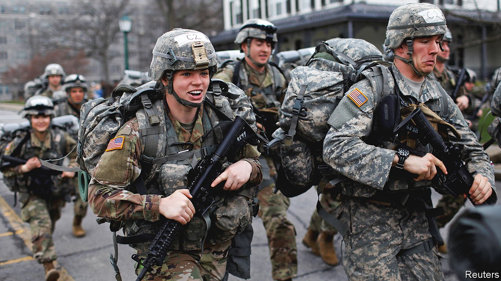

###### Gender war

# A challenge to male-only draft registration lands at America’s Supreme Court 

##### Gender war 

 

> Apr 8th 2021 

“BE THE MAN”, says an advert for the Selective Service System. The entreaty is not merely a suggestion. For decades, registering for the Selective Service—the federal agency that keeps a roster of America’s 18- to-25-year-old men, in case a military draft returns—has been a legal duty males must fulfil within 30 days of their 18th birthday.

Whether citizen or immigrant, dual national or national guardsman, all men must comply or face investigation by the Department of Justice. Potential consequences are not light: denial of student loans, disqualification from citizenship, fines reaching $250,000 and up to five years in prison.


A new petition to the Supreme Court challenges a broad carve-out to this rule. By requiring men (and transgender women) to register for the Selective Service, but exempting women (and transgender men), the plaintiffs say, the federal government is involved in invidious gender discrimination barred by the constitution. 

National Coalition For Men v Selective Service System revisits a 1981 ruling that upheld the Selective Service’s sorting by sex. That judgment, Rostker v Goldberg, came when women could not serve in combat roles. “Rostker’s fundamental premise is no longer true,” the plaintiffs say. “In 2013, the Department of Defence lifted the ban on women in combat” and two years later “announced that all military roles, units and schools would officially be open to women with ‘no exceptions’.”

Now that women fly fighter jets and serve as army rangers, the reasoning goes, there is no justification for giving them a pass on registering for the Selective Service. So held Gray Miller, a district-court judge in Texas, in 2019. The Fifth Circuit Court of Appeals shared that sentiment but reversed Judge Miller’s ruling. Rostker is still binding law, the court noted, and new circumstances do not give a lower court “licence to disregard or overrule” a Supreme Court precedent. 

Will the justices agree to reconsider their 40-year-old ruling—released days before Sandra Day O’Connor would be nominated as the first woman to join their ranks—that “men and women are simply not similarly situated” in the military context? The plaintiffs cite a 1973 case argued by a young Ruth Bader Ginsburg (two decades before she became a Supreme Court justice) as encouragement: “Although purportedly protective of women”, stereotypes of women as belonging at home put them “not on a pedestal, but in a cage”.

The American Civil Liberties Union is bringing the case on behalf of a men’s-rights group and two male plaintiffs. They enjoy support from the National Organisation for Women and a group of former generals. However, an amicus brief from a coalition including the Eagle Forum, a conservative organisation founded by Phyllis Schlafly, an anti-feminism activist who died in 2016, defends the status quo.

It is an “unassailable biological fact”, the brief argues, that men are generally bigger, stronger and faster than women. And “the harsh realities of combat” do not ebb merely because some lawyers and judges ignore them—“no matter how sincere and committed they are to the principles of equality”. ■

