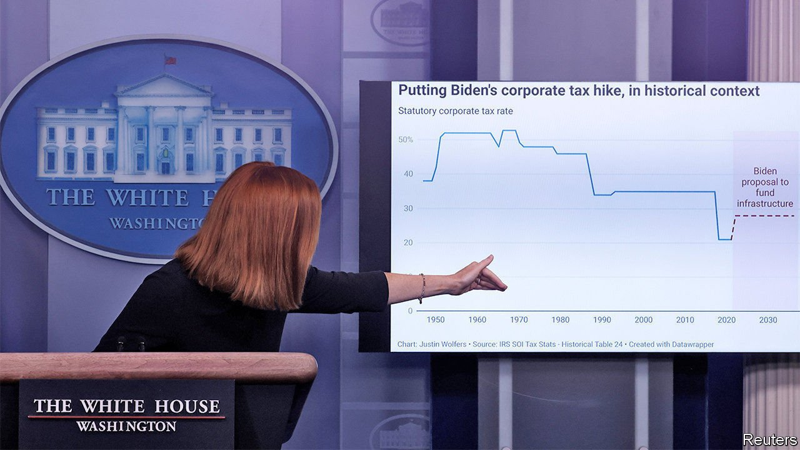

###### Taxing corporate America

# America Inc is on the hook for Joe Biden’s splurge on infrastructure 

##### Where the trillions could come from 

 

> Apr 10th 2021 

UNLIKE HIS $1.9trn covid-19 relief bill, which was almost entirely deficit-financed, President Joe Biden would like his recently unveiled $2trn infrastructure plan to be paid for with taxes. Individual taxes have been left for later. Unluckily for American companies, the White House has set its sights on them to pony up.

This is hardly unexpected. Mr Biden had campaigned on a partial repeal of Donald Trump’s tax cuts, which slashed the statutory rate of corporate tax from 35% to 21%. The president would now like to split the difference, raising the rate to 28%. But this would yield only about $900bn of the $2trn total, according to fresh calculations by the Penn Wharton Budget Model.


A bigger chunk would come from American firms’ profits held overseas. The tax rate on global intangible low-taxed income (GILTI for short) would be doubled from 10.5% to 21%, and the tax would be assessed on a country-by-country basis rather than in aggregate. It would also eliminate the deduction for overseas income earned from American-based intangible assets like intellectual property. “There would be a strong tax magnet for that intellectual property and the associated jobs to migrate outside the US,” argues Rohit Kumar of PwC, a professional-services firm.

Together, the Penn Wharton model estimates, these changes would bring in $1trn in revenue over the coming decade, the period covered by the $2trn in spending. A new proposed minimum tax for “the very largest of corporations” of 15% on the book income shown to investors would raise another $184bn.

The proposal aims to reverse two trends. One is the growing share of multinationals’ income channelled through tax havens (now 60% of foreign earnings compared with 30% in 2000). The other is the declining collection of corporate tax as a share of GDP (just 1% now compared with 2% before the Trump tax cuts, and well below the 3% average of other rich countries).

But without comparable tax regimes in other countries, the cost of being an American-based multinational would go up considerably. That is why Janet Yellen, the treasury secretary, has begun pushing for a —though the currently proposed minimum rate of 12.5% would be well under Mr Biden’s. Perhaps that is also why the plan promises (vaguely) to limit corporate “inversions”, which allow businesses to change nationality and avoid the taxman.

The opening bid is unlikely to get through Congress unscathed. Republicans will be loth to go along with the plan, meaning that even minor dissent among Democrats could provoke large changes. Senator Joe Manchin of West Virginia has already argued for a smaller corporate-tax increase, to 25%. The proposal remains skeletal. Its flesh will probably materialise only after months of committee hearings. And the howls emanating from corporate America are already deafening. ■

See also: 

