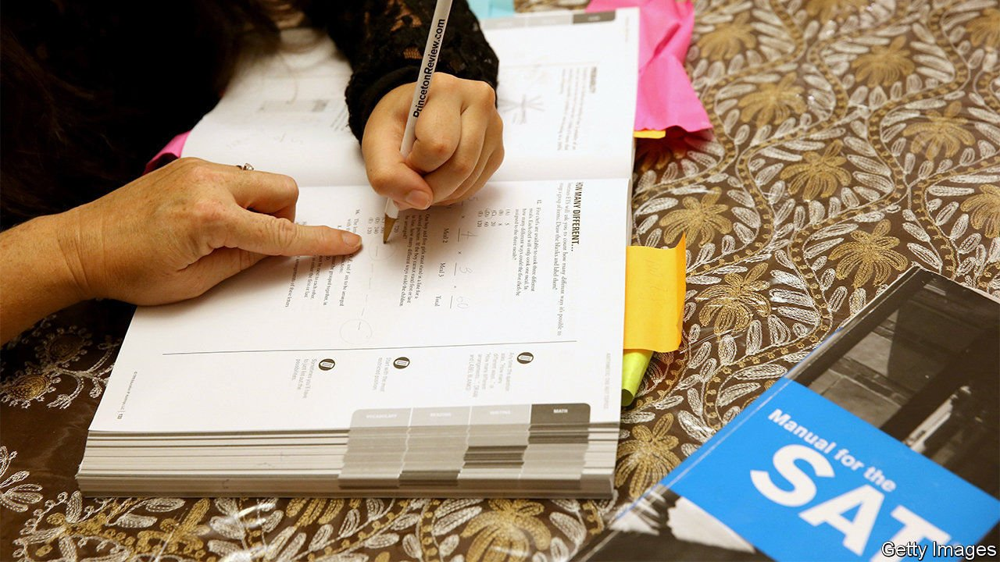

###### College admissions

# America tries to figure out a fairer way to select students 

##### Sidelining standardised tests won’t make college admissions fairer 

 

> Apr 8th 2021 

THE PANDEMIC has played havoc with college admissions. With many testing sites closed, over 1,400 colleges and universities (about a third of American degree-granting institutions) no longer required admissions exams for first-year students applying for autumn 2021. Many made the submission of test scores optional; 69 did not consider test scores at all. More than 1,300 colleges have already announced “test-optional” policies for 2022.

The coronavirus has hastened a trend already under way. Starting with a handful of institutions in 2005, and growing to over 1,000 (including half of the top 100 liberal-arts colleges) in 2019, many had gone test-optional before the pandemic. In May 2020 the governing body of the University of California, a public university with over 280,000 students on nine undergraduate campuses, voted to phase out the two main admissions tests, SAT and ACT, over five years. But a lawsuit sped up the timeline. A preliminary injunction prevented the university from using the SAT or ACT in admissions or scholarship decisions this year.


Opponents argue that these tests are biased. SAT and ACT scores are highly correlated with income, race and gender. Despite earning higher maths grades in school, women perform worse than men on the maths section of the SAT by 18 points (out of 800) on average. A student with an annual family income below $20,000 can expect to score 137 points lower on average (also out of 800) on the reading section of the SAT than a student with a family income above $200,000. Overall, black and Hispanic students perform worse than white students, and white students perform worse than Asian students. Similar concerns apply to the ACT.

Janet Godwin, CEO of ACT, which tests about half of all American high-school graduates, says the test outcomes are a symptom of systemic inequality, not a cause. She admits that the results are correlated with income, but she attributes this to the fact that a child living in a high-income zip code will have access to better resources. ACT has partnered with educational groups to provide access to test-preparatory resources to help close this gap.

Colleges have experienced a surge in demand since test-optional policies went into effect. First-year applications at Harvard jumped 42% (and the acceptance rate fell to 3.4%, from 4.9% last year); those at New York University rose by 17%. “A lot of students who felt that the SAT or ACT was a barrier to getting into those institutions are now taking their chances by applying,” says Angel Pérez, CEO of the National Association for College Admission Counselling.

But with test scores downplayed or removed, admissions counsellors must focus on other aspects of an application. Some of those may also favour the privileged. A study from Stanford University of 60,000 applications to the University of California found that the content of students’ essays was more strongly correlated with income than the SAT.

Extra-curricular activities are probably no fairer. Disadvantaged students have less access to them. And a study at Stanford that presented evaluators with fictional student profiles found that elite alumni, who often serve as interviewers and sit on review boards, preferred upper-class activities over lower-class ones requiring similar skills. Evaluators favoured the cello over the banjo, sailing over soccer, and foreign-film club over the video-games club.

Some measures do seem to perform better. Grade-point average predicts performance at college well, with less of an association with income. Some universities, such as the University of Texas at Austin, rely on class rank to admit a portion of their student body. Yet about half of high schools no longer rank students.

Rather than tinkering, advocates for more equitable admissions are calling for an overhaul. Some have suggested a lottery among students who meet minimum qualifications. Universities say they could admit “three times as many students without having to lower standards at all,” says Jesse Rothstein, a professor of public policy at University of California, Berkeley. “Why don’t we put our money where our mouth is?” Others recommend a more intricate process, such as the “match” system used to admit medical-school graduates into residency programmes.

Yet overhauling admissions may have its limits. “We aspire towards a meritocracy, but the reality is we have systemic inequality in our society,” says Mr Pérez. “Until we fix the inequities at the lower levels, we're not even going to begin to make a dent in higher education.” ■

