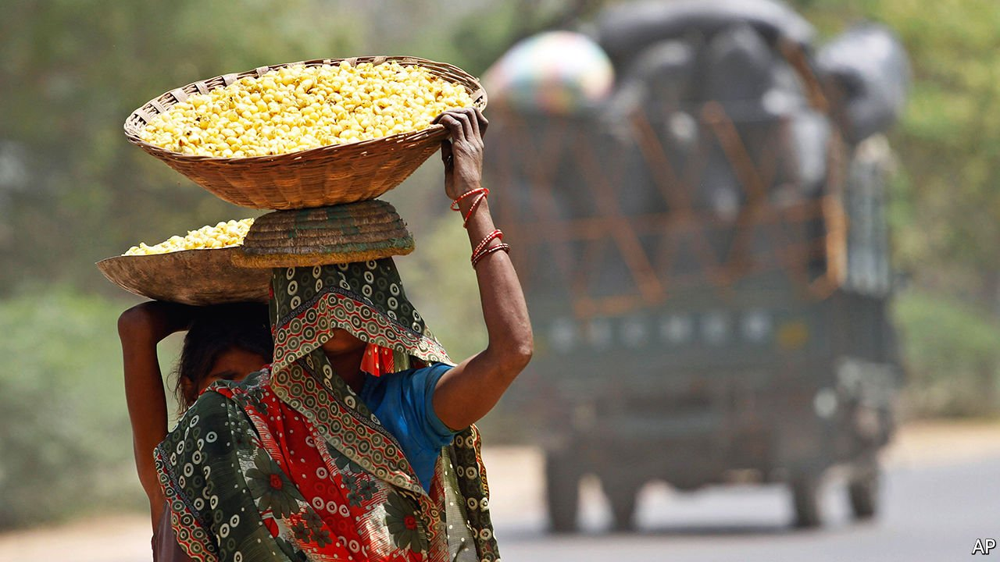

###### Botanical blessings

# The joys of mahua, an Indian tree, flower and liquor 

##### A long-demonised forest product gets its due 

 

> Apr 17th 2021 

IF YOU LISTEN carefully, there is a new sound: plip-plop, as the mahua tree drops its blossoms, one by one, onto a net of saris stitched together like a trampoline. Traditionally, these droplet-shaped flowers would fall directly onto the ground, nestling among a layer of dried leaves. Then the men, women and children of the tribes that live in the forests of central India would crouch through the morning hours, rummaging among the leaves with their baskets. Or they would burn away the clutter, coating the ground with a fine black ash, which made the cream-coloured mahua flower easy to spot, if a bit dusty. That dirt did not matter when the harvest was being sold for just 40 rupees ($0.53) per kilogram, and that was in a good year. A middleman stored and dried the stuff—Madhuca longifolia sheds its foliage in March, weeks before it ripens—later selling it back at a steep profit to the same cash-poor tribal communities, who cook most of it into a wondrous moonshine.

Now, with a reusable net made from a few dozen saris that cost just 40 rupees each, the bounty of whole trees can be harvested without back-breaking work. Paired with reliable scales, standardised pallets and better sun-drying techniques, the simple technology is helping the tribal folk turn nature’s gift into consumer products.


Mahua’s appeal is at least as old as Hinduism. Its wine was extolled in ancient scriptures. The fourth-century poet Kalidasa wrote of Shiva’s consort Parvati wearing its flowers as a garland. But its culture is older still, and deepest in India’s tribal interior, where the inhabitants have resisted being drawn into the Hindu mainstream. The tree is abundant in the tribal-dominated states of Jharkhand and Chhattisgarh. It grows thickest in districts like Bastar, in Chhattisgarh, which are better known for the armed Maoists, called Naxalites, who have been battling the Indian state since the 1960s. The deep poverty and alienation that sustain the Naxalites have kept microcredit and fair market practices at bay. But bureaucrat-led efforts to modernise the market for mahua are under way.

In January Jharkhand played host to the first Mahua Conference, at which 4m rupees were pledged towards a new dedicated research centre of the kind that most of India’s agricultural products already enjoy. It is a welcome change. The Indian state has rarely been a friend to mahua. Liquor is regulated mercilessly. Punitive taxation and prohibition have been practised since colonial times.Even the raw mahua flower, despite its utility in food, medicine and household oils, has been kept from interstate trade and banned outright in some districts. “We have to reduce the negativity associated with mahua,” an official said at the conference.

With a new brand, Chhattisgarh Herbals, at least one state government is pursuing the experiment of paying more for better stuff. India’s consumer class may take an interest in tribal wholesomeness. The prohibition against home distilleries will last longer; bad batches still poison drinkers. Meanwhile mahua—the tree, the flower and the liquor—is slowly on the way to regaining the respect it deserves.■

