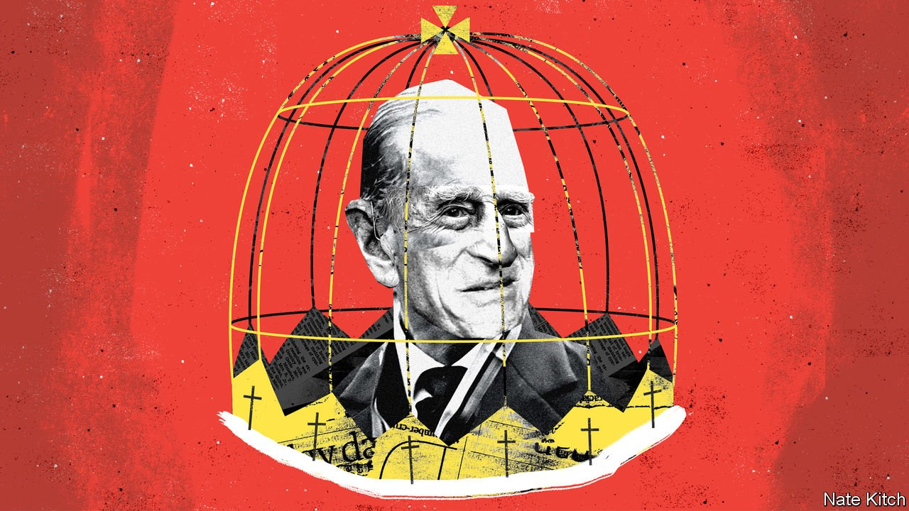

###### Bagehot

# Prince Philip and the dynasty factor 

##### The fascination of a royal death 

 

> Apr 15th 2021 

THE MODERN world was built on the graves of royal dynasties. The grave-diggers started their work with the American and French revolutions in the second half of the 18th century, paused for a while in the 19th, as Europe recoiled from the excesses of Madame Guillotine and the Emperor Napoleon, and then resumed with gusto in the 20th. The first world war and its aftermath saw the destruction of such great names as Russia’s Romanovs, Germany’s Hohenzollerns and Austria-Hungary’s Habsburgs. Today there are just 26 monarchies left.

The explanation is not hard to grasp. Dynasts inherit their positions regardless of ability. James VI was 13 months old when he became king of Scotland. Edward VI was a sickly child when he succeeded Henry VIII. George III was mad. Dynasty is based on the union of the public and private in the monarch’s person. The death of a king could plunge the country into decades of conflict, as with the Wars of the Roses. A royal marriage could reshape international alliances. Hilary Mantel describes the politics of Henry VIII’s reign as “graphically gynaecological” because it was dominated by the king’s desire to produce a son. Modernity is built on the negation of all of this.


Yet the reaction to Prince Philip’s death on April 9th demonstrated that the dynastic principle continues to flourish in one of the world’s most advanced countries. The BBC suspended its programming to focus on the news. Newspapers produced special editions framed in black. A vast army of royal experts competed to tell the most heart-warming anecdotes about the crusty royal. Old newsreels of the queen’s coronation were rolled out to remind the world that, while most surviving monarchies seem almost embarrassed about their role—witness the bicycling kings and queens of the Nordic world—the Windsors believe that monarchy is worth doing only with pomp and circumstance.

This is all the more remarkable because Prince Philip of Greece and Denmark, as he was born, was himself almost a casualty of the death of dynasties. The family was expelled from Greece shortly after his birth, and his parents quickly went their separate ways—his father to a life of dissolution, his mother to a mental asylum. Philip spent his childhood as an orphan princeling dependent on the kindness of strangers and the whims of his scattered family. It was only his marriage to the queen, which the old guard at the palace strongly opposed, that enabled him to turn his lineage into a way of life.

Why do the British continue to cherish the dynastic principle at the very heart of the state? There has been no shortage of answers to this question over the past days. One is that the royals are tireless public servants: the prince carried out more than 22,000 solo engagements and countless more as an appendage to his wife, always walking two steps behind her. A second is that they are judicious modernisers: the prince melded clever innovations (such as the Duke of Edinburgh award scheme for youngsters) with ancient rituals. A third is that the monarchy is a source of unity in a country that is often at war with itself.

The first two answers are weak. The theatre of monarchy is not primarily a theatre of works performed and duties fulfilled. It is a theatre of majesty. The only way to fully modernise the monarchy is to abolish it: the point of the institution is to act as a counterbalance to the everyday world of value for money and performance targets. Monarchy is romance or it is nothing.

The third answer is closer to the truth. Regular politics is inevitably about differences: rival parties bellow at each other from opposing benches and then vote in something called a division. These disagreements are unusually sharp at the moment: furious arguments about Brexit are now giving way to equally furious arguments about devolution. Questions of identity underlie these issues: what does it mean to be “British” in a multi-ethnic society? And what prevents us from spinning out of control in an age of such hectic change? The reaction to the duke’s death was a symptom of a desire to find unity at a time of discord and continuity at a time of flux.

But even this argument contains holes. The BBC received more than 100,000 complaints about its wall-to-wall coverage of the Duke’s death, with the postponement of the finale of another national institution, “Masterchef”, causing particular fury. Prince Philip’s blunt style exacerbated some of the divisions at the heart of the country’s culture wars. And recent rows about Meghan Markle—a victim of royal racism to her defenders and an entitled woke princess to her critics—suggest that the monarchy fosters division as well as healing it.

A subtler answer lies in the way that the dynastic principle puts the basic facts of biology right at the heart of the public square. As defined by politicians, the public square is about utilitarian calculations and party manoeuvring; as defined by dynasties, it is about more fundamental things in life.

The most keenly watched royal events are marriages (and their breakdown) and births. The Duke of Edinburgh’s death provided a chance to observe on the public stage something that usually takes place only in private. It also allowed people to do at a national level what they usually do within their families: contemplate the way things have changed over the decades. These great royal events are unifying because they are “brilliant editions of universal facts”, to borrow a phrase from Walter Bagehot, the great Victorian editor of The Economist. They are also consoling, for they remind people that even those with great wealth and status share the troubles from which lesser mortals suffer—unsatisfactory partners, wayward children and, eventually, decay and death.

It is extraordinary that the dynastic principle has survived. That it has done so by taking the most atypical people on the planet—blue bloods living in gilded cages—and turning them into exemplars of our common humanity is quite bizarre.■

