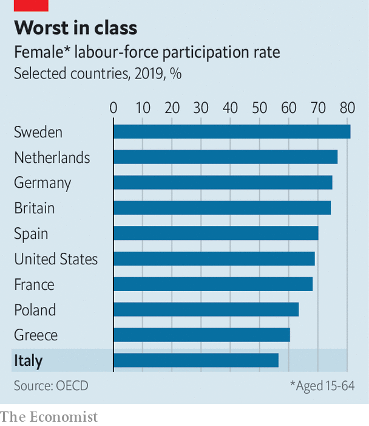

###### The big divide

# Italian women take more top jobs, but many have no job at all 

##### Some EU funds may be spent on better child care 

 

> Apr 15th 2021 

ENRICO LETTA, a former prime minister who returned from the political wilderness to lead Italy’s centre-left Democratic Party (PD), is one of Italy’s more courteous politicians. Yet in one respect he has acted ruthlessly since being elected leader on March 14th. Having named a woman as one of his two deputies and given women eight of the 16 seats in the PD’s executive, he forced out its male chief whips in both houses of parliament so that women could be appointed to replace them.

Mr Letta’s uncharacteristic purge came as a well-judged response to an outcry that followed his predecessor’s decision to put men into all three of the ministerial places allotted to the PD in Mario Draghi’s coalition government. The indignant clamour was a sign of changed expectations in a country that, back in the 1970s, had one of Europe’s most militant and successful feminist movements, but which then lost ground dramatically in terms of equality for women.


Giusi Marchetta, a feminist writer, blames among other factors the influence of Silvio Berlusconi’s television channels, with their lascivious portrayal of women. Born in 1982, Ms Marchetta says: “I grew up in an atmosphere in which the notion of women was constantly sexualised.”

A turning-point was the nationwide demonstration in 2011 against the hosting by Mr Berlusconi, then Italy’s prime minister, of so-called “Bunga Bunga” parties, whose many female guests included a 16-year-old. The subsequent rise of social media has eroded the influence of television, and of Mr Berlusconi’s network. Recent years have also seen a sharpened focus on practical issues, from the levying of VAT on tampons to violence against women and sexual harassment.

 


Between 2010 and 2018, Italy’s gender-equality rating, as measured by the European Institute for Gender Equality, increased by more than ten points out of 100—the biggest rise for any EU state. Last year the institute’s index ranked Italy 13th out of the EU’s 27 countries, ahead of Portugal but well behind Spain and France. Italy has seen an increase in the number of women in top jobs, largely thanks to the introduction of quotas for female company directors (33%) and national lawmakers (40%). And the pay gap between men and women in Italy is nowadays no wider than in many other European countries.

Still, these advances mask what Francesca Bettio of the University of Siena fears is a larger problem: the limited participation of women in the labour market. Italy has the lowest female employment rate of any EU country, at 57%; and the worst in the industrialised world bar Mexico and Turkey. Italian women are also far more likely than Italian men to be employed part-time or on short-term contracts.

To some extent this reflects social attitudes, notably the view, especially prevalent in the south, that women should give up work when they first become pregnant. But such attitudes are both cause and effect of things that politicians could change, including a strikingly low level of formal child care. In Italy there are public and private places available for only 26% of children below the age of three, against more than half in both France and Spain. Mr Draghi’s government is currently debating whether to earmark part of its share of the EU’s €750bn ($895bn) post-pandemic recovery fund to increase that figure. ■

