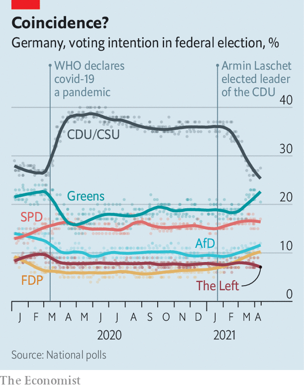

###### A fracturing Union

# The battle to succeed Angela Merkel gets nastier 

##### Germany’s conservatives are fumbling it 

 

> Apr 17th 2021 

“MY PLACE is in Bavaria.” When asked if he hoped to succeed Angela Merkel, who will step down as Germany’s chancellor after an election in September, Markus Söder repeated his not-quite-denial so often that it became a running joke. As head of Bavaria’s centre-right Christian Social Union (CSU), sister party to Mrs Merkel’s Christian Democrats (CDU), Mr Söder (pictured above, right), a cocky, self-assured type, has ruled Germany’s brashest, and second biggest, state since 2018. Many thought his ambitions ended there.

Yet April 13th found Mr Söder seated in the Bundestag explaining why his place might be in Berlin after all. The CDU/CSU choose a joint chancellor-candidate to lead them into national elections. Appearing before the parties’ MPs, Mr Söder laid out his pitch for the job. Armin Laschet, the mild-mannered CDU leader (pictured, left), made his own case from three socially distanced seats away. Johann Wadephul, a CDU MP who backs Mr Söder, says the four-hour debate was the most intense parliamentary session he can recall.


Two days earlier, in a show of faux-magnanimity, Mr Söder had finally made his ambitions clear, declaring that he would accept the CDU/CSU, or Union, nomination if the larger party asked. If not, no hard feelings. The next day the CDU’s leadership committee unanimously backed Mr Laschet. Yet rather than step back, Mr Söder doubled down. The CDU’s top brass was out of touch, he implied; better to consult more broadly. The drama was on.

Shifting the duel to parliament bolstered Mr Söder’sargument that his appeal extends beyond his own state and party. His pitch—that his huge polling lead over Mr Laschet, cemented in the course of the pandemic, was good for the Union’s electoral prospects—found receptive ears among CDU MPs who fear for their seats. Some read out letters from constituency workers concerned that Mr Laschet would spell electoral doom. But with the CDU leader showing no inclination to yield and MPs enjoying no formal role in the process, the Union was left in stalemate. The two men pledged to reach a deal by the end of the week. How they would do so remained unclear as The Economist went to press.

 


The rivals have been careful to avoid full-frontal warfare, and no doubt the runner-up will offer the victor unequivocal backing. But this week’s episode will leave scars. If Mr Laschet prevails, as seems more likely, he will begin the campaign as damaged goods. True, he is responsible for his own policy flip-flops and faltering communication style. But Mr Söder has shone a harsh light on Mr Laschet’s pitiful polling—69% of voters in North Rhine-Westphalia, the state he runs, are unhappy with him—and forced CDU MPs publicly to oppose his candidacy. Mr Söder’slate push for the job has harmed the relationship between the sister parties, and exposed splits between the CDU leadership and base.

Were Mr Söder to secure the candidacy he would have to deal with a bruised CDU leadership that might not find the will to offer him full-throated support. And the sympathetic coverage he has so far enjoyed from journalists who love to mock the hapless Mr Laschet would fade once he was confronted with the Greens, the Union’s main adversary, argues Ursula Münch of the Tutzing Academy for Political Education. Mr Söder, one of Germany’s more opportunistic politicians, would see conveniently jettisoned conservative positions on matters like immigration or the European Union exhumed for scrutiny.

For the CDU/CSU, Europe’s most important political alliance, to rely on an informal process for such a crucial decision is “ridiculous”, acknowledges Mr Wadephul. But this is also the first time in German history that a governing party will campaign without an incumbent chancellor, and it shows. “There is no blueprint for this,” says Christian Wohlrabe, a CDU candidate in Berlin’s city election, also due in September. The long reign of Mrs Merkel, who herself was forced to yield to the CSU in 2002 before winning office three years later, has left the party out of ideas at the moment it needs them most. “We have new candidates and new issues,” says Mr Wadephul. “It will be a completely different race.” But Mr Söder’s long refusal to rule himself in or out made a contest for the candidacy based on competing visions impossible.

Then there is covid-19. As Germany’s third wave accelerates, the pandemic seems likely to dominate politics well into the summer. The government is legislating to increase its powers over renegade states; among other things, Germany looks set for its first widespread curfew. The seemingly endless lockdown will make it harder for the Union candidate to pull off the already-tricky task of creating a political vision for post-Merkel Germany without disowning the popular chancellor. (Wisely, she has vowed to stay out of the contest.)

The woes of the Union are thrown into sharper relief by the discipline of their political rivals. On April 19th the Greens will announce their first-ever candidate for the chancellery (expected to be Annalena Baerbock, the party’s young co-leader). The party hopes the contrast between its well-managed process and the drawn-out psychodrama of the Union’s will not be lost on voters. Under either Mr Laschet or Mr Söder, the conservatives will remain odds-on to run the first post-Merkel government. But that the notion of a Green chancellor no longer seems outlandish is testament not only to that party’s acumen, but to the agonies of its opponent. ■

