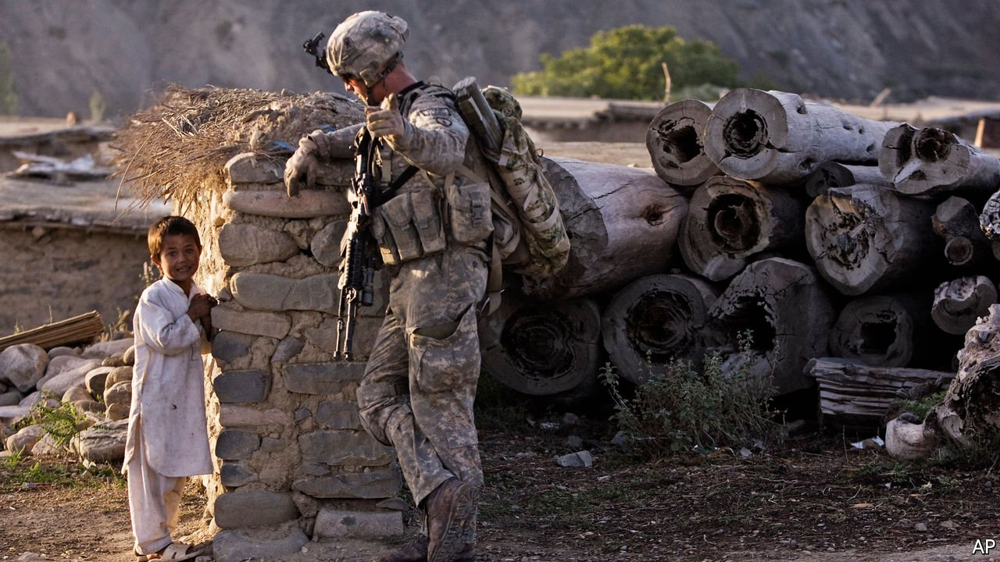

###### Afghanistan

# Joe Biden is wrong to withdraw American troops from Afghanistan 

##### But America can still try to minimise the damage 

 

> Apr 15th 2021 

A DOZEN YEARS ago Afghanistan was sliding into carnage. The Taliban, who had scattered back into their villages after the American invasion in 2001, had regrouped and were launching attacks daily on American forces. America was split. President Barack Obama argued that Afghanistan’s elected rulers, though deeply flawed, were much better than the jihadists they had replaced, and should be protected. His vice-president, Joe Biden, wanted to draw down troops, leaving only a small counter-terrorist force. Mr Biden lost the argument; an extra 17,000 American troops flew into Kabul to prop up the government.

Today Mr Biden is president, and faces a similar dilemma. The Taliban are as strong as they have been since 2001. The Afghan state, backed by America and its NATO allies, is tottering. This time, however, Mr Biden is in a position to get his way. By September 11th, two decades exactly since al-Qaeda terrorists felled the twin towers, prompting America to overthrow the Taliban regime that harboured them, almost all the remaining 2,500 American troops in Afghanistan will have left. A handful will stay to guard the embassy. The decision was made against the advice of America’s generals, who had warned Mr Biden (and Donald Trump before him) .


Mr Biden thinks the costs of staying outweigh those of leaving. He campaigned promising to end America’s “forever wars”. Few Americans see the case for remaining part of a seemingly unwinnable conflict 7,000 miles away. Yet the decision was wrong. American troop levels were already much reduced. No American soldier has died in combat in over a year. It costs little to keep a small force in place, guaranteeing the security of a larger number of NATO troops who have been training Afghan forces. With America gone, they will surely leave, too.

America has defended other allies, such as South Korea, for far longer than it has protected the Afghan government. Abandoning Kabul to its fate will undermine other allies’ confidence in America. And it will lead to more bloodshed, not less. Civilian casualties are already mounting; the number killed increased by 29% in the first three months of this year, compared with last, says the UN. The government still controls most cities, but several, including Kabul, are under siege and racked by suicide-bombings. The Taliban hope to oust the government, just as they ousted and slaughtered Afghanistan’s rulers in the 1990s after their Soviet sponsor collapsed. A Taliban victory could mean the reimposition of a pious, premodern tyranny. Urban Afghans could lose the freedom to listen to pop music. Girls may be stopped from going to school, or killed if they try.

If Mr Biden insists on pulling out American troops, he should at least take steps to reduce the likelihood of total disaster. The Soviet-backed state did not collapse immediately when Russian soldiers withdrew; it fell when the money ran out. So America should promise to subsidise Kabul for longer. The Taliban’s leaders now have plush offices in Qatar and travel freely internationally. They are, at least nominally, negotiating with Kabul. They must be made to realise that if they take over by force, they will be international pariahs once again, and the money will stop. Even in Taliban-held districts teachers and doctors are paid by foreign donors. Ashraf Ghani, Afghanistan’s president, must also now realise that more American troops are not coming to his rescue, and try seriously to negotiate—or cede his position to someone who will.

The omens are not good. The Taliban believe they have defeated America; they do not seem inclined towards concessions. Even if they negotiate rather than shoot their way back into government, the Afghan constitution of 2004, with its legal protections for women and other freedoms, is unlikely to last. The Taliban show little sign of giving up their links with al-Qaeda. Mr Biden may be pulling troops out of the country now. A future president may have to send them back in. ■

