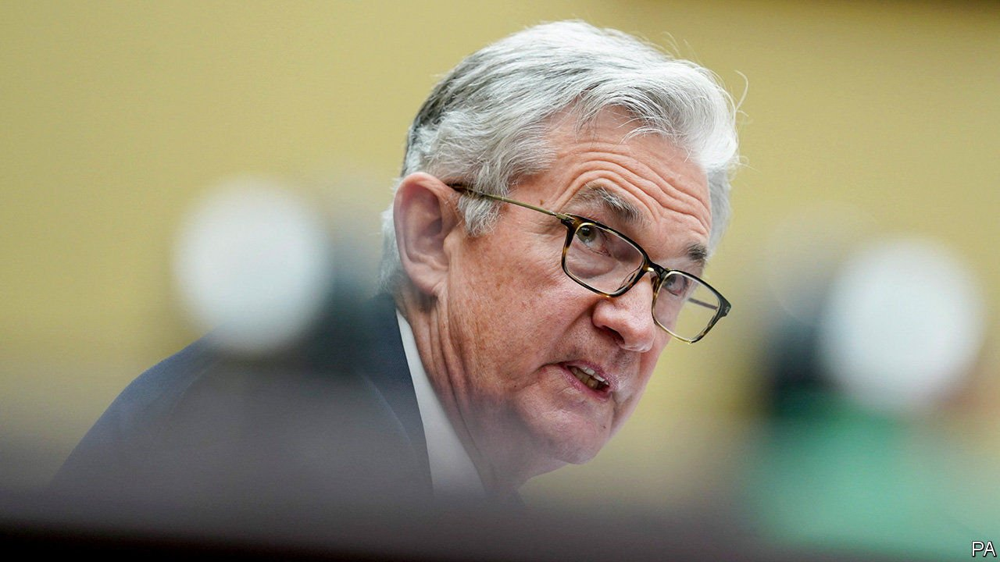
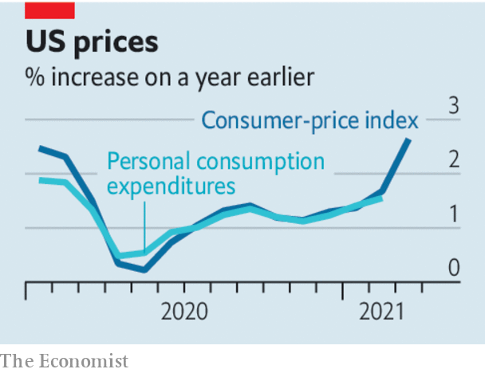

###### Be prepared

# The Fed should explain how it will respond to rising inflation 

##### The Fed’s “average inflation targeting” regime remains too vague 

 

> Apr 15th 2021 

THE INEVITABLE has begun. America’s consumer-price index (CPI) in March was 2.6% higher than a year earlier, when prices collapsed as the pandemic struck. The increase in inflation from 1.7% in February was the biggest rise since 2009, the last time the economy was recovering from a deep shock. Several more months of high numbers—by rich-world standards—are coming. The CPI could reach over 3.5% by May. On the separate price index used by the Federal Reserve, inflation will soon rise above the central bank’s 2% target.

The Fed is rightly unworried by cosmetically higher inflation that reflects what happened a year ago. Yet the central bank does have an inflation problem that will trouble it when the economic recovery produces sustained price pressures. A new monetary-policy framework it adopted in August dictates that it should push inflation temporarily higher than its target after recessions, to make up lost ground. The problem is that nobody knows by how much or for how long it wants inflation to overshoot after the pandemic. With the risks of an inflationary episode greater than they have been in years, the ambiguity is an unfortunate additional source of uncertainty.


The idea behind “average inflation targeting” is to make sure that inflation averages 2% over the full economic cycle, rather than falling short over time owing to recessions. It is a welcome corrective to the old regime, which took too long to restore the economy to health after the global financial crisis due in part to a misplaced fear of inflation.

 


Yet the new framework remains vague. Richard Clarida, the Fed’s vice-chairman, has suggested that it means waiting to hit inflation and employment goals before raising interest rates, and then operating as normal—a bit like a driver waiting to hit the brakes until the car has arrived, regardless of its stopping distance. Other Fed officials have hinted that they want to make up more precisely the ground lost to downturns.

But it is unclear whether to measure from March 2020, when the present crisis struck, or from August, when the new regime came into effect. Include the spring and there is a shortfall; start in August and there is none, because prices have risen at an annual pace of . Then again the Fed could argue that, as long as long-term inflation expectations stay around its target, it is already set for 2% on average and need not overshoot by much. Policymakers also disagree about how far above the target it is reasonable to go, temporarily, in the name of catching up.

Central bankers often differ over the state of the economy or the probable impact of their monetary-policy decisions. Failing to articulate what they are aiming for is more unusual. The ambiguity is contributing to uncertainty over inflation and interest rates, which has also been heightened by the novel circumstances of the pandemic and President Joe Biden’s enormous fiscal stimulus. A gap has opened between financial markets, which expect the Fed to raise interest rates in 2022, andthe median monetary-policymaker, who does not expect rates to rise until 2024 at the earliest. Investors are also pricing in a growing risk that inflation will run well above the Fed’s target for quite some time.

Jerome Powell, the Fed chairman, has said that it is deliberately avoiding committing itself to a numerical rule. Sometimes central bankers must avoid excessive specificity, and forging consensus on a committee can be hard. But sooner or later the Fed must decide what it wants as inflation rises. It should do so soon. The monetary-policy meeting that starts on April 27th would be a good time to clear up some of the ambiguity. ■

