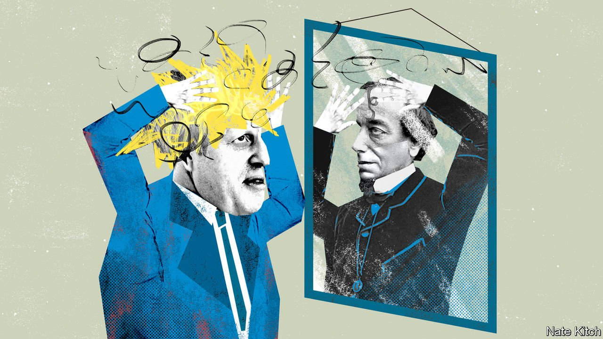

###### On pulse oximeters, special drawing rights, Lord Salisbury, boycotts, religion, Harvard

# Letters to the editor 

##### A selection of correspondence 

 

> Apr 17th 2021 


Pulse oximeters and race

Regarding your article on race and sex bias in medical devices (), I founded Masimo and co-invented the modern pulse oximeter, which measures blood-oxygen levels. Black patients have indeed been a challenge for conventional pulse oximetry, resulting in overestimates of arterial blood oxygen saturation, but that is not the whole picture. Many studies have reported a bias between different brands of pulse oximeters on patients, with larger biases found in those with darker skin.


An internal study at Masimo, which covered 2,000 subjects, including 1,000 with dark skin, found a 0.3% difference between the groups across an oxygen saturation range of 70-100%, and 0.25% in the more limited pulse oximetry range of 92-96%. When we compared black and white subjects who had reported their ethnicity (200 black and 194 white) we found a bias of 0.4%, between the two groups. Applying the statistical test used in the University of Michigan study you referred to, we found a difference between dark- and light-skinned subjects of 1%, whereas that same Michigan test found a 325% difference.

Given that our bias was so much less, we questioned what could be the cause of the disparity between the results presented by Michigan and all the data we had seen in the past two decades. We are aware of several potential factors that, if present in the patients in the study, affect the accuracy of pulse oximetry readings. These include sickle-cell disease, tissue damage and poor circulation, which afflict black patients more than any other racial group, and elevated methaemoglobin. Hydroxychloroquine, which has been used on covid-19 patients, has been shown to elevate methaemoglobin in black patients.

Perhaps the most critical oversight in the design of the Michigan study was an unacceptably long delay of up to ten minutes between pulse oximetry readings and invasive blood sampling. From our studies we know that these two measurements must be taken simultaneously, because the oxygen saturation of sick patients can change dramatically in ten seconds, let alone ten minutes.

Moreover, pulse oximeters do not all have the same accuracy and reliability. It is important that researchers report the brand and version they used. In the pursuit of science and patient safety, Masimo is conducting further tests for bias in pulse oximetry measurements on black patients and we will report our findings in the near future.

The Michigan study is important as it highlights the need to include subjects that represent all the different kinds of patients that will depend on a medical intervention. It is equally important that studies actively control for confounding variables that could produce biased conclusions and lead us all astray.

JOE KIANI

Chairman and CEO

Masimo

Irvine, California

 


In support of the IMF’s SDR

Your criticism of the IMF’s allocation of $650bn in new “Special Drawing Rights” lacked an understanding of the instrument (“”, April 3rd). This is not primarily about granting unconditional aid to low-income countries under external financial pressure, though that is a significant by-product that can be shared by many other countries. More important, the allocation will help support the recovery of the world economy, and thereby all IMF members. In 1969, when the SDR mechanism was established, the purpose was to facilitate the smoother working of the international adjustment process by relaxing the external constraint on countries’ macroeconomic policies. That rationale underlay the three previous general SDR allocations.

The global economy should have received a SDR-shot-in-the-arm a year ago. The delayed global responses have steepened the task ahead. It is naive to suggest that the appropriate way to respond would have been, or should be, prolonged negotiation about special funds, IMF facilities, and more bilateral aid. Many countries’ pandemic-related medical needs are substantial.

Additionally, countries have been hit with an exogenous economic shock through no fault of their own. The IMF was created with pre-positioned financial resources to respond quickly to such shocks, and the SDR is a useful tool in its response kit. The money is there. It can and should be delivered quickly; better late than never.

EDWIN TRUMAN

Senior fellow

Mossavar-Rahmani Centre for Business and Government

Harvard University

Cambridge, Massachusetts

Your leader makes the case that a general allocation of SDRS will be a sign of failure for the IMF. This is the first proposal during this pandemic that meets the scale of the economic challenge facing low and middle-income countries. The IMF should be congratulated for taking action when few others have. The proposal should be swiftly accompanied by a recycling mechanism to transfer SDRS to where they are needed most: to the countries that desperately need liquidity and reserves to respond to the pandemic and avoid default.

JAMIE DRUMMOND

Global strategist

Global Goal

Washington, DC

DR DAVID McNAIR

Executive director

Global Policy

The ONE Campaign

Brussels

MIKE MULDOON

Managing director

Innovative Finance

The Rockefeller Foundation

RONAN PALMER

Director

Clean Economy

E3G

MARK PLANT

Senior Policy Fellow

Center for Global Development

FRIEDERIKE RÖDER

Vice President Global Advocacy

Global Citizen

ELOISE TODD

Co-Founder

Pandemic Action Network 

 


The pen club

A small nit. stated that only three British prime ministers—Disraeli, Churchill and Boris Johnson—made a living by writing (March 27th).

However, before the death of his elder brother, Lord Salisbury (as he was known) made his living by writing for the Saturday Review, the Quarterly Review and similar publications. His articles were necessary to support a growing family. Once assuming the family lands, he concentrated on politics, becoming an important Victorian prime minister.

RALPH WALTER

Centre in Victorian Political Culture

Keble College, Oxford

 


Sport boycotts

Any cold shouldering of the Beijing Winter Olympics could backfire (“”, March 27th). The boycott of the Moscow Olympics in 1980 merely mobilised Russian public support for the Soviet invasion of Afghanistan. It poisoned the well even deeper between America and the Soviet Union. A NATO exercise in 1983, Able-Archer, was mistaken by Moscow as preparation for an American first-strike because all trust between the nuclear rivals had been lost.

The world may soon need China to prevent a nuclear conflict in the Taiwan Strait, South Asia or the Korean peninsula. An Olympic boycott could burn the bridges to Beijing.

FRANK RICHTER

Clawson, Michigan

 


Veritas

 (March 20th) asks how to tell if people went to Harvard. An older version of the joke goes, “You can always tell a Harvard man, but you can’t tell him much.”

RICHARD WAUGAMAN

Potomac, Maryland

