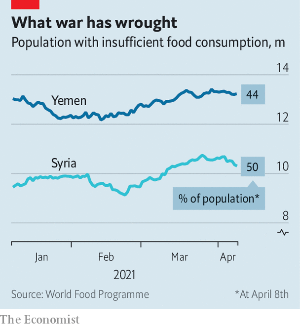

###### Feast, fast and famine

# Arab governments are worried about food security 

##### From war zones to oil-rich Gulf states, hunger is a threat 

 

> Apr 17th 2021 

RAMADAN, WHICH began at sunset on April 12th in much of the world, is a month of both fasting and feasting, as long days of restraint give way to big meals after sunset. Celebrations were curtailed last year because of the covid-19 pandemic. With looser restrictions now in some Arab countries, families are looking towards a more festive holiday. Yet many will struggle to put food on the table.

The UN’s World Food Programme (WFP) estimates that 960m people do not have enough food to be healthy. Some 64m of them are scattered across 12 Arab states. That is about one in six Arabs. Wars and economic crises have made hunger a chronic fact of life for some. And even stable governments are worried about the effect of rising global food prices.

 


The problem is most severe in Syria and Yemen, where around half the population is hungry (see chart). A basket of staples in Syria—bread, rice, lentils, oil and sugar—was 222% more expensive in February than a year earlier. It now costs more than double the monthly salary of an average state worker. In Yemen the UN warns of looming famine. Aid agencies have cut rations because of tight budgets. Fuel shortages in both countries have pushed up prices.

Meat was already an unaffordable luxury for many Syrians. Dairy and fruit are fast becoming the same. Bread, the cheapest source of calories, often no longer accompanies a meal—it is a meal. Yet it can take hours in a queue to obtain subsidised bread from the government. Before the war Syria grew enough wheat to meet its needs. A study published last year by Humboldt University in Berlin used satellite data to find that the country lost 943,000 hectares of cultivated land (about a 20% decrease) between 2010 and 2018.

Other countries are grappling with newer challenges. Last year in Lebanon a bowl of fattoush, a salad of vegetables topped with toasted bread, cost 6,000 pounds ($4) for a family of five. Since then a financial crisis has caused the currency to lose around 90% of its value. Food prices have climbed by 417% in the past year.

Though much of Lebanon’s food is imported, local products have become more expensive, too. The same fattoush now costs more than 18,000 pounds. To serve a simple iftar fast-breaking meal—soup, salad, a main course with chicken—each night of Ramadan would run to two-and-a-half times the monthly minimum wage of 675,000 pounds, estimates the American University in Beirut. Supermarkets have seen brawls over subsidised staples like cooking oil, which some shops now distribute under armed guard. On April 13th a man was killed at a food drive.

In January Goldman Sachs, a bank, predicted the start of a commodities “supercycle”, with higher demand spurred by loosening pandemic restrictions and a weaker dollar. That is a worry in Egypt, which imports almost 13m tonnes of wheat annually for subsidised bread. The budget is based on an average price of about $200 a tonne. Earlier this year prices hovered at around $240, partly due to new export taxes in Russia. Egypt’s finance minister says the government may start to hedge its wheat contracts to protect against future increases. Prices for rice, another staple, are also at their highest in years.

Weak demand in Egypt has kept inflation low so far: food prices have been flat or have dipped in recent months. But they may well start to climb later this year. Even a small increase would hurt; a third of Egyptians live on less than 736 pounds ($47) a month. The UN’s global food-price index has climbed for ten straight months, and in March reached its highest level since mid-2014. Food prices are the main cause of inflation in Saudi Arabia. They rose by 11% in February.

In the United Arab Emirates (UAE), one of the world’s richest countries, well-heeled citizens and expats happily plunk down $100 a person for Ramadan buffets. Yet even there, ministers have mooted the idea of price controls on food. The UAE has begun growing its own food in the desert—everything from tomatoes to quinoa—but still imports 90% of what it eats. With a currency pegged to the dollar, as in most Gulf states, a weaker greenback means higher prices in the supermarket. Grocers were told to offer discounts during Ramadan. That is a luxury the UAE can afford. Elsewhere in the region, though, the next few years may be lean. ■

