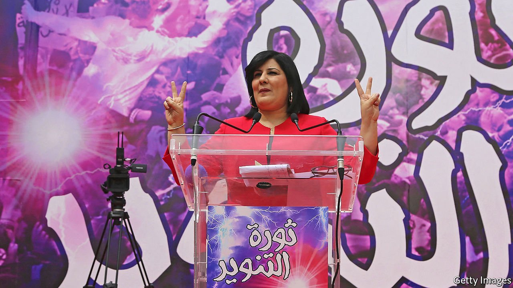

###### The megaphone

# Tunisians are rallying around Abir Moussi, a demagogue 

##### She’s big on conspiracy theories, short on policies 

 

> Apr 17th 2021 

KHADIJA, LIKE many Tunisians, thinks life was better before the revolution that toppled Zine El Abidine Ben Ali, a dictator, in 2011. For sure, there is more freedom, but democracy has not brought prosperity. Corruption, inflation and unemployment persist. Khadija, 50, does not have a job. Yet she hopes that Abir Moussi, a politician, will turn Tunisia around. “Moussi speaks for the people,” she says.

Since winning a seat in parliament in 2019, Ms Moussi (pictured) has made a name for herself with her populist outbursts. She claims the revolution was a “plot” by foreign countries—in the past it was “Europeans, Americans and Zionists”, now it is Qatar and Turkey. When not spouting conspiracy theories, she is channelling Tunisians’ nostalgia for the relative order and stability of the Ben Ali era. That has made her quite popular. If elections were held today, polls show her Free Destourian Party (PDL) would come top.


As it is, the PDL is the fifth-biggest party in a parliament Ms Moussi says is broken. Plenty of Tunisians agree. Eight prime ministers in ten years have been unable to pull the country out of its rut. But Ms Moussi is part of the problem. She leads frequent protests that disrupt the assembly. Her target is usually Ennahda, the moderate Islamist party that has the most seats. They are “terrorists” trying to impose religious rule, she claims—or, rather, screams. Sometimes she brings a megaphone to work and yells at Ennahda’s leader, the mild-mannered Rachid Ghannouchi, who is also parliament’s speaker.

Ms Moussi says a member of Ennahda assaulted her during one episode. But local watchdogs call the PDL the most confrontational party in parliament. Last year its members unbolted the speaker’s chair and held it aloft during a protest. The journalists’ union has called for a boycott of Ms Moussi over what it calls her “fascist practices”. This came after she claimed to have seen a reporter engaging in sexual activities with a parliamentary staff member.

Her rhetoric often sounds like that used by anti-Islamist regimes in the United Arab Emirates, Saudi Arabia and Egypt. Her view of democracy appears similar, too. She wants to strengthen the presidency and security forces, and ban Ennahda. “I don't think she's ever specifically said she opposes democracy," says Youssef Cherif of the Columbia Global Centre, a research institute in Tunis. “But she seems happy to let people assume that, not least through her crusading against the pillars of Tunisian democracy, such as other political parties or foreign-funded NGOs.”

At rallies Ms Moussi, a former official in Ben Ali’s party, surrounds herself with symbols of the past, while making no mention of the repression Tunisians used to suffer. Nor does she offer many solutions to the country’s problems. Still, a growing number of Tunisians feel that she speaks for them. When she ran for president in 2019, she got just 4% of the vote. The winner, Kais Saied, is the only politician more popular than her.But she would do much better now. Many Tunisians see a strong ruler as the path to prosperity. ■

